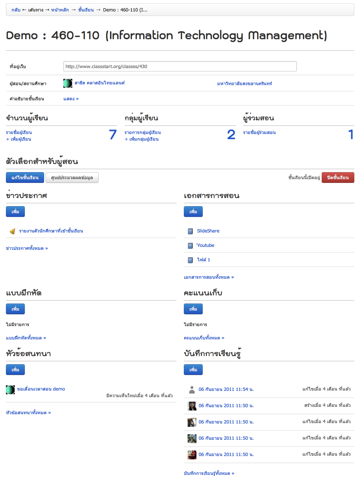

.. _assistants-function:

=================
สำหรับผู้ช่วยสอน
=================

ในส่วนนี้ผู้ช่วยสอนเป็นผู้ดำเนินการหลัก:ref:`view-assist-class-detail-form` ซึ่งการจะเป็นผู้ช่วยได้นั้นจะต้องได้รับการเชิญหรือการอนุมัติผู้ช่วยสอนในชั้นเรียนนั้นๆ ตามขั้นตอนการเพิ่มผู้ช่วยสอน:ref:`create-class-assistant-section` โดยผู้สอนซึ่งเป็นผู้สร้างชั้นเรียนนั้น เพื่อกระจายหน้าที่ต่างๆให้ผู้ช่วยสอนรับผิดชอบและดูแลชั้นเรียนแทนได้เสมือนเป็นผู้สอนในชั้นเรียนนั้นเช่นกัน หากต่างกันกับผู้สอนเฉพาะสิทธิ์บางส่่วนในชั้นเรียน ซึ่งผู้ช่วยสอนเรียนรู้วิธีการใช้งานของผู้สอน ClassStart.org ได้ :ref:`teachers-function` ดังต่อไปนี้

    
    จัดการชั้นเรียนที่ช่วยสอน 
    
      แกไขชั้นเรียนที่ช่วยสอน 
      ดูชั้นเรียนที่ช่วยสอน
      รายละเอียดตางๆ ในหนาชั้นเรียนที่ช่วยสอน
      การเพิ่มผูเรียน
      การอนุมัตินักเรียนเขาสูชั้นเรียนที่ช่วยสอน
    
    จัดการขาวประกาศ
    
      เพิ่มขาวประกาศ
      แกไขขาวประกาศ
      ลบขาวประกาศ
    
    จัดการเอกสารการสอน
      เพิ่มเอกสารการสอน
      แกไขเอกสารการสอน 
      เพิ่มไฟลแนบในเอกสารการสอน
      แกไขไฟลแนบในเอกสารการสอน
      ลบไฟลแนบในเอกสารการสอน
      
    จัดการกระดานขอความ
      สรางหัวขอสนทนาใหม
      เพิ่มไฟลแนบในหัวขอสนทนา
      แกไขไฟลแนบในหัวขอสนทนา
      ลบไฟลแนบในหัวขอสนทนา
      เพิ่มความเห็น
      เพิ่มไฟลแนบในความเห็น
      ปดหัวขอสนทนา
    
    อานบันทึกการเรียนรูของชั้นเรียนที่ช่วยสอน
    
    จัดการกลุมผูเรียน 
      เพิ่มกลุมผูเรียน
      แกไขกลุมผูเรียน
      ลบกลุมผูเรียน
      เพิ่มสมาชิกในกลุมผูเรียน
      ลบสมาชิกจากกลุมผูเรียน
      แกไขตัวแทนกลุม
    
    จัดการแบบฝกหัด(การบาน)
      สรางแบบฝกหัดใหม
      แกไขแบบฝกหัด
      เพิ่มไฟลแนบในแบบฝกหัด 
      แกไขไฟลแนบในแบบฝกหัด 
      ลบไฟลแนบในแบบฝกหัด
      ปดแบบฝกหัด
      ตรวจใหคะแนนแบบฝกหัด

.. _view-assist-class-detail-section:

ดูชั้นเรียนที่ช่วยสอน
------------------

เมื่อผู้สอนสร้างชั้นเรียนและเพิ่มผู้ช่วยสอนเพื่อช่วยจัดการชั้นเรียนแล้ว ผู้ช่วยสอนสามารถตรวจสอบรายละเอียดชั้นเรียนที่ช่วยสอนได้ โดยสามารถทำได้ 3 วิธี ดังนี้ 

วิธีที่ 1
	คลิกเลือกจากเมนูผู้สอน จากนั้นเลือกชั้นเรียนที่ฉันช่วยสอน
	
วิธีที่ 2
	คลิกเลือกจากเมนูสมาชิก จากนั้นเลือกหน้าหลัก และกดปุ่ม "ชั้นเรียนที่ฉันช่วยสอน"
	
วิธีที่ 3
 	คลิกเลือกจากเมนูสมาชิก จากนั้นเลือกชั้นเรียนของฉัน
	
ระบบจะแสดงชั้นเรียนที่ผู้ช่วยสอนมีสิทธิ์ในการจัดการตามการอนุมัติของผู้สอนขึ้นมาตามลำดับของวันที่ชั้นเรียนที่ช่วยสอนถูกสร้างขึ้น จากนั้นให้คลิกเลือกที่ชื่อชั้นเรียนที่ฉันช่วยสอน เพื่อเข้าไปสู่ชั้นเรียนที่ต้องการ

รายละเอียดต่างๆ ในหน้าชั้นเรียน
-------------------------------
:ref:`view-assist-class-detail-form` ประกอบไปด้วยส่วนต่างๆ ดังนี้ 

    รายละเอียดชั้นเรียน 
      ชื่อชั้นเรียน
  
    ที่อยู่เว็บ 
      แสดงที่อยู่ของเว็บไซต์ของชั้นเรียน
    
    ผู้สอน 
      รายชื่อผู้สอน และสามารถลิงค์เข้าไปในประวัติของผู้สอนได้
    
    สถานศึกษา 
      รายชื่อสถานศึกษาของชั้นเรียน
    
    ผู้ช่วยสอน : รายชื่อผู้ช่วยสอน   
      คลิกที่รายชื่อผู้ช่วยสอน จะปรากฏรายชื่อของผู้ช่วยสอนทั้งหมดของชั้นเรียนนั้น
    
    จำนวนผู้เรียน : รายชื่อผู้เรียน
      คลิกที่รายชื่อผู้เรียน จะปรากฏรายชื่อของผู้เรียนทั้งหมดของชั้นเรียนนั้น
    
    กลุ่มผู้เรียน : รายการกลุ่มผู้เรียน
      คลิกที่รายการกลุ่มผู้เรียน จะปรากฏรายการของกลุ่มผู้เรียนทั้งหมดของชั้นเรียนนั้น
        
    คำอธิบายชั้นเรียน
      รายละเอียดรายวิชาที่เปิดสอน
  
    ตัวเลือกสำหรับผู้สอน 
      แก้ไขรายละเอียดของชั้นเรียน และแสดงสถานะเปิด/ปิดของชั้นเรียน
  
    ผู้ขอเข้าร่วมชั้นเรียน 
      รายชื่อผู้ขอเข้าร่วมชั้นเรียนขณะรอการอนุมัติจากผู้สอน ซึ่งเมื่อได้รับการอนุมัติแล้วจะเรียกว่า "ผู้เรียน" แทน
  
    ข่าวประกาศ 
      รายการข่าวประกาศต่างๆ ของชั้นเรียนนั้น เพื่อแจ้งให้ผู้เรียนในชั้นเรียนทราบ
  
    เอกสารการสอน 
      รายการเอกสารการสอนต่างๆ ทั้งแบบไฟล์แนบเพื่อประกอบการสอน วีดิโอคลิบ เอกสารออนไลน์ พร้อมอ้างถึงที่มาขอไฟล์อย่างชัดเจน
  
    แบบฝึกหัด 
      รายการแบบฝึกหัดสำหรับผู้เรียนในชั้นเรียน สามารถกำหนดระยะเวลาเพื่อการส่งคำตอบของผู้เรียน และผู้สอน/ผู้ช่วยสอน สามารถให้คะแนนแบบฝึกหัดต่างๆ ได้
  
    คะแนนเก็บ
      รายละเอียดคะแนนของผู้เรียนในชั้นเรียน
  
    หัวข้อสนทนา(กระดานข้อความ) 
      กระดานข้อความสำหรับแสดงรายการสนทนาของชั้นเรียน เพื่อเปิดช่องทางการสื่อสารระหว่างผู้สอน ผู้ช่วยสอน และผู้เรียนได้ทุกเวลาตามหัวข้อในการสนทนาที่กำหนดได้ด้วยตนเอง
    
    บันทึกการเรียนรู้ 
      รายการการเรียนรู้ต่างๆ ที่เกิดขึ้นในชั้นเรียนแต่ละครั้ง โดยผู้สอน ผู้ช่วยสอน และผู้เรียนสามารถบันทึกเพื่อกระจายความรู้ที่ได้รับได้ด้วยตนเอง และในชั้นเรียนทราบ

.. _view-assist-class-detail-form:

  
  แบบฟอร์มแสดงรายละเอียดต่างๆ ของชั้นเรียนที่ช่วยสอน

จัดการชั้นเรียนที่ช่วยสอน
-----------------------

เมื่อผู้สอนทำการเพิ่มผู้ช่วยสอนเข้าไปยังชั้นเรียนแล้ว ผู้ช่วยสอนจะสามารถจัดการชั้นเรียนนั้นได้เหมือนกับผู้สอนทุกอย่างยกเว้นการปิดชั้นเรียน ดังนั้นผู้ช่วยสอนสามารถอ่านคู่มือนี้ในบทที่เกี่ยวข้องกับผู้สอน :ref:`teachers-function` เพื่อเรียนรู้วิธีการในการใช้งาน ClassStart.org ได้