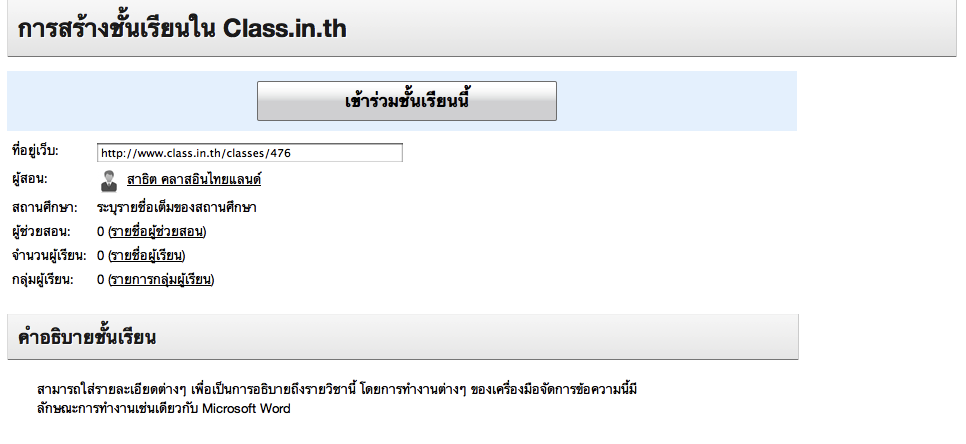
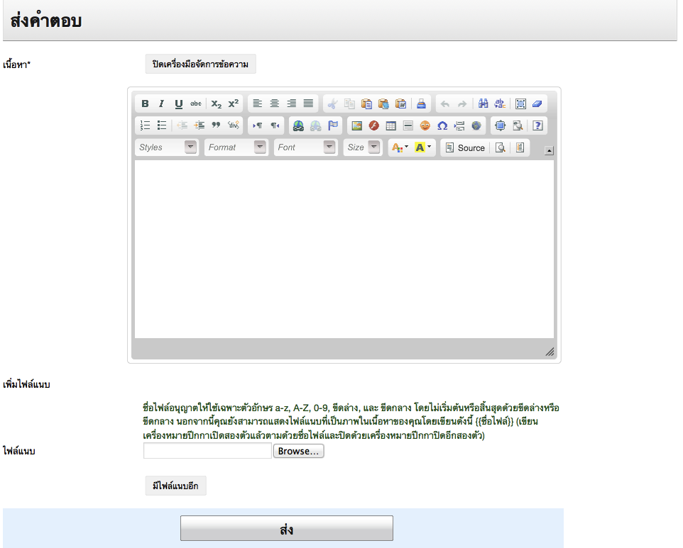

=============
สำหรับผู้เรียน
=============

กำลังจัดทำ

เข้าร่วมชั้นเรียน*
==============

กำลังจัดทำ

.. _join-class-form:

  
  แบบฟอร์มการเข้าร่วมชั้นเรียน

อ่านบันทึกการเรียนรู้ของเพื่อนร่วมชั้นเรียน*
=======================================

กำลังจัดทำ

อ่านข่าวประกาศ*
===============

กำลังจัดทำ

อ่านเอกสารการสอน*
===================

กำลังจัดทำ

ใช้งานกระดานข้อความ*
=====================

กำลังจัดทำ

สร้างหัวข้อสนทนาใหม่*
---------------------

กำลังจัดทำ

:ref: `discussion-section`_

เพิ่มไฟล์แนบในหัวข้อสนทนา*
--------------------------

กำลังจัดทำ

แก้ไขไฟล์แนบในหัวข้อสนทนา*
---------------------------

กำลังจัดทำ

ลบไฟล์แนบในหัวข้อสนทนา*
-------------------------

กำลังจัดทำ

เพิ่มความเห็น*
-------------

:ref: `opinion-section`_

กำลังจัดทำ

เพิ่มไฟล์แนบในความเห็น*
-----------------------

กำลังจัดทำ

ส่งคำตอบแบบฝึกหัด (การบ้าน)*
==============================

กำลังจัดทำ

ส่งคำตอบ*
---------

กำลังจัดทำ

.. _commit-answer-form:

  
  แบบฟอร์มการส่งคำตอบ

แก้ไขคำตอบ*
-----------

กำลังจัดทำ

เพิ่มไฟล์แนบในคำตอบ*
---------------------

กำลังจัดทำ

แก้ไขไฟล์แนบในคำตอบ*
----------------------

กำลังจัดทำ

ลบไฟล์แนบในคำตอบ*
--------------------

กำลังจัดทำ

ส่งคำตอบงานกลุ่ม
-----------------

สำหรับแบบฝึกหัดที่เป็นงานกลุ่มนั้น สมาชิกในกลุ่มที่เป็นตัวแทนกลุ่มเท่านั้นที่สามารถส่งคำตอบได้ สมาชิกในกลุ่มคนอื่นจะไม่สามารถส่งคำตอบได้ สำหรับตัวแทนกลุ่ม ขั้นตอนการส่งคำตอบงานกลุ่มจะเหมือนกับวิธีการในการการส่งคำตอบงานเดี่ยว

สมาชิกในกลุ่มที่ไม่ได้เป็นตัวแทนกลุ่ม แม้จะไม่สามารถส่งคำตอบเองได้ แต่ก็สามารถตรวจสอบได้ว่าตัวแทนกลุ่มได้ส่งคำตอบหรือยัง โดยเข้าไปยังหน้าของแบบฝึกหัดที่เป็นงานกลุ่มนั้น ระบบจะแจ้งว่าคำตอบสำหรับแบบฝึกหัดนี้ของกลุ่มที่ผู้เรียนเป็นสมาชิกอยู่ได้ส่งแล้วหรือยัง