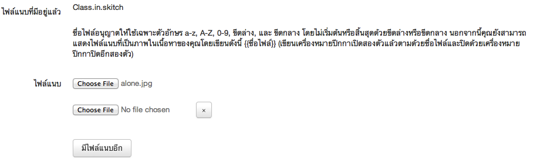

=============
สำหรับผู้เรียน
=============

ผู้เรียนสามารถอ่านรายละเอียดชั้นเรียนแต่ละชั้นเพิ่มเติมได้ที่ :ref:`view-class-detail-form` หลังจากที่ได้ผ่านการอนุมัติเข้าชั้นเรียนจากผู้สอนของชั้นเรียนนั้นๆ ได้

.. _join-class-section:

เข้าร่วมชั้นเรียน*
==============

ผู้สอนจะเป็นผู้บอกที่อยู่เว็บ (web address) ของชั้นเรียนให้แก่ท่าน หลังจากท่านรู้ที่อยู่เว็บของชั้นเรียน ให้ท่านไปยังหน้าเว็บนั้นเพื่อกดปุ่ม "เข้าร่วมชั้นเรียน" หลังจากท่านกดแล้ว ระบบจะแจ้งผู้สอนผ่านอีเมล ซึ่งหลังจากผู้สอนอนุมัติคำขอของท่าน ท่านจะเป็นผู้เรียนของชั้นเรียนนั้นทันที

.. _join-class-form:

  
  แบบฟอร์มการเข้าร่วมชั้นเรียน
  
เมื่อผู้เรียนขออนุมัติเข้าร่วมชั้นเรียนแล้ว ส่วนของผู้สอนจะปรากฏข้อมูลของผู้ขอเข้าร่วมชั้นเรียนในหน้าชั้นเรียนของฉัน 

อ่านบันทึกการเรียนรู้ของเพื่อนร่วมชั้นเรียน*
=======================================

ผู้เรียนสามารถอ่านบันทึกการเรียนรู้ ได้ตามขั้นตอนดังต่อไปนี้

  #. เข้าไปที่หน้าหลักของผู้เรียน เลือกบันทึกการเรียนรู้
  #. ในส่วนของบันทึกการเรียนรู้ เลือกคลิกบันทึกที่ต้องการ หากในหน้าที่แสดงผลปัจจุบันไม่มีบันทึกดังกล่าว สามารถกดปุ่ม "บันทึกการเรียนรู้ทั้งหมด'' จะปรากฏหน้าบันทึกการเรียนรู้ทั้งหมดแสดงขึ้นมา ตามวันที่บันทึกข้อมูลนั้น
  #. จากนั้นให้คลิกเลือกบันทึกที่ต้องการ
  #. สังเกตส่วนของบันทึกการเรียนรู้ที่เกิดขึ้นตลอดการสอนที่ถูกสร้างขึ้นทั้งที่เป็นข้อมูลส่วนตัวและผู้เรียนในชั้นเรียน ซึ่งหากต้องการให้แสดงบันทึกการเรียนรู้ทั้งหมด สามารถกดปุ่ม "บันทึกการเรียนรู้ทั้งหมด'' เพื่อเปิดหน้าแสดงรายการบันทึกการเรียนรู้ทั้งหมด

อ่านข่าวประกาศ*
===============

ผู้เรียนสามารถอ่านบันทึกการเรียนรู้ ได้ตามขั้นตอนดังต่อไปนี้

  #. เข้าไปที่หน้าหลักของผู้เรียน เลือกบันทึกการเรียนรู้
  #. ในส่วนของบันทึกการเรียนรู้ เลือกคลิกบันทึกที่ต้องการ หากในหน้าที่แสดงผลปัจจุบันไม่มีบันทึกดังกล่าว สามารถกดปุ่ม "บันทึกการเรียนรู้ทั้งหมด'' จะปรากฏหน้าบันทึกการเรียนรู้ทั้งหมดแสดงขึ้นมา ตามวันที่บันทึกข้อมูลนั้น
  #. จากนั้นให้คลิกเลือกบันทึกที่ต้องการ
  #. สังเกตส่วนของบันทึกการเรียนรู้ที่เกิดขึ้นตลอดการสอนที่ถูกสร้างขึ้นทั้งที่เป็นข้อมูลส่วนตัวและผู้เรียนในชั้นเรียน ซึ่งหากต้องการให้แสดงบันทึกการเรียนรู้ทั้งหมด สามารถกดปุ่ม "บันทึกการเรียนรู้ทั้งหมด'' เพื่อเปิดหน้าแสดงรายการบันทึกการเรียนรู้ทั้งหมด

อ่านเอกสารการสอน*
===================

ผู้เรียนสามารถอ่านเอกสารการสอน ได้ตามขั้นตอนดังต่อไปนี้

  #. เข้าไปที่หน้าหลักของผู้เรียน เลือกเอกสารการสอน
  #. ในส่วนของเอกสารการสอน เลือกคลิกเอกสารที่ต้องการ หากในหน้าที่แสดงผลปัจจุบันไม่มีเอกสารดังกล่าว สามารถกดปุ่ม "เอกสารการสอนทั้งหมด'' จะปรากฏหน้าเอกสารการสอนทั้งหมดแสดงขึ้นมา ตามวันที่บันทึกข้อมูลนั้น
  #. จากนั้นให้คลิกเลือกเอกสารที่ต้องการ
  #. สังเกตส่วนของเอกสารการสอนที่เกิดขึ้นตลอดการสอนที่ถูกสร้างขึ้นทั้งที่เป็นข้อมูลส่วนตัวและผู้เรียนในชั้นเรียน ซึ่งหากต้องการให้แสดงเอกสารการสอนทั้งหมด สามารถกดปุ่ม "เอกสารการสอนทั้งหมด'' เพื่อเปิดหน้าแสดงรายการเอกสารการสอนทั้งหมด

ใช้งานกระดานข้อความ*
=====================

ผู้เรียนสามารถอ่านกระดานข้อความ ได้ตามขั้นตอนดังต่อไปนี้

  #. เข้าไปที่หน้าหลักของผู้เรียน เลือกกระดานข้อความ
  #. ในส่วนของกระดานข้อความ เลือกคลิกข้อความที่ต้องการ หากในหน้าที่แสดงผลปัจจุบันไม่มีข้อความดังกล่าว สามารถกดปุ่ม "กระดานข้อความทั้งหมด'' จะปรากฏหน้ากระดานข้อความทั้งหมดแสดงขึ้นมา ตามวันที่บันทึกข้อมูลนั้น
  #. จากนั้นให้คลิกเลือกข้อความที่ต้องการ
  #. สังเกตส่วนของกระดานข้อความที่เกิดขึ้นตลอดการสอนที่ถูกสร้างขึ้นทั้งที่เป็นข้อมูลส่วนตัวและผู้เรียนในชั้นเรียน ซึ่งหากต้องการให้แสดงกระดานข้อความทั้งหมด สามารถกดปุ่ม "กระดานข้อความทั้งหมด'' เพื่อเปิดหน้าแสดงรายการกระดานข้อความทั้งหมด

สร้างหัวข้อสนทนาใหม่*
---------------------

ผู้เรียนที่อยู่ในชั้นเรียนสามารถเพิ่มหัวข้อสนทนาใหม่ได้ เพื่อใช้ในชั้นเรียนตามขั้นตอนดังต่อไปนี้

  #. เข้าไปที่ชั้นเรียนของฉัน เลือกชั้นเรียนที่ต้องการเพิ่มหัวข้อสนทนา
  #. ในส่วนของเอกสารการสอน กดปุ่ม "เพิ่มหัวข้อใหม่" จะปรากฏแบบฟอร์มเพิ่มหัวข้อสนทนาใหม่แสดงขึ้นมา ดังรูป :ref:`create-class-discussion-form` หรือ กดปุ่ม "หัวข้อสนทนาทั้งหมด" แล้วจึงกดปุ่ม "เพิ่มหัวข้อใหม่" ตามลำดับ
  #. กรอกหัวข้อที่ต้องการสนทนาที่ใช้ในชั้นเรียน ในช่องหัวข้อ*
  #. กรอกรายละเอียดในช่องเนื้อหา* เพื่ออธิบายรายละเอียดการสนทนาที่เพิ่มใหม่ ซึ่งสามารถใช้เครื่องมือจัดการข้อความ :ref:`word-tools-section` ช่วยในการจัดรูปแบบ
  #. คลิกเครื่องหมายหน้าหัวข้อ ส่งอีเมล์เพื่อแจ้งผู้เรียนทั้งหมด เพื่อส่งอีเมล์แจ้งรายละเอียดเกี่ยวกับการสนทนาในครั้งนี้ให้กับผู้เรียนทั้งหมดทราบ
  #. เมื่อกรอกรายละเอียดต่างๆ แล้ว กดปุ่ม "สร้าง" เพื่อบันทึกหัวข้อสนทนาสำหรับชั้นเรียน และเมื่อสร้างสำเร็จแล้วจะปรากฏข้อความ "หัวข้อสนทนาสร้างแล้ว" แสดงขึ้นมา
  #. จากนั้นสามารถเพิ่มไฟล์แนบ ได้ตามขั้นตอน :ref:`create-attached-file-discussion-section` 
  #. และเพิ่มความเห็นใหม่ ได้ตามขั้นตอน :ref:`opinion-section`

  *ตรวจสอบการแสดงผลได้จากส่วนเอกสารการสอนของชั้นเรียนของฉัน* :ref:`view-class-detail-section` 

เพิ่มไฟล์แนบในหัวข้อสนทนา*
--------------------------

กรณีต้องการแนบไฟล์เพื่อใช้ในหัวข้อสนทนา สามารถทำตามขั้นตอนดังต่อไปนี้ 

  #. เปิดหน้าหลักของชั้นเรียน แล้วเข้าสู่รายการหัวข้อสนทนาที่ต้องการ
  #. กดปุ่ม "เพิ่มไฟล์แนบ" จากนั้นกดปุ่ม "Choose File" เพื่อเลือกไฟล์จากทึ่เก็บไฟล์นั้น โดยไม่จำกัดประเภทไฟล์ที่แนบและการแนบไฟล์แต่ละครั้ง สามารถแนบไฟล์ได้ครั้งละ 1 ไฟล์
  #. เมื่อแนบไฟล์ต้องการแล้ว กดปุ่ม "เพิ่มไฟล์แนบ" เพื่อบันทึกไฟล์ที่แนบในหัวข้อสนทนานั้น และเมื่อสำเร็จแล้วจะปรากฏข้อความ "ไฟล์ถูกเพิ่มแล้ว" แสดงขึ้นมา
  #. และสามารถเพิ่มไฟล์แนบได้อีก โดยทำตามขั้นตอนข้อที่ 2 ตามลำดับ
  
***ข้อจำกัดของไฟล์แนบใน ClassStart.org มีดังนี้***
  
        *ชื่อไฟล์อนุญาตให้ใช้เฉพาะตัวอักษร a-z, A-Z, 0-9, ขีดล่าง, และ ขีดกลาง โดยไม่เริ่มต้นหรือสิ้นสุดด้วยขีดล่างหรือขีดกลาง นอกจากนี้คุณยังสามารถแสดงไฟล์แนบที่เป็นภาพในเนื้อหาของคุณโดยเขียนดังนี้ {{ชื่อไฟล์}} (เขียนเครื่องหมายปีกกาเปิดสองตัวแล้วตามด้วยชื่อไฟล์และปิดด้วยเครื่องหมายปีกกาปิดอีกสองตัว)*

แก้ไขไฟล์แนบในหัวข้อสนทนา*
---------------------------

  #. เปิดหน้าหลักของชั้นเรียน แล้วเข้าสู่รายการหัวข้อสนทนาที่ต้องการ
  #. ทำตามขั้นตอนการลบไฟล์แนบในหัวข้อสนทนา :ref:`delete-attached-file-discussion-section` เพื่อลบไฟล์ที่แนบแล้วออก
  #. แล้วทำตามขั้นตอนเพิ่มไฟล์แนบในหัวข้อสนทนา :ref:`create-attached-file-discussion-section` เพื่อแนบไฟล์ใหม่แทนไฟล์เดิม

ลบไฟล์แนบในหัวข้อสนทนา*
-------------------------
 
  #. เปิดหน้าหลักของชั้นเรียน แล้วเข้าสู่รายการหัวข้อสนทนาที่ต้องการ
  #. กดปุ่ม "ลบ" ด้านข้างของไฟล์ที่แนบแต่ละไฟล์
  #. จะปรากฏข้อความ "การกระทำนี้จะแก้ไขไม่ได้ คุณแน่ใจหรือไม่ว่าต้องการลบไฟล์แนบนี้?" เพื่อยืนยันการลบไฟล์ 
  
      - หากต้องการลบ กดปุ่ม "OK"
      - หากต้องการยกเลิกการลบ กดปุ่ม "Cancel" 
  
  #. เมื่อกดปุ่มยืนยันความต้องการแล้ว ระบบจะดำเนินการตามที่ยืนยัน
  
      - หากกดปุ่ม "OK"  จะปรากฏข้อความ "Uploaded File ได้ถูกทำการลบแล้วสำเร็จแล้ว"
      - หากกดปุ่ม "Cancel" จะกลับสู่หน้ารายละเอียดหัวข้อสนทนานั้น 
 
 

เพิ่มความเห็น*
-------------

 #. เปิดหน้าหลักของชั้นเรียน แล้วเข้าสู่รายการหัวข้อสนทนาที่ต้องการ
 #. กรอกความคิดเห็นในช่องว่าง เพื่อแสดงความคิดเห็นต่างๆ เกี่ยวกับการสนทนาที่เลือก โดยสามารถใช้เครื่องมือจัดการข้อความช่วยจัดรูปแบบได้ :ref:`word-tools-section`
 #. หากต้องการแนบไฟล์ สามารถแนบไฟล์ได้ตามขั้นตอน :ref:`create-attached-file-opinion`
 #. กดปุ่ม "สร้าง" เพื่อบันทึกความคิดเห็น เมื่อสำเร็จจะปรากฏข้อความ "ความเห็นถูกเพิ่มแล้ว"

เพิ่มไฟล์แนบในความเห็น*
-----------------------

  #. เปิดหน้าหลักของชั้นเรียน แล้วเข้าสู่รายการหัวข้อสนทนาที่ต้องการ
  #. กรอกความคิดเห็นในหัวข้อสนทนา
  #. กดปุ่ม "Browse…" เพื่อเลือกไฟล์ที่มีแล้ว แนบใส่ในความคิดเห็นที่แสดงในหัวข้อสนทนา 
  #. เมื่อได้ไฟล์ตามที่เก็บไว้ ให้กดปุ่ม "open" เพื่ออัพโหลดไฟล์ขึ้นไปใส่ความคิดเห็น 
  #. กดปุ่ม "สร้าง" เพื่อบันทึกข้อมูล
  #. เมื่อเสร็จแล้วจะปรากฏข้อความ "ความเห็นถูกเพิ่มแล้ว" แสดงขึ้นมา

ส่งคำตอบแบบฝึกหัด (การบ้าน)*
==============================

ผู้เรียนสามารถตรวจสอบแบบฝึกหัดได้จากหน้าหลักของผู้เรียนที่ผู้เรียนได้ผ่านการอนุมัติเข้าชั้นเรียนแล้ว ในส่วนของแบบฝึกหัด

.. _create-answer-assignment-section:

ส่งคำตอบ*
---------

ผู้เรียนสามารถส่งคำตอบของแบบฝึกหัด ตามขั้นตอนดังต่อไปนี้

  #. เข้าไปที่ชั้นเรียนของฉัน เลือกชั้นเรียนที่ต้องการส่งคำตอบของแบบฝึกหัดนั้น
  #. ในส่วนของแบบฝึกหัด เลือกคลิกรายการแบบฝึกหัดที่ต้องการส่งคำตอบ หากในหน้าแสดงผลปัจจุบันไม่มีแบบฝึกหัดดังกล่าว สามารถกดปุ่ม "แบบฝึกหัดทั้งหมด" จะปรากฏรายการแบบฝึกหัดทั้งหมดของชั้นเรียนนั้นแสดงขึ้นมา จากนั้นให้คลิกเลือกแบบฝึกหัดที่ต้องการส่งคำตอบ
  #. เมื่อเข้าสู่รายละเอียดของแบบฝึกหัดนั้นแล้ว ให้กดปุ่ม "ส่งคำตอบ" ทางด้านซ้ายในส่วนตัวเลือกสำหรับผู้เรียน เพื่อใส่รายละเอียดของคำตอบและแนบไฟล์ (หากมี)  
  #. กรอกรายละเอียดที่ต้องการแก้ไขหรือเพิ่มเติมของแบบฝึกหัดนั้น
  
      - ใส่รายละเอียดของคำตอบในช่องเนื้อหา
      - แนบไฟล์คำตอบ (หากมี)
      
  #. กดปุ่ม "สร้าง" เพื่อบันทึกคำตอบของแบบฝึกหัด เมื่อบันทีึกแล้วจะปรากฏข้อความ "คำตอบได้ถูกส่งไปแล้ว" แสดงขึ้นมา
  

.. _commit-answer-form:

  
  แบบฟอร์มการส่งคำตอบ

.. _edit-answer-assignment-section:

แก้ไขคำตอบ*
-----------

ผู้เรียนสามารถปรับเปลี่ยนรายละเอียดของแบบฝึกหัด ตามขั้นตอนดังต่อไปนี้

  #. เข้าไปที่ชั้นเรียนของฉัน เลือกชั้นเรียนที่มีรายการของแบบฝึกหัดนั้น
  #. ในส่วนของแบบฝึกหัด เลือกคลิกรายการที่ต้องการส่งคำตอบ หากในหน้าที่แสดงผลปัจจุบันไม่มีแบบฝึกหัดดังกล่าว สามารถกดปุ่ม "แบบฝึกหัดทั้งหมด" จะปรากฏรายการแบบฝึกหัดทั้งหมดของชั้นเรียนนั้นแสดงขึ้นมา จากนั้นให้คลิกเลือกแบบฝึกหัดที่ต้องการ
  #. เมื่อเข้าสู่รายละเอียดของแบบฝึกหัดนั้นแล้ว ให้กดปุ่ม "ดูคำตอบที่ส่งไปแล้ว" ทางด้านซ้ายในส่วนตัวเลือกสำหรับผู้เรียน เพื่อใส่รายละเอียดของคำตอบและแนบไฟล์ (หากมี)  
  #. กรอกรายละเอียดที่ต้องการแก้ไขหรือเพิ่มเติมของแบบฝึกหัดนั้น
  
      - ใส่รายละเอียดของคำตอบในช่องเนื้อหา
      - แนบไฟล์คำตอบ (หากมี)

  #. กดปุ่ม "จัดเก็บ" เพื่อบันทึกคำตอบที่แก้ไข เมื่อบันทีึกแล้วจะปรากฏข้อความ "คำตอบได้แก้ไขแล้ว" แสดงขึ้นมา
  

เพิ่มไฟล์แนบในคำตอบ*
---------------------

กรณีที่ผู้เรียนมีไฟล์เอกสารอยู่แล้ว สามารถแนบไฟล์เพื่อส่งคำตอบของแบบฝึกหัดแต่ละชุด ตามขั้นตอนดังต่อไปนี้ 

  #. เปิดหน้าหลักของชั้นเรียน แล้วเข้าสู่รายการแบบฝึกหัดที่ต้องการ โดยหากต้องการสร้างคำตอบใหม่ สามารถทำตามขั้นตอน :ref:`create-answer-assignment-section` ได้ตามลำดับ ส่วนกรณีที่มีคำตอบแล้ว สามารถทำตามขั้นตอนการแก้ไขคำตอบ :ref:`edit-answer-assignment-section` เพื่อเพิ่มไฟล์แนบ
  #. การแนบไฟล์นั้นให้กดปุ่ม "เพิ่มไฟล์แนบ" ทางด้านล่างซ้ายในส่วนของโจทย์ จากนั้นระบบจะแสดงแบบฟอร์ม :ref:`std-attached-files-form` เพื่อเพิ่มไฟล์แนบแสดงขึ้นมา
  #. ให้กดปุ่ม "Choose File" เพื่อเลือกไฟล์จากทึ่เก็บไฟล์นั้น โดยไม่จำกัดประเภทไฟล์ที่แนบและการแนบไฟล์แต่ละครั้ง สามารถแนบไฟล์ได้ครั้งละ 1 ไฟล์ 
  #. จากนั้นให้กดปุ่ม "เพ่ิมไฟล์แนบ" เพื่ออัพโหลดไฟล์ดัวกล่าวแนบประกอบในการส่งคำตอบชุดนั้น และเมื่อสำเร็จแล้วจะปรากฏข้อความ "ไฟล์ถูกเพิ่มแล้ว" แสดงขึ้นมา 
  #. หากต้องการแนบไฟล์เพิ่มเติม ให้กดปุ่ม "เพิ่มไฟล์แนบ" ทำตามข้อ แล้วทำตามขั้นตอนที่ 2. เป็นต้นไปตามลำดับ 

***ข้อจำกัดของไฟล์แนบใน ClassStart.org มีดังนี้***
  
        *ชื่อไฟล์อนุญาตให้ใช้เฉพาะตัวอักษร a-z, A-Z, 0-9, ขีดล่าง, และ ขีดกลาง โดยไม่เริ่มต้นหรือสิ้นสุดด้วยขีดล่างหรือขีดกลาง นอกจากนี้คุณยังสามารถแสดงไฟล์แนบที่เป็นภาพในเนื้อหาของคุณโดยเขียนดังนี้ {{ชื่อไฟล์}} (เขียนเครื่องหมายปีกกาเปิดสองตัวแล้วตามด้วยชื่อไฟล์และปิดด้วยเครื่องหมายปีกกาปิดอีกสองตัว)*

.. _std-attached-files-form:

  
  ส่วนการแสดงผลเกี่ยวกับไฟล์แนบ

แก้ไขไฟล์แนบในคำตอบ*
----------------------

  #. เปิดหน้าหลักของชั้นเรียน แล้วเข้าสู่รายการแบบฝึกหัดที่ต้องการ
  #. ทำตามขั้นตอนการลบไฟล์แนบในแบบฝึกหัด :ref:`delete-attached-files-assignment-section` เพื่อลบไฟล์ที่แนบแล้วออก
  #. แล้วทำตามขั้นตอนเพิ่มไฟล์แนบในแบบฝึกหัด :ref:`create-attached-files-assignment-section` เพื่อแนบไฟล์ใหม่แทนไฟล์เดิม

ลบไฟล์แนบในคำตอบ*
--------------------

กรณีที่ผู้เรียนต้องการลบไฟล์ที่แนบแล้วในคำตอบ สามารถตามขั้นตอนดังต่อไปนี้ 

  #. เปิดหน้าหลักของชั้นเรียน แล้วคลิกเข้าสู่รายการแบบฝึกหัดที่ต้องการ
  #. สามารถกดปุ่ม "ลบ" ทางด้านข้างของแต่ละไฟล์ 
  #. จะปรากฏข้อความ "การกระทำนี้จะแก้ไขไม่ได้ คุณแน่ใจหรือไม่ว่าต้องการลบไฟล์แนบนี้?" เพื่อยืนยันการลบไฟล์ 
  
      - หากต้องการลบ กดปุ่ม "OK"
      - หากต้องการยกเลิกการลบ กดปุ่ม "Cancel" 
  
  #. เมื่อกดปุ่มยืนยันความต้องการแล้ว ระบบจะดำเนินการตามที่ยืนยัน
  
      - หากกดปุ่ม "OK"  จะปรากฏข้อความ "ไฟล์ถูกลบแล้ว"
      - หากกดปุ่ม "Cancel" จะกลับสู่หน้ารายละเอียดแบบฝึกหัดนั้น 
  
  *ตรวจสอบการแสดงผลได้จากส่วนแบบฝึกหัดของชั้นเรียนของฉัน* :ref:`view-class-detail-section` 

ส่งคำตอบงานกลุ่ม
-----------------

สำหรับแบบฝึกหัดที่เป็นงานกลุ่มนั้น ผู้เรียนในกลุ่มที่เป็นตัวแทนกลุ่มเท่านั้นที่สามารถส่งคำตอบได้ ผู้เรียนในกลุ่มคนอื่นจะไม่สามารถส่งคำตอบได้ สำหรับตัวแทนกลุ่ม ขั้นตอนการส่งคำตอบงานกลุ่มจะเหมือนกับวิธีการในการการส่งคำตอบงานเดี่ยว

ผู้เรียนในกลุ่มที่ไม่ได้เป็นตัวแทนกลุ่ม แม้จะไม่สามารถส่งคำตอบเองได้ แต่ก็สามารถตรวจสอบได้ว่าตัวแทนกลุ่มได้ส่งคำตอบหรือยัง โดยเข้าไปยังหน้าของแบบฝึกหัดที่เป็นงานกลุ่มนั้น ระบบจะแจ้งว่าคำตอบสำหรับแบบฝึกหัดนี้ของกลุ่มที่ผู้เรียนเป็นสมาชิกอยู่ได้ส่งแล้วหรือยัง