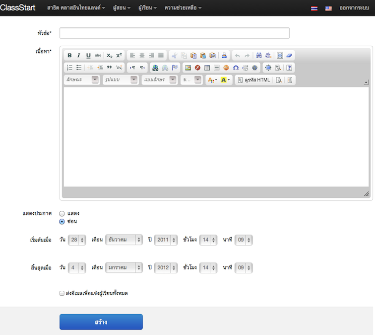

=============
สำหรับผู้สอน
=============

กำลังจัดทำ

จัดการชั้นเรียน*
==============
มีการทำงานให้เลือกดังนี้ 
ชั้นเรียนที่ฉันสอน
ชั้นเรียนที่ฉันช่วยสอน

หัวข้อสนทนาในชั้นเรียนที่ฉันสอน
หัวข้อสนทนาในชั้นเรียนที่ฉันช่วยสอน

สร้างชั้นเรียนใหม่

สร้างชั้นเรียน*
------------
โดยคลิ๊กเลือกที่เมนูผู้สอน เลือก สร้างชั้นเรียนใหม่

จะได้ แบบฟอร์มการสร้างชั้นเรียนใหม่ ซึ่งผู้สอนระบุรายละเอียดต่างๆ ตามหัวข้อที่ีมีเครื่องหมายดอกจัน (*) อยู่หลังหัวข้อเป็นหัวข้อที่ต้องกรอก ส่วนหัวข้อที่ไม่มีเครื่องหมายดอกจันไม่จำเป็นต้องกรอก แต่สมาชิกควรกรอกข้อมูลให้ครบทุกหัวข้อเพื่อความสมบูรณ์ของข้อมูลชั้นเรียนที่สร้างขึ้น

.. _create-class-form:

.. figure:: _static/teachers/create_class_form.png
  :align: center
  :scale: 60
  
  แบบฟอร์มการสร้างชั้นเรียน

ชื่อชั้นเรียน
  ใส่ชื่อชั้นเรียนที่ต้องการสร้าง
คำอธิบายชั้นเรียน 
  ใส่รายละเอียดต่างๆ ที่อธิบายถึงชั้นเรียนที่สร้างขึ้น โดยสามารถใช้เครื่องมือจัดการข้อความที่มีอยู่ได้เช่นเดียวกับการทำงานของโปรแกรมพิมพ์งานทั่วไป เช่น Microsoft Word หรือหากไม่ต้องการใช้เครื่องมือช่วยจัดการ สามารถกดปุ่ม ปิดเครื่องมือจัดการข้อความเพื่อปิดเครื่องมือจัดการข้อความ :ref:`word_tools_section` ต่างๆ ได้ 
เมื่อระบุรายละเอียดต่างๆ เสร็จสิ้นแล้วให้กดปุ่ม สร้าง 
หากดำเนินการสำเร็จ จะมีข้อความ "ชั้นเรียนถูกสร้างแล้ว" แสดงขึ้นมา
และสามารถตรวจสอบชั้นเรียนที่สร้างแล้วได้ โดยการคลิกไปที่เมนูตามขั้นตอนต่อไปนี้ 
#คลิกที่เมนูผู้สอน เลือกชั้นเรียนที่ชั้นสอน
#ระบบจะแสดงชั้นเรียนที่ผู้สอนได้สร้างไว้แล้วขึ้นมาตามลำดับของวันที่สร้าง

แก้ไขชั้นเรียน*
------------
เมื่อผู้สอนได้สร้างชั้นเรียนต่างๆ แล้ว หากต้องการเพิ่มเติมหรือแก้ไขรายละเอียดชั้นเรียนที่สร้างไว้ สามารถทำได้โดยการคลิกไปที่เมนูตามขั้นตอนต่อไปนี้
#คลิกที่เมนูผู้สอน เลือกชั้นเรียนที่ชั้นสอน
#ระบบจะแสดงชั้นเรียนที่ผู้สอนได้สร้างไว้แล้วขึ้นมาตามลำดับของวันที่สร้าง
#คลิกเลือกชั้นเรียนที่ต้องการแก้ไข โดยการกดปุ่ม "แก้ไข" ทางด้านขวามือของชื่อชั้นเรียนนั้นๆ หรือสามารถคลิกไปที่ชื่อชั้นเรียนนั้น แล้วกดปุ่ม "แก้ไข" ในส่วนของตัวเลือกสำหรับผู้สอน
#เมื่อระบบแสดงหน้าแก้ไขชั้นเรียนขึ้นมาแล้ว ผู้สอนสามารถแก้ไขรายละเอียดของชั้นเรียนต่างๆ ได้ตามต้องการ (โดยหัวข้อที่ีมีเครื่องหมายดอกจัน (*) อยู่หลังหัวข้อเป็นหัวข้อที่ต้องกรอก) 
#เมื่อแก้ไขรายละเอียดชั้นเรียนเสร็จแล้ว ให้กดปุ่ม "จัดเก็บ" เพื่อบันทึกข้อมูลชั้นเรียนที่แก้ไขในระบบ
#หากดำเนินการสำเร็จ จะมีข้อความแสดงขึ้นมาว่า "ชั้นเรียนได้ถูกแก้ไขแล้ว" 

ดูชั้นเรียนที่สอน*
---------------
เมื่อผู้สอนได้สร้างชั้นเรียนต่างๆ แล้ว หากต้องการตรวจสอบรายละเอียดชั้นเรียนที่สร้างไว้ สามารถทำได้ 2 วิธี ดังนี้ 
#วิธีที่ 1 คลิกเลือกจากเมนู
#วิธีที่ 2 คลิกเลือกจากหน้าหลัก

ซึ่งมีขั้นตอนต่อไปนี้
#หากเลือกวิธีที่ 1 ให้คลิกที่เมนูผู้สอน เลือกชั้นเรียนที่ชั้นสอน
#หากเลือกวิธีที่ 2 ให้คลิกที่เมนูสมาชิก เลือกหน้าหลัก และกดปุ่ม "ชั้นเรียนที่ฉันสอน"
#ระบบจะแสดงชั้นเรียนที่ผู้สอนได้สร้างไว้แล้วขึ้นมาตามลำดับของวันที่สร้าง
กำลังจัดทำ

การอนุมัตินักเรียนเข้าสู่ชั้นเรียน*
-----------------------------

กำลังจัดทำ

.. _approve-class-form:

.. figure:: _static/teachers/approve_class_form.png
  :align: center
  :scale: 60
  
  ภาพประกอบการอนุมัตินักเรียนเข้าสู่ชั้นเรียน

จัดการข่าวประกาศ*
=================

กำลังจัดทำ

เพิ่มข่าวประกาศ
---------------

กำลังจัดทำ

.. _create-annoucement-form:

  
  แบบฟอร์มการเพิ่มข่าวประกาศ

แก้ไขข่าวประกาศ*
----------------

กำลังจัดทำ

ลบข่าวประกาศ*
--------------

กำลังจัดทำ

จัดการเอกสารการสอน*
=====================

กำลังจัดทำ

เพิ่มเอกสารการสอน*
-------------------

กำลังจัดทำ

.. _create-class-material-form:

.. figure:: _static/teachers/create_class_material.png
  :align: center
  :scale: 60
  
  แบบฟอร์มการเพิ่มเอกสารการสอน

แก้ไขเอกสารการสอน*
--------------------

กำลังจัดทำ

.. _edit-class-material-form:

.. figure:: _static/teachers/edit_class_material_form.png
  :align: center
  :scale: 60
  
  แบบฟอร์มการแก้ไขเอกสารการสอน

เพิ่มไฟล์แนบในเอกสารการสอน*
-----------------------------

กำลังจัดทำ

แก้ไขไฟล์แนบในเอกสารการสอน*
-----------------------------

กำลังจัดทำ

ลบไฟล์แนบในเอกสารการสอน*
----------------------------

กำลังจัดทำ

จัดการกระดานข้อความ*
=====================

กำลังจัดทำ

.. _discussion-section:

สร้างหัวข้อสนทนาใหม่*
---------------------

กำลังจัดทำ

.. _create-class-discussion-form:

.. figure:: _static/teachers/create_class_discussion_form.png
  :align: center
  :scale: 60
  
  แบบฟอร์มการสร้างหัวข้อสนทนาในกระดานข้อความ

เพิ่มไฟล์แนบในหัวข้อสนทนา*
--------------------------

กำลังจัดทำ

แก้ไขไฟล์แนบในหัวข้อสนทนา*
---------------------------

กำลังจัดทำ

ลบไฟล์แนบในหัวข้อสนทนา*
-------------------------

กำลังจัดทำ

.. _opinion-section:
เพิ่มความเห็น*
-------------

กำลังจัดทำ

.. _create-class-opinion-form:

.. figure:: _static/teachers/create_class_opinion_form.png
  :align: center
  :scale: 60
  
  แบบฟอร์มการเพิ่มความคิดเห็น

เพิ่มไฟล์แนบในความเห็น*
-----------------------

กำลังจัดทำ

ปิดหัวข้อสนทนา*
---------------

กำลังจัดทำ

อ่านบันทึกการเรียนรู้ของชั้นเรียน*
==============================

กำลังจัดทำ

จัดการกลุ่มผู้เรียน*
================

กำลังจัดทำ

เพิ่มกลุ่มผู้เรียน*
--------------

กำลังจัดทำ

.. _create-group-class-form:

.. figure:: _static/teachers/create_group_class_form.png
  :align: center
  :scale: 60
  
  แบบฟอร์มการสร้างกลุ่มผู้เรียน

แก้ไขกลุ่มผู้เรียน*
---------------

กำลังจัดทำ

ลบกลุ่มผู้เรียน*
-------------

กำลังจัดทำ

เพิ่มสมาชิกในกลุ่มผู้เรียน*
-----------------------

กำลังจัดทำ

.. _create-group-class-member-form:

.. figure:: _static/teachers/create_group_class_member_form.png
  :align: center
  :scale: 60
  
  แบบฟอร์มการเพิ่มสมาชิกในกลุ่มผู้เรียน

ลบสมาชิกจากกลุ่มผู้เรียน*
-----------------------

กำลังจัดทำ

แก้ไขตัวแทนกลุ่ม*
----------------

กำลังจัดทำ

เพิ่มผู้ช่วยสอน*
__________

กำลังจัดทำ

จัดการแบบฝึกหัด (การบ้าน)*
==========================

กำลังจัดทำ

สร้างแบบฝึกหัดใหม่*
------------------

กำลังจัดทำ

.. _create-class-assignment-form:

.. figure:: _static/teachers/create_class_assignment.png
  :align: center
  :scale: 60
  
  แบบฟอร์มการสร้างแบบฝึกหัด

แก้ไขแบบฝึกหัด*
---------------

กำลังจัดทำ

เพิ่มไฟล์แนบในแบบฝึกหัด*
------------------------

กำลังจัดทำ

แก้ไขไฟล์แนบในแบบฝึกหัด*
------------------------

กำลังจัดทำ

ลบไฟล์แนบในแบบฝึกหัด*
-----------------------

กำลังจัดทำ

ปิดแบบฝึกหัด*
-------------

กำลังจัดทำ

ตรวจให้คะแนนแบบฝึกหัด*
------------------------

กำลังจัดทำ
s
.. _post-score-class-assignment-form:

.. figure:: _static/teachers/post_score_class_assignment.png
  :align: center
  :scale: 60
  
  แบบฟอร์มการให้คะแนนแบบฝึกหัด
