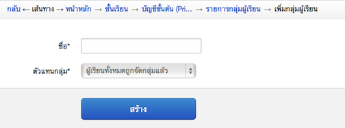
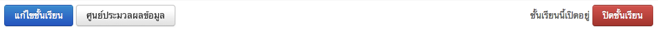

.. _teachers-function:

=============
สำหรับผู้สอน
=============

จัดการชั้นเรียน
==============

ผู้สอนเป็นผู้ดำเนินการหลักในส่วนนี้ โดยเริ่มตั้งแต่การสร้างชั้นเรียน เพื่อให้ผู้เรียนได้ทำการขออนุมัติเข้าเรียนในชั้นเรียนที่ต้องการ โดยผู้สอนจะต้องทำการอนุมัติผู้เข้าเรียนในชั้นเรียนก่อน จึงจะสามารถจัดการผู้เรียน ไม่ว่าจะเป็นการแบ่งกลุ่ม ประกาศข่าว พูดคุย ปรึกษาผ่านหัวข้อสนทนา ให้คะแนนพร้อมทั้งอธิบายและแจกแจงเอกสารการสอนและแบบฝึกหัดต่างๆ เพื่อให้ผู้เรียนได้ศึกษาผ่านทางชั้นเรียนออนไลน์

สร้างชั้นเรียน
------------

  #. คลิกเลือกที่เมนูผู้สอนเลือก "สร้างชั้นเรียนใหม่" จะได้แบบฟอร์มการสร้างชั้นเรียนใหม่ :ref:`create-class-form` ซึ่งผู้สอนระบุรายละเอียดต่างๆ ตามหัวข้อที่ีมีเครื่องหมายดอกจัน (*) อยู่หลังหัวข้อเป็นหัวข้อที่ต้องกรอก ส่วนหัวข้อที่ไม่มีเครื่องหมายดอกจันไม่จำเป็นต้องกรอก แต่สมาชิกควรกรอกข้อมูลให้ครบทุกหัวข้อเพื่อความสมบูรณ์ของข้อมูลชั้นเรียนที่สร้างขึ้น

    ชื่อชั้นเรียน
      ใส่ชื่อชั้นเรียนที่ต้องการสร้าง
       	
    คำอธิบายชั้นเรียน 
      ใส่รายละเอียดต่างๆ ที่อธิบายถึงชั้นเรียนที่สร้างขึ้น โดยสามารถใช้เครื่องมือจัดการข้อความที่มีอยู่ได้เช่นเดียวกับการทำงานของโปรแกรมพิมพ์งานทั่วไป เช่น Microsoft Word หรือหากไม่ต้องการใช้เครื่องมือช่วยจัดการ สามารถกดปุ่ม ปิดเครื่องมือจัดการข้อความเพื่อปิดเครื่องมือจัดการข้อความ :ref:`word-tools-section` ต่างๆ ได้ 

  #. เมื่อระบุรายละเอียดต่างๆ เสร็จสิ้นแล้วให้กดปุ่ม "สร้าง" 

  #. หากดำเนินการสำเร็จ จะมีข้อความ "ชั้นเรียนถูกสร้างแล้ว" แสดงขึ้นมาและสามารถตรวจสอบชั้นเรียนที่สร้างแล้วได้จากขั้นตอนการดูชั้นเรียนที่สอน :ref:`view-class-detail-section`  

.. _create-class-form:

.. figure:: _static/teachers/create_class_form.png
  :align: center
  :scale: 80
  
  แบบฟอร์มการสร้างชั้นเรียน

แก้ไขชั้นเรียน
-------------
เมื่อผู้สอนต้องการเพิ่มเติมหรือแก้ไขรายละเอียดชั้นเรียนที่สร้างไว้ได้ ตามขั้นตอนต่อไปนี้

  #. คลิกที่เมนูผู้สอน เลือกชั้นเรียนที่ฉันสอน
  #. ระบบจะแสดงชั้นเรียนที่ผู้สอนได้สร้างไว้แล้วขึ้นมาตามลำดับของวันที่สร้าง
  #. คลิกเลือกชั้นเรียนที่ต้องการแก้ไข โดยการกดปุ่ม "แก้ไข" ทางด้านขวามือของชื่อชั้นเรียนนั้นๆ หรือสามารถคลิกไปที่ชื่อชั้นเรียนนั้น แล้วกดปุ่ม "แก้ไข" ในส่วนของตัวเลือกสำหรับผู้สอน
  #. เมื่อระบบแสดงหน้าแก้ไขชั้นเรียนขึ้นมาแล้ว ผู้สอนสามารถแก้ไขรายละเอียดของชั้นเรียนต่างๆ ได้ตามต้องการ (โดยหัวข้อที่ีมีเครื่องหมายดอกจัน (*) อยู่หลังหัวข้อเป็นหัวข้อที่ต้องกรอก) 
  #. เมื่อแก้ไขรายละเอียดชั้นเรียนเสร็จแล้ว ให้กดปุ่ม "จัดเก็บ" เพื่อบันทึกข้อมูลชั้นเรียนที่แก้ไขในระบบ
  #. หากดำเนินการสำเร็จ จะมีข้อความแสดงขึ้นมาว่า "ชั้นเรียนได้ถูกแก้ไขแล้ว" 

.. _view-class-detail-section:

ดูชั้นเรียนที่สอน
---------------
เมื่อผู้สอนสร้างชั้นเรียนต่างๆ แล้ว หากต้องการตรวจสอบรายละเอียดชั้นเรียนที่สร้างไว้ สามารถทำได้ 3 วิธี ดังนี้ 

วิธีที่ 1
	คลิกเลือกจากเมนูผู้สอน จากนั้นเลือกชั้นเรียนที่ฉันสอน
	
วิธีที่ 2
	คลิกเลือกจากเมนูสมาชิก จากนั้นเลือกหน้าหลัก และกดปุ่ม "ชั้นเรียนของฉัน"
	
วิธีที่ 3
 	คลิกเลือกจากเมนูสมาชิก จากนั้นเลือกชั้นเรียนของฉัน
	
ระบบจะแสดงชั้นเรียนที่ผู้สอนได้สร้างไว้แล้วขึ้นมาตามลำดับของวันที่สร้าง จากนั้นให้คลิกเลือกที่ชื่อชั้นเรียนที่ฉันสอน เพื่อเข้าไปสู่ชั้นเรียนที่ต้องการ

รายละเอียดต่างๆ ในหน้าชั้นเรียน
--------------------------------
:ref:`view-class-detail-form` ประกอบไปด้วยส่วนต่างๆ ดังนี้ 

    รายละเอียดชั้นเรียน 
      ชื่อชั้นเรียน
  
    ที่อยู่เว็บ 
      แสดงที่อยู่ของเว็บไซต์ของชั้นเรียน
    
    ผู้สอน 
      รายชื่อผู้สอน และสามารถลิงค์เข้าไปในประวัติของผู้สอนได้
    
    สถานศึกษา 
      รายชื่อสถานศึกษาของชั้นเรียน
    
    ผู้ช่วยสอน : รายชื่อผู้ช่วยสอน   
      คลิกที่รายชื่อผู้ช่วยสอน จะปรากฏรายชื่อของผู้ช่วยสอนทั้งหมดของชั้นเรียนนั้น
    
    จำนวนผู้เรียน : รายชื่อผู้เรียน
      คลิกที่รายชื่อผู้เรียน จะปรากฏรายชื่อของผู้เรียนทั้งหมดของชั้นเรียนนั้น
    
    กลุ่มผู้เรียน : รายการกลุ่มผู้เรียน
      คลิกที่รายการกลุ่มผู้เรียน จะปรากฏรายการของกลุ่มผู้เรียนทั้งหมดของชั้นเรียนนั้น
        
    คำอธิบายชั้นเรียน
      รายละเอียดรายวิชาที่เปิดสอน
  
    ตัวเลือกสำหรับผู้สอน  :ref:`class-teachers-choice-section`
      แก้ไขรายละเอียดของชั้นเรียน และแสดงสถานะเปิด/ปิดของชั้นเรียน 
  
    ผู้ขอเข้าร่วมชั้นเรียน 
      รายชื่อผู้ขอเข้าร่วมชั้นเรียนขณะรอการอนุมัติจากผู้สอน/ผู้ช่วยสอน ซึ่งเมื่อได้รับการอนุมัติแล้วจะเรียกว่า "ผู้เรียน" แทน
  
    ข่าวประกาศ 
      รายการข่าวประกาศต่างๆ ของชั้นเรียนนั้น เพื่อแจ้งให้ผู้เรียนในชั้นเรียนทราบ
  
    คะแนนเก็บ
      รายละเอียดคะแนนของผู้เรียนในชั้นเรียน

    เอกสารการสอน 
      รายการเอกสารการสอนต่างๆ ทั้งแบบไฟล์แนบเพื่อประกอบการสอน วีดิโอคลิบ เอกสารออนไลน์ พร้อมอ้างถึงที่มาขอไฟล์อย่างชัดเจน
  
    แบบฝึกหัด 
      รายการแบบฝึกหัดสำหรับผู้เรียนในชั้นเรียน สามารถกำหนดระยะเวลาเพื่อการส่งคำตอบของผู้เรียน และผู้สอน/ผู้ช่วยสอน สามารถให้คะแนนแบบฝึกหัดต่างๆ ได้
  
    หัวข้อสนทนา(กระดานข้อความ) 
      กระดานข้อความสำหรับแสดงรายการสนทนาของชั้นเรียน เพื่อเปิดช่องทางการสื่อสารระหว่างผู้สอน  ผู้ช่วยสอนและผู้เรียนได้ทุกเวลาตามหัวข้อในการสนทนาที่กำหนดได้ด้วยตนเอง
    
    บันทึกการเรียนรู้ 
      รายการการเรียนรู้ต่างๆ ที่เกิดขึ้นในชั้นเรียนแต่ละครั้ง โดยผู้สอน ผู้ช่วยสอนและผู้เรียนสามารถบันทึกเพื่อกระจายความรู้ที่ได้รับได้ด้วยตนเอง และในชั้นเรียนทราบ

.. _view-class-detail-form:

  
  แบบฟอร์มแสดงรายละเอียดต่างๆ ของชั้นเรียน

.. _class-teachers-choice-section:

  
  ส่วนการแสดงผลของตัวเลือกสำหรับผู้สอน

.. _create-direct-class-student:

การเพิ่มผู้เรียน
==============

เมื่อผู้สอนสร้างชั้นเรียนแล้ว สามารถแจ้งให้ผู้ขอเข้าร่วมชั้นเรียนหรือผู้เรียนทำได้ 2 วิธี ดังนี้

วิธีที่ 1 
    บอกหน้าที่อยู่เว็บให้ผู้ขอเข้าเรียนทราบ 
    
วิธีที่ 2 
    เพิ่มผู้เรียนโดยตรง ซึ่งผู้สอนจะต้องทราบอีเมลของผู้ขอเข้าเรียน และผู้ขอเข้าเรียนจะต้องเป็นสมาชิกของเว็บไซต์ (http://www.class.in.th) แล้ว 

**วิธีที่ 1 บอกหน้าที่อยู่เว็บให้ผู้ขอเข้าเรียนทราบ**  ตามขั้นตอนดังต่อไปนี้

  #. เข้าไปที่ชั้นเรียนที่ฉันสอน จากนั้นให้กดเลือกที่ชื่อของชั้นเรียนสร้างแล้ว
  #. นำที่อยู่เว็บในช่องสี่เหลี่ยมที่แสดงในชั้นเรียนนั้นๆ แจ้งให้ผู้ขอเข้าร่วมชั้นเรียนทราบ เช่น 

  ::
  
      ตัวอย่างที่อยู่เว็บ
      ที่อยู่เว็บ:  http://www.class.in.th/classes/9999
        
  #. เมื่อผู้ขอเข้าร่วมชั้นเรียนได้ดำเนินการขออนุมัติเข้าชั้นเรียนสำเร็จแล้ว จะมีสถานะเป็น "รอการอนุมัติ" ซึ่งผู้สอนสามารถตรวจสอบรายชื่อได้ที่รายละเอียดของชั้นเรียนนั้น ในส่วนของ "ผู้ขอเข้าร่วมชั้นเรียน" ดังรูป :ref:`approve-class-form` 
  #. ผู้สอนสามารถอนุมัติการขอเข้าร่วมชั้นเรียนของผู้เรียนแต่ละท่าน ด้วยการกดปุ่ม "อนุญาต"  และกรณีไม่สามารถอนุมัติการขอเข้าชั้นเรียนด้วยการกดปุ่ม "ปฏิเสธ" 
  #. ผู้สอนจะสามารถดำเนินการขั้นตอนนี้ได้จนกว่ารายชื่อผู้ขอเข้าร่วมชั้นเรียนเปลี่ยนสถานะจาก "รอการอนุมัติ" หมดแล้ว
  #. สามารถตรวจสอบจำนวนผู้เรียนได้จาก หัวข้อรายชื่อผู้เรียน

**วิธีที่ 2 เพิ่มผู้เรียนโดยตรง** ตามขั้นตอนดังต่อไปนี้

  #. เข้าไปที่ชั้นเรียนที่ฉันสอน จากนั้นให้กดเลือกที่ชื่อของชั้นเรียนสร้างแล้ว
  #. กดปุ่ม "เพิ่มผู้เรียน" 
  #. ระบบจะแสดงหน้าเพิ่มผู้เรียน ให้ดังรูป :ref:`create-class-member-form`  
  #. จากนั้นให้ผู้สอนกรอกอีเมลของผู้เรียนในช่องอีเมล
  #. เมื่อกรอกรายละเอียดแล้วกดปุ่ม "เพิ่มผู้เรียน" เพื่อบันทึกผู้เรียน ในชั้นเรียนนั้นๆ 

  *กรณีที่ผู้ขอเข้าร่วมชั้นเรียนถูกปฏิเสธจากผู้สอน สามารถทำการขออนุมัติใหม่ได้ ตามขั้นตอนข้างต้น*

.. _create-class-member-form:

.. figure:: _static/teachers/create_class_member.png
  :align: center
  :scale: 80
  
  ภาพประกอบการเพิ่มผู้เรียนโดยตรง
 
 
การอนุมัติผู้เรียนเข้าสู่ชั้นเรียน
-----------------------------

เมื่อผู้เรียนขออนุมัติเข้าร่วมชั้นเรียนแล้ว ผู้สอนจะปรากฏข้อมูลของผู้ขอเข้าร่วมชั้นเรียนในหน้าชั้นเรียนของฉัน "ส่วนของผู้ขอเข้าร่วมชั้นเรียน" โดยในขั้นตอนนี้ผู้สอนสามารถ "อนุมัติ" หรือ "ปฏิเสธ" การขอเข้าร่วมชั้นเรียนของผู้เรียนได้ ตามขั้นตอนดังต่อไปนี้

.. _approve-class-form:

.. figure:: _static/teachers/approve_class_form.png
  :align: center
  :scale: 80
  
  ภาพประกอบการอนุมัติผู้เรียนเข้าสู่ชั้นเรียน

  #. เมื่อผู้ขอเข้าร่วมชั้นเรียนได้ดำเนินการขออนุมัติเข้าชั้นเรียน :ref:`join-class-section` สำเร็จแล้ว จะมีสถานะเป็น "รอการอนุมัติ" ซึ่งผู้สอนสามารถตรวจสอบรายชื่อได้ที่รายละเอียดของชั้นเรียนนั้นในส่วนของ "ผู้ขอเข้าร่วมชั้นเรียน" ดังรูป :ref:`approve-class-form` 
  #. ผู้สอนสามารถอนุมัติการขอเข้าร่วมชั้นเรียนของผู้เรียนแต่ละท่าน ด้วยการกดปุ่ม "อนุญาต"  และกรณีไม่สามารถอนุมัติการขอเข้าชั้นเรียนด้วยการกดปุ่ม "ปฏิเสธ" 
  #. ผู้สอนจะสามารถดำเนินการขั้นตอนนี้ได้จนกว่ารายชื่อผู้ขอเข้าร่วมชั้นเรียนเปลี่ยนสถานะจาก "รอการอนุมัติ" หมดแล้ว
  #. สามารถตรวจสอบจำนวนผู้เรียนได้จาก หัวข้อรายชื่อผู้เรียน

.. _announcement-section:

จัดการข่าวประกาศ
=================

.. _create-class-announcement-section:

เพิ่มข่าวประกาศ
---------------

ผู้สอนเป็นผู้เพิ่มข่าวประกาศ ตามขั้นตอนดังต่อไปนี้

  #. เข้าไปที่ชั้นเรียนของฉัน เลือกชั้นเรียนที่ต้องการประกาศข่าวให้ผู้เรียนทราบ
  #. ในส่วนของข่าวประกาศ กดปุ่ม "เพิ่มข่าวประกาศใหม่" จะปรากฏแบบฟอร์มข่าวประกาศแสดงขึ้นมา ดังรูป :ref:`create-annoucement-form` 
  #. กรอกหัวข้อข่าวประกาศ ในช่องหัวข้อ*
  #. กรอกรายละเอียดต่างๆ ที่ต้องการแจ้งให้ผู้เรียนทราบในช่องเนื้อหา* ซึ่งสามารถใช้เครื่องมือจัดการข้อความช่วยในการจัดรูปแบบข่าวประกาศ
  #. เลือกการแสดงผลข่าวประกาศ 
  
      - ใช่ กรณีที่ต้องการแสดงข่าวประกาศทันที หลังจากบันทึกข่าวประกาศ
      - ไม่ใช่ กรณีที่ต้องการซ่อนข่าวประกาศไว้ก่อน และหากต้องการแสดงในครั้งหน้าสามารถเลือกการแสดงผลเป็น "ใช่"
       
  #. ระบุวันที่และเวลาเร่ิมต้นของการแสดงผลข่าวประกาศ
  #. ระบุวันที่และเวลาสิ้นสุดของการแสดงผลข่าวประกาศ
  #. คลิกเครื่องหมายหน้าช่องสี่เหลี่ยม เพื่อส่งอีเมลแจ้งข่าวประกาศที่สร้างนี้ให้กับผู้เรียนในชั้นเรียนนั้นทั้งหมด
  #. กดปุ่ม "สร้าง" เพื่อบันทึกข่าวประกาศ และเมื่อสร้างสำเร็จแล้วจะปรากฏข้อความ "ข่าวประกาศได้ถูกทำการสร้างแล้วสำเร็จแล้ว" แสดงขึ้นมา
  
*ตรวจสอบการแสดงผลได้จากส่วนข่าวประกาศของชั้นเรียนของฉัน*  :ref:`view-class-detail-section` 

.. _create-annoucement-form:

.. figure:: _static/teachers/create_announcement_form.png
  :align: center
  :scale: 80
  
  แบบฟอร์มการเพิ่มข่าวประกาศ

แก้ไขข่าวประกาศ
----------------

ผู้สอนสามารถปรับเปลี่ยนรายละเอียดของข่าวประกาศ ตามขั้นตอนดังต่อไปนี้

  #. เข้าไปที่ชั้นเรียนของฉัน เลือกชั้นเรียนที่ประกาศข่าวไว้
  #. ในส่วนของข่าวประกาศเลือกคลิกข่าวประกาศที่ต้องการแก้ไขหรือเพิ่มเติม หากในหน้าที่แสดงผลปัจจุบันไม่มีข่าวประกาศดังกล่าว สามารถกดปุ่ม "ข่าวประกาศทั้งหมด" จะปรากฏหน้าข่าวประกาศทั้งหมดของชั้นเรียนนั้นแสดงขึ้นมา จากนั้นให้คลิกเลือกข่าวประกาศที่ต้องการ
  #. กดปุ่ม "แก้ไขข่าวประกาศ" เพื่อแก้ไขรายละเอียดของข่าวประกาศ
  #. กรอกรายละเอียดที่ต้องการแก้ไขหรือเพิ่มเติมของข่าวประกาศ
  #. เลือกการแสดงผลของข่าวประกาศ 
      
      - ใช่ กรณีที่ต้องการแสดงข่าวประกาศทันที หลังจากบันทึกข่าวประกาศ
      - ไม่ใช่ กรณีที่ต้องการซ่อนข่าวประกาศไว้ก่อน และหากต้องการแสดงในครั้งหน้าสามารถเลือกการแสดงผลเป็น "ใช่" 
      
  #. ระบุวันที่และเวลาเร่ิมต้นของการแสดงผลข่าวประกาศ
  #. ระบุวันที่และเวลาสิ้นสุดของการแสดงผลข่าวประกาศ
  #. คลิกเครื่องหมายหน้าช่องสี่เหลี่ยม เพื่อส่งอีเมลแจ้งข่าวประกาศที่สร้างนี้ให้กับผู้เรียนในชั้นเรียนนั้นทั้งหมด
  #. กดปุ่ม "จัดเก็บ" เพื่อบันทึกข่าวประกาศที่แก้ไข เมื่อบันทีึกแล้วจะปรากฏข้อความ "ข่าวประกาศได้ถูกทำการแก้ไขสำเร็จแล้ว" แสดงขึ้นมา
  
  *ตรวจสอบการแสดงผลได้จากส่วนข่าวประกาศของชั้นเรียนของฉัน* :ref:`view-class-detail-section` 

ลบข่าวประกาศ
--------------

ผู้สอนสามารถลบข่าวประกาศที่ประกาศไว้ ตามขั้นตอนดังต่อไปนี้

  #. เข้าไปที่ชั้นเรียนของฉัน เลือกชั้นเรียนที่ประกาศข่าวไว้
  #. ในส่วนของข่าวประกาศเลือกคลิกข่าวประกาศที่ต้องการลบ หากในหน้าที่แสดงผลปัจจุบันไม่มีข่าวประกาศดังกล่าว สามารถกดปุ่ม "ข่าวประกาศทั้งหมด" จะปรากฏหน้าข่าวประกาศทั้งหมดของชั้นเรียนนั้นแสดงขึ้นมา จากนั้นให้คลิกเลือกข่าวประกาศที่ต้องการ
  #. กดปุ่ม "ลบ" เพื่อลบข่าวประกาศ
  #. จะปรากฏข้อความ "คุณแน่ใจหรือไม่ ?" เพื่อยืนยันการลบข่าวประกาศ
  
      - หากต้องการลบ กดปุ่ม "OK"
      - หากต้องการยกเลิกการลบ กดปุ่ม "Cancel" 
  
  #. เมื่อกดปุ่มยืนยันความต้องการแล้ว ระบบจะดำเนินการตามที่ยืนยัน
  
      - หากกดปุ่ม "OK"  จะปรากฏข้อความ "ข่าวประกาศได้ถูกทำการลบแล้วสำเร็จแล้ว"
      - หากกดปุ่ม "Cancel" จะกลับสู่หน้าข่าวประกาศนั้น 
  
  *ตรวจสอบการแสดงผลได้จากส่วนข่าวประกาศของชั้นเรียนของฉัน* :ref:`view-class-detail-section` 

.. _material-section:

จัดการเอกสารการสอน
=====================

.. _create-class-material-section :

เพิ่มเอกสารการสอน
-------------------

ผู้สอนเป็นผู้เพิ่มเอกสารการสอนเพื่อใช้ในชั้นเรียนตามขั้นตอนดังต่อไปนี้

  #. เข้าไปที่ชั้นเรียนของฉัน เลือกชั้นเรียนที่ต้องการเพิ่มเอกสารการสอน
  #. ในส่วนของเอกสารการสอน กดปุ่ม "เพิ่มเอกสารการสอนใหม่" จะปรากฏแบบฟอร์มเพิ่มเอกสารการสอนแสดงขึ้นมา ดังรูป :ref:`create-class-material-form` 
  #. กรอกหัวข้อเอกสารการสอนที่ใช้ในชั้นเรียน ในช่องหัวข้อ*
  #. กรอกรายละเอียดในช่องเนื้อหา* เพื่ออธิบายเอกสารการสอนที่เพิ่มใหม่ ซึ่งสามารถใช้เครื่องมือจัดการข้อความ :ref:`word-tools-section` ช่วยในการจัดรูปแบบ
  #. หากต้องการแนบไฟล์ที่มีแล้ว ขึ้นเป็นไฟล์แนบ สามารถทำตามขั้นตอน :ref:`add-material-files-attach-section`
  #. เมื่อกรอกรายละเอียดและแนบไฟล์แล้ว กดปุ่ม "สร้าง" เพื่อบันทึกเอกสารการสอนสำหรับชั้นเรียน และเมื่อสร้างสำเร็จแล้วจะปรากฏข้อความ "เอกสารการสอนได้ถูกทำการสร้างสำเร็จแล้ว" แสดงขึ้นมา

***ข้อจำกัดของไฟล์แนบใน ClassStart.org มีดังนี้***
  
        *ชื่อไฟล์อนุญาตให้ใช้เฉพาะตัวอักษร a-z, A-Z, 0-9, ขีดล่าง, และ ขีดกลาง โดยไม่เริ่มต้นหรือสิ้นสุดด้วยขีดล่างหรือขีดกลาง นอกจากนี้คุณยังสามารถแสดงไฟล์แนบที่เป็นภาพในเนื้อหาของคุณโดยเขียนดังนี้ {{ชื่อไฟล์}} (เขียนเครื่องหมายปีกกาเปิดสองตัวแล้วตามด้วยชื่อไฟล์และปิดด้วยเครื่องหมายปีกกาปิดอีกสองตัว)*

  *ตรวจสอบการแสดงผลได้จากส่วนเอกสารการสอนของชั้นเรียนของฉัน* :ref:`view-class-detail-section` 

.. _create-class-material-form:

.. figure:: _static/teachers/create_class_material.png
  :align: center
  :scale: 80
  
  แบบฟอร์มการเพิ่มเอกสารการสอน

.. _edit-class-material-section:

แก้ไขเอกสารการสอน
--------------------

ผู้สอนสามารถปรับเปลี่ยนรายละเอียดของเอกสารการสอน ตามขั้นตอนดังต่อไปนี้

  #. เข้าไปที่ชั้นเรียนของฉัน เลือกชั้นเรียนที่มีรายการของเอกสารการสอนนั้นไว้
  #. ในส่วนของเอกสารการสอนเลือกคลิกรายการที่ต้องการแก้ไขหรือเพิ่มเติม หากในหน้าที่แสดงผลปัจจุบันไม่มีเอกสารการสอนดังกล่าว สามารถกดปุ่ม "เอกสารการสอนทั้งหมด" จะปรากฏหน้าเอกสารการสอนทั้งหมดของชั้นเรียนนั้นแสดงขึ้นมา จากนั้นให้คลิกเลือกเอกสารการสอนที่ต้องการ
  #. กดปุ่ม "แก้ไขเอกสารการสอน" เพื่อแก้ไขรายละเอียดของเอกสารการสอน
  #. กรอกรายละเอียดที่ต้องการแก้ไขหรือเพิ่มเติมของเอกสารการสอน
  #. เลือกการแสดงผลของเอกสารการสอน 
      
      - ใช่ กรณีที่ต้องการแสดงเอกสารการสอนทันที หลังจากบันทึกเอกสารการสอน
      - ไม่ใช่ กรณีที่ต้องการซ่อนเอกสารไว้ก่อน และหากต้องการแสดงในครั้งหน้าสามารถเลือกการแสดงผลเป็น "ใช่" 
      
  #. ระบุวันที่และเวลาเร่ิมต้นของการแสดงผลเอกสารการสอน
  #. ระบุวันที่และเวลาสิ้นสุดของการแสดงผลเอกสารการสอน
  #. คลิกเครื่องหมายหน้าช่องสี่เหลี่ยม เพื่อส่งอีเมลแจ้งเอกสารการสอนที่สร้างนี้ให้กับผู้เรียนในชั้นเรียนนั้นทั้งหมด
  #. กดปุ่ม "จัดเก็บ" เพื่อบันทึกเอกสารการสอนที่แก้ไข เมื่อบันทีึกแล้วจะปรากฏข้อความ "เอกสารการสอนได้ถูกทำการแก้ไขสำเร็จแล้ว" แสดงขึ้นมา
  
  *ตรวจสอบการแสดงผลได้จากส่วนเอกสารการสอนของชั้นเรียนของฉัน* :ref:`view-class-detail-section` 

.. _edit-class-material-form:

.. figure:: _static/teachers/edit_class_material_form.png
  :align: center
  :scale: 80
  
  แบบฟอร์มการแก้ไขเอกสารการสอน

.. _add-material-files-attach-section:

เพิ่มไฟล์แนบในเอกสารการสอน
-----------------------------

กรณีที่ผู้สอนมีไฟล์เอกสารอยู่แล้ว สามารถแนบไฟล์เพื่อใช้เป็นเอกสารการสอน  ตามขั้นตอนดังต่อไปนี้ 

  #. เปิดหน้าหลักของชั้นเรียน แล้วเข้าสู่รายการเอกสารการสอนที่ต้องการ โดยหากต้องการสร้างเอกสารการใหม่ สามารถทำตามขั้นตอน :ref:`create-class-material-section` ได้ตามลำดับ ส่วนกรณีที่มีเอกสารการสอนแล้ว สามารถทำตามขั้นตอนการแก้ไขเอกสารการสอน :ref:`edit-class-material-section` เพื่อเพิ่มไฟล์แนบ
  #. การแนบไฟล์นั้นให้กดปุ่ม "Choose File" เพื่อเลือกไฟล์จากทึ่เก็บไฟล์นั้น โดยไม่จำกัดประเภทไฟล์ที่แนบและการแนบไฟล์แต่ละครั้ง สามารถแนบไฟล์ได้ครั้งละ 1 ไฟล์ 
  #. หากต้องการแนบไฟล์เพิ่มเติม ให้กดปุ่ม "มีไฟล์แนบอีก" จะปรากฏบรรทัดเพิ่มเติมขึ้นมา 
  #. ทำตามข้อ 2. เพื่อเลือกไฟล์อื่นเพิ่มเติม
  #. เมื่อแนบไฟล์ได้ตามจำนวนที่ต้องการแล้ว กดปุ่ม "สร้าง" หรือ "แก้ไข" เพื่อบันทึกเอกสารการสอนสำหรับชั้นเรียน และเมื่อสำเร็จแล้วจะปรากฏข้อความ "เอกสารการสอนได้ถูกทำการสร้างสำเร็จแล้ว" หรือ "เอกสารการสอนได้ถูกทำการแก้ไขเสร็จแล้ว" แสดงขึ้นมา

***ข้อจำกัดของไฟล์แนบใน ClassStart.org มีดังนี้***
  
        *ชื่อไฟล์อนุญาตให้ใช้เฉพาะตัวอักษร a-z, A-Z, 0-9, ขีดล่าง, และ ขีดกลาง โดยไม่เริ่มต้นหรือสิ้นสุดด้วยขีดล่างหรือขีดกลาง นอกจากนี้คุณยังสามารถแสดงไฟล์แนบที่เป็นภาพในเนื้อหาของคุณโดยเขียนดังนี้ {{ชื่อไฟล์}} (เขียนเครื่องหมายปีกกาเปิดสองตัวแล้วตามด้วยชื่อไฟล์และปิดด้วยเครื่องหมายปีกกาปิดอีกสองตัว)*

.. _attached-file-form:

.. figure:: _static/teachers/AttachedFile.png
  :align: center
  :scale: 80
  
  ส่วนการแสดงผลเกี่ยวกับไฟล์แนบ

แก้ไขไฟล์แนบในเอกสารการสอน
------------------------------

กรณีที่ผู้สอนมีไฟล์เอกสารอยู่แล้ว สามารถแนบไฟล์เพื่อใช้เป็นเอกสารการสอน  ตามขั้นตอนดังต่อไปนี้ 

  #. เปิดหน้าหลักของชั้นเรียน แล้วเข้าสู่รายการเอกสารการสอนที่ต้องการ สามารถทำตามขั้นตอนการแก้ไขเอกสารการสอน :ref:`edit-class-material-section` เพื่อแก้ไขไฟล์แนบ
  #. การแนบไฟล์นั้นให้กดปุ่ม "Choose File" เพื่อเลือกไฟล์จากทึ่เก็บไฟล์นั้น โดยไม่จำกัดประเภทไฟล์ที่แนบและการเลือกไฟล์แต่ละครั้ง สามารถเลือกไฟล์ได้ครั้งละ 1 ไฟล์ ดังรูป :ref:`attached-file-form`
  #. หากต้องการแนบไฟล์เพิ่มเติม ให้กดปุ่ม "มีไฟล์แนบอีก" จะปรากฏบรรทัดเพิ่มเติมขึ้นมา 
  #. ทำตามข้อ 2. เพื่อเลือกไฟล์อื่นเพิ่มเติม
  #. เมื่อแนบไฟล์ได้ตามจำนวนที่ต้องการแล้ว กดปุ่ม "สร้าง" หรือ "แก้ไข" เพื่อบันทึกเอกสารการสอนสำหรับชั้นเรียน และเมื่อสำเร็จแล้วจะปรากฏข้อความ "เอกสารการสอนได้ถูกทำการสร้างสำเร็จแล้ว" หรือ "เอกสารการสอนได้ถูกทำการแก้ไขเสร็จแล้ว" แสดงขึ้นมา

***ข้อจำกัดของไฟล์แนบใน ClassStart.org มีดังนี้***
  
        *ชื่อไฟล์อนุญาตให้ใช้เฉพาะตัวอักษร a-z, A-Z, 0-9, ขีดล่าง, และ ขีดกลาง โดยไม่เริ่มต้นหรือสิ้นสุดด้วยขีดล่างหรือขีดกลาง นอกจากนี้คุณยังสามารถแสดงไฟล์แนบที่เป็นภาพในเนื้อหาของคุณโดยเขียนดังนี้ {{ชื่อไฟล์}} (เขียนเครื่องหมายปีกกาเปิดสองตัวแล้วตามด้วยชื่อไฟล์และปิดด้วยเครื่องหมายปีกกาปิดอีกสองตัว)*

ลบไฟล์แนบในเอกสารการสอน
----------------------------

กรณีที่ผู้สอนต้องการลบไฟล์ที่แนบแล้วในเอกสารการสอน สามารถตามขั้นตอนดังต่อไปนี้ 

  #. เปิดหน้าหลักของชั้นเรียน แล้วคลิกเข้าสู่รายการเอกสารการสอนที่ต้องการ
  #. สามารถกดปุ่ม "ลบ" ทางด้านข้างของแต่ละไฟล์ 
  #. จะปรากฏข้อความ "การกระทำนี้จะแก้ไขไม่ได้ คุณแน่ใจหรือไม่ว่าต้องการลบไฟล์แนบนี้?" เพื่อยืนยันการลบไฟล์ 
  
      - หากต้องการลบ กดปุ่ม "OK"
      - หากต้องการยกเลิกการลบ กดปุ่ม "Cancel" 
  
  #. เมื่อกดปุ่มยืนยันความต้องการแล้ว ระบบจะดำเนินการตามที่ยืนยัน
  
      - หากกดปุ่ม "OK"  จะปรากฏข้อความ "Uploaded File ได้ถูกทำการลบแล้วสำเร็จแล้ว"
      - หากกดปุ่ม "Cancel" จะกลับสู่หน้ารายละเอียดเอกสารการสอนนั้น 
  
  *ตรวจสอบการแสดงผลได้จากส่วนเอกสารการสอนของชั้นเรียนของฉัน* :ref:`view-class-detail-section` 

.. _discussion-section:

จัดการกระดานข้อความ
======================

ผู้สอนสามารถตรวจสอบหัวข้อสนทนาได้ 2 วิธี ได้แก่

  วิธีที่ 1  โดยการใช้เมนูผู้สอน 
  
    จากนั้นเลือกหัวข้อสนทนาในชั้นเรียนที่ฉันสอน
    จะปรากฏข้อสนทนาที่ถูกสร้างขึ้นในชั้นเรียนต่างๆ ที่ผู้สอนสร้างไว้เท่านั้น
  
  วิธีที่ 2  โดยเข้าไปในหน้าหลัก
  
    จากนั้นเลือกชั้นเรียนของฉันแล้วคลิกเลือกชั้นเรียนที่ต้องการ 
    จะปรากฏรายละเอียดต่างๆของชั้นเรียนนั้นๆ 
    
    ตรวจสอบส่วนของหัวข้อสนทนา เพื่อดูข้อสนทนาที่ถูกสร้างขึ้นในชั้นเรียนนั้น ซึ่งหากต้องการให้แสดงข้อสนทนาทั้งหมด สามารถกดปุ่ม "หัวข้อสนทนาทั้งหมด" เพื่อเปิดหน้าแสดงรายการข้อสนทนาทั้งหมดของชั้นเรียนนั้น

.. _create-class-discussion-section:

สร้างหัวข้อสนทนาใหม่
---------------------

สมาชิกที่อยู่ในชั้นเรียนสามารถเพิ่มหัวข้อสนทนาใหม่ได้ เพื่อใช้ในชั้นเรียนตามขั้นตอนดังต่อไปนี้

  #. เข้าไปที่ชั้นเรียนของฉัน เลือกชั้นเรียนที่ต้องการเพิ่มหัวข้อสนทนา
  #. ในส่วนของเอกสารการสอน กดปุ่ม "เพิ่มหัวข้อใหม่" จะปรากฏแบบฟอร์มเพิ่มหัวข้อสนทนาใหม่แสดงขึ้นมา ดังรูป :ref:`create-class-discussion-form` หรือ กดปุ่ม "หัวข้อสนทนาทั้งหมด" แล้วจึงกดปุ่ม "เพิ่มหัวข้อใหม่" ตามลำดับ
  #. กรอกหัวข้อที่ต้องการสนทนาที่ใช้ในชั้นเรียน ในช่องหัวข้อ*
  #. กรอกรายละเอียดในช่องเนื้อหา* เพื่ออธิบายรายละเอียดการสนทนาที่เพิ่มใหม่ ซึ่งสามารถใช้เครื่องมือจัดการข้อความ :ref:`word-tools-section` ช่วยในการจัดรูปแบบ
  #. คลิกเครื่องหมายหน้าหัวข้อ ส่งอีเมล์เพื่อแจ้งผู้เรียนทั้งหมด เพื่อส่งอีเมล์แจ้งรายละเอียดเกี่ยวกับการสนทนาในครั้งนี้ให้กับผู้เรียนทั้งหมดทราบ
  #. เมื่อกรอกรายละเอียดต่างๆ แล้ว กดปุ่ม "สร้าง" เพื่อบันทึกหัวข้อสนทนาสำหรับชั้นเรียน และเมื่อสร้างสำเร็จแล้วจะปรากฏข้อความ "หัวข้อสนทนาสร้างแล้ว" แสดงขึ้นมา
  #. จากนั้นสามารถเพิ่มไฟล์แนบ ได้ตามขั้นตอน :ref:`create-attached-file-discussion-section` 
  #. และเพิ่มความเห็นใหม่ ได้ตามขั้นตอน :ref:`opinion-section`

  *ตรวจสอบการแสดงผลได้จากส่วนเอกสารการสอนของชั้นเรียนของฉัน* :ref:`view-class-detail-section` 

.. _create-class-discussion-form:

.. figure:: _static/teachers/create_class_discussion_form.png
  :align: center
  :scale: 80
  
  แบบฟอร์มการสร้างหัวข้อสนทนาในกระดานข้อความ

.. _create-attached-file-discussion-section:

เพิ่มไฟล์แนบในหัวข้อสนทนา
--------------------------

กรณีต้องการแนบไฟล์เพื่อใช้ในหัวข้อสนทนา สามารถทำตามขั้นตอนดังต่อไปนี้ 

  #. เปิดหน้าหลักของชั้นเรียน แล้วเข้าสู่รายการหัวข้อสนทนาที่ต้องการ
  #. กดปุ่ม "เพิ่มไฟล์แนบ" จากนั้นกดปุ่ม "Choose File" เพื่อเลือกไฟล์จากทึ่เก็บไฟล์นั้น โดยไม่จำกัดประเภทไฟล์ที่แนบและการแนบไฟล์แต่ละครั้ง สามารถแนบไฟล์ได้ครั้งละ 1 ไฟล์
  #. เมื่อแนบไฟล์ต้องการแล้ว กดปุ่ม "เพิ่มไฟล์แนบ" เพื่อบันทึกไฟล์ที่แนบในหัวข้อสนทนานั้น และเมื่อสำเร็จแล้วจะปรากฏข้อความ "ไฟล์ถูกเพิ่มแล้ว" แสดงขึ้นมา
  #. และสามารถเพิ่มไฟล์แนบได้อีก โดยทำตามขั้นตอนข้อที่ 2 ตามลำดับ
  
***ข้อจำกัดของไฟล์แนบใน ClassStart.org มีดังนี้***
  
        *ชื่อไฟล์อนุญาตให้ใช้เฉพาะตัวอักษร a-z, A-Z, 0-9, ขีดล่าง, และ ขีดกลาง โดยไม่เริ่มต้นหรือสิ้นสุดด้วยขีดล่างหรือขีดกลาง นอกจากนี้คุณยังสามารถแสดงไฟล์แนบที่เป็นภาพในเนื้อหาของคุณโดยเขียนดังนี้ {{ชื่อไฟล์}} (เขียนเครื่องหมายปีกกาเปิดสองตัวแล้วตามด้วยชื่อไฟล์และปิดด้วยเครื่องหมายปีกกาปิดอีกสองตัว)*

แก้ไขไฟล์แนบในหัวข้อสนทนา
---------------------------

  #. เปิดหน้าหลักของชั้นเรียน แล้วเข้าสู่รายการหัวข้อสนทนาที่ต้องการ
  #. ทำตามขั้นตอนการลบไฟล์แนบในหัวข้อสนทนา :ref:`delete-attached-file-discussion-section` เพื่อลบไฟล์ที่แนบแล้วออก
  #. แล้วทำตามขั้นตอนเพิ่มไฟล์แนบในหัวข้อสนทนา :ref:`create-attached-file-discussion-section` เพื่อแนบไฟล์ใหม่แทนไฟล์เดิม

.. _delete-attached-file-discussion-section:

ลบไฟล์แนบในหัวข้อสนทนา
--------------------------

  #. เปิดหน้าหลักของชั้นเรียน แล้วเข้าสู่รายการหัวข้อสนทนาที่ต้องการ
  #. กดปุ่ม "ลบ" ด้านข้างของไฟล์ที่แนบแต่ละไฟล์
  #. จะปรากฏข้อความ "การกระทำนี้จะแก้ไขไม่ได้ คุณแน่ใจหรือไม่ว่าต้องการลบไฟล์แนบนี้?" เพื่อยืนยันการลบไฟล์ 
  
      - หากต้องการลบ กดปุ่ม "OK"
      - หากต้องการยกเลิกการลบ กดปุ่ม "Cancel" 
  
  #. เมื่อกดปุ่มยืนยันความต้องการแล้ว ระบบจะดำเนินการตามที่ยืนยัน
  
      - หากกดปุ่ม "OK"  จะปรากฏข้อความ "Uploaded File ได้ถูกทำการลบแล้วสำเร็จแล้ว"
      - หากกดปุ่ม "Cancel" จะกลับสู่หน้ารายละเอียดหัวข้อสนทนานั้น 
 
 
.. _opinion-section:

เพิ่มความเห็น
-------------

 #. เปิดหน้าหลักของชั้นเรียน แล้วเข้าสู่รายการหัวข้อสนทนาที่ต้องการ
 #. กรอกความคิดเห็นในช่องว่าง เพื่อแสดงความคิดเห็นต่างๆ เกี่ยวกับการสนทนาที่เลือก โดยสามารถใช้เครื่องมือจัดการข้อความช่วยจัดรูปแบบได้ :ref:`word-tools-section`
 #. หากต้องการแนบไฟล์ สามารถแนบไฟล์ได้ตามขั้นตอน :ref:`create-attached-file-opinion`
 #. กดปุ่ม "สร้าง" เพื่อบันทึกความคิดเห็น เมื่อสำเร็จจะปรากฏข้อความ "ความเห็นถูกเพิ่มแล้ว"

.. _create-class-opinion-form:

.. figure:: _static/teachers/create_class_opinion_form.png
  :align: center
  :scale: 80
  
  แบบฟอร์มการเพิ่มความคิดเห็น

.. _create-attached-file-opinion:

เพิ่มไฟล์แนบในความเห็น
-----------------------

  #. เปิดหน้าหลักของชั้นเรียน แล้วเข้าสู่รายการหัวข้อสนทนาที่ต้องการ
  #. กรอกความคิดเห็นในหัวข้อสนทนา
  #. กดปุ่ม "Browse…" เพื่อเลือกไฟล์ที่มีแล้ว แนบใส่ในความคิดเห็นที่แสดงในหัวข้อสนทนา 
  #. เมื่อได้ไฟล์ตามที่เก็บไว้ ให้กดปุ่ม "open" เพื่ออัพโหลดไฟล์ขึ้นไปใส่ความคิดเห็น 
  #. กดปุ่ม "สร้าง" เพื่อบันทึกข้อมูล
  #. เมื่อเสร็จแล้วจะปรากฏข้อความ "ความเห็นถูกเพิ่มแล้ว" แสดงขึ้นมา

ปิดหัวข้อสนทนา
---------------

  #. เปิดหน้าหลักของชั้นเรียน แล้วเข้าสู่รายการหัวข้อสนทนาที่ต้องการ
  #. กดปุ่ม "ปิดการสนทนา" 
  #. เมื่อเสร็จแล้วจะปรากฏข้อความ "การสนทนาสิ้นสุดแล้ว" และส่วนท้ายของการสนทนาจะมีข้อความ "หัวข้อสนทนานี้ปิดแล้ว" จะไม่สามารถเพิ่มความคิดเห็นใดๆ ได้ต่อไป
 
 
  **เปิดหัวข้อสนทนาเดิม หลังจากปิดไปแล้ว**

    - กรณีที่ต้องการเปิดหัวข้อสนทนาเดิมนี้อีกครั้ง ผู้สอนสามารถกดปุ่ม "เปิดหัวข้อสนทนา" ในส่วนท้ายของตัวเลือกสำหรับผู้สอนได้อีก
    - เมื่อเสร็จแล้วจะปรากฏข้อความ "หัวข้อสนทนาเปิดแล้ว" ซึ่งสามารถเพ่ิมเติมความคิดเห็นต่างๆ ได้เช่นเดิม

.. _read-journal-class:

อ่านบันทึกการเรียนรู้ของชั้นเรียน
==============================

ผู้สอนสามารถอ่านบันทึกการเรียนรู้ของชั้นเรียน ได้ตามขั้นตอนดังต่อไปนี้

  #. เข้าไปในหน้าหลัก 
  #. จากนั้นเลือกชั้นเรียนของฉันแล้วคลิกเลือกชั้นเรียนที่ต้องการ จะปรากฏรายละเอียดต่างๆของชั้นเรียนนั้นๆ 
  #. สังเกตส่วนของบันทึกการเรียนรู้ที่เกิดขึ้นตลอดการสอนที่ถูกสร้างขึ้นทั้งจากผู้สอนและผู้เรียนในชั้นเรียนนั้น ซึ่งหากต้องการให้แสดงบันทึกการเรียนรู้ทั้งหมด สามารถกดปุ่ม "บันทึกการเรียนรู้ทั้งหมด" เพื่อเปิดหน้าแสดงรายการบันทึกการเรียนรู้ทั้งหมดของชั้นเรียนนั้น
  

จัดการกลุ่มผู้เรียน
=================

ผู้สอนสามารถจัดกลุ่มผู้เรียนในชั้นเรียนได้ ตามความเหมาะสมต่างๆในการเรียนการสอน เช่น แบ่งกลุ่มเพื่อทำงานส่งแบบฝึกหัดแต่ละข้อที่แจ้งผู้เรียนไป และให้คะแนนตามกลุ่มที่ตั้งขึ้น 

โดยแต่ละกลุ่มจะต้องมีตัวแทนกลุ่มและสมาชิกในกลุ่มประกอบอยู่ด้วย ซึ่งทั้งหมดจะต้องเป็นผู้เรียนในชั้นเรียนนั้นๆ แล้ว หมายความว่า สมาชิกในกลุ่มทุกคนจะต้องผ่านการอนุมัติเข้าชั้นเรียนจากผู้สอนแล้ว ผู้สอนจึงจะสามารถจัดกลุ่มผู้เรียนได้

*ผู้สอนตรวจสอบรายชื่อผู้เรียนและกลุ่มผู้เรียนของชั้นเรียนแต่ละชั้นได้ ในชั้นเรียนของฉัน* :ref:`view-class-detail-section` 

เพิ่มกลุ่มผู้เรียน
--------------

ผู้สอนสามารถเพิ่มกลุ่มผู้เรียนได้ 2 วิธี ได้แก่

  วิธีที่ 1 เพิ่มกลุ่มผู้เรียนได้จากหน้าชั้นเรียนที่ต้องการได้ทันที :ref:`view-class-detail-form`
  
  #. เมื่อผู้สอนเข้าสู่ชั้นเรียนที่ต้องการได้แล้ว ให้กดปุ่ม "เพิ่มกลุ่มผู้เรียน" 
  #. จะปรากฏแบบฟอร์มเพิ่มกลุ่มผู้เรียน :ref:`create-group-class-form` ดังรูป จากนั้นสามารถทำตามขั้นตอนที่ 5 ต่อไปตามลำดับ
 
       
  วิธีที่ 2 เพิ่มกลุ่มผู้เรียนจากหน้ารายการกลุ่มผู้เรียน ซึ่งจะแสดงรายชื่อกลุ่มผู้เรียนต่างๆ ในชั้นเรียนไว้
    
  #. เมื่อคลิกเข้าสู่ชั้นเรียนที่ต้องการแล้ว ให้คลิกเลือกรายการกลุ่มผู้เรียน 
  #. จะปรากฏรายการกลุ่มผู้เรียนทั้งหมดแสดงขึ้นมาตามจำนวนที่แสดงไว้ก่อนหน้า
  #. ผู้สอนสามารถกดปุ่ม "เพิ่มกลุ่มผู้เรียน"
  #. จะปรากฏแบบฟอร์มเพิ่มกลุ่มผู้เรียน :ref:`create-group-class-form` ดังรูป
  
  เมื่อปรากฏแบบฟอร์มเพิ่มกลุ่มผู้เรียนตามแต่ละวิธีแล้ว สามารถทำตามขั้นตอนต่อไป ดังต่อไปนี้

  5. กรอกชื่อกลุ่มผู้เรียน ที่ต้องการสร้างในหัวข้อ "ชื่อ*" 
  #. เลิือกตัวแทนกลุ่มจากผู้เรียนในชั้นเรียน โดยการคลิกเลือกที่ช่องที่มีลูกศรเลื่อนขึ้น-ลง
  #. หากมีรายชื่อผู้เรียนปรากฏอยู่ แสดงว่า ผู้เรียนท่านนั้นยังไม่ถูกจัดกลุ่มใดๆ ผู้สอนสามารถเลื่อนขึ้น-ลง เพื่อเลือกรายชื่อผู้เรียนหรือรหัสประจำตัวผู้เรียนที่ต้องการได้ โดยรายชื่อที่แสดงขึ้นมาในช่องนั้นถูกเรียงลำดับตามตัวอักษรที่ปรากฏ
  #. เมื่อผู้สอนเลือกรายชื่อแล้ว จะปรากฏรายชื่อผู้เรียนในช่องเพื่อระบุให้ผู้เรียนท่านนั้นเป็นตัวแทนกลุ่มที่จะสร้าง
  #. จากนั้นกดปุ่ม "สร้าง" เพื่อบันทึกข้อมูลกลุ่มผู้เรียน จะปรากฏข้อความ "กลุ่มผู้เรียนได้ถูกทำการสร้างแล้วสำเร็จแล้ว" พร้อมการแสดงรายละเอียดตามชื่อกลุ่มที่สร้างขึ้นมา 

  *จุดสังเกต* เมื่อผู้สอนเลือกรายชื่อผู้เรียนท่านใดแล้ว รายชื่อท่านนั้นจะไม่ปรากฏให้เลือกอีก และหากผู้เรียนในชั้นเรียนถูกเลือกหมดแล้ว จะปรากฏข้อความ "ผู้เรียนทั้งชั้นเรียนได้ถูกจัดกลุ่มหมดแล้ว" 
   
  *ผู้สอนตรวจสอบรายชื่อผู้เรียนและกลุ่มผู้เรียนได้ในชั้นเรียนของฉัน* :ref:`view-class-detail-section` 

.. _create-group-class-form:

.. figure:: _static/teachers/create_group_class_form.png
  :align: center
  :scale: 80
  
  แบบฟอร์มการสร้างกลุ่มผู้เรียน

แก้ไขกลุ่มผู้เรียน
---------------

  #. เมื่อคลิกเข้าสู่ชั้นเรียนที่ต้องการแล้ว ให้คลิกเลือกรายการกลุ่มผู้เรียน จะปรากฏรายการกลุ่มผู้เรียนทั้งหมดแสดงขึ้นมาตามจำนวนที่แสดงไว้ก่อนหน้า
  #. คลิกเลือกกลุ่มผู้เรียนที่ต้องการแก้ไข 
  #. เมื่อข้อมูลของกลุ่มผู้เรียนแสดงขึ้น ให้กดปุ่ม "แก้ไขกลุ่มผู้เรียน" ในส่วนตัวเลือกสำหรับผู้สอนทางด้านซ้าย
  #. ผู้สอนสามารถแก้ไข ชื่อกลุ่ม และตัวแทนกลุ่ม ได้ตามต้องการ 
  #. จากนั้นกดปุ่ม "จัดเก็บ" เพื่อบันทึกข้อมูลที่แก้ไขของกลุ่มนั้น 
  #. เมื่อเสร็จแล้ว จะปรากฏข้อความ "กลุ่มผู้เรียนได้ถูกทำการแก้ไขสำเร็จแล้ว"
  

ลบกลุ่มผู้เรียน
-------------

  #. เมื่อคลิกเข้าสู่ชั้นเรียนที่ต้องการแล้ว ให้คลิกเลือกรายการกลุ่มผู้เรียน จะปรากฏรายการกลุ่มผู้เรียนทั้งหมดแสดงขึ้นมาตามจำนวนที่แสดงไว้ก่อนหน้า
  #. คลิกเลือกกลุ่มผู้เรียนที่ต้องการแก้ไข 
  #. เมื่อข้อมูลของกลุ่มผู้เรียนแสดงขึ้น ให้กดปุ่ม "ลบกลุ่มผู้เรียน" ในส่วนตัวเลือกสำหรับผู้สอนทางด้านขวา
  #. จะปรากฏข้อความ "คุณแน่ใจไหม?" เพื่อยืนยันความต้องการ 
  
      - หากต้องการลบ กดปุ่ม "OK"
      - หากต้องการยกเลิกการลบ กดปุ่ม "Cancel" 
  
  #. เมื่อกดปุ่มยืนยันความต้องการแล้ว ระบบจะดำเนินการตามที่ยืนยัน
  
      - หากกดปุ่ม "OK"  จะปรากฏข้อความ "กลุ่มผู้เรียนได้ถูกทำการลบแล้วสำเร็จแล้ว"
      - หากกดปุ่ม "Cancel" จะกลับสู่หน้ารายละเอียดหัวข้อสนทนานั้น 

เพิ่มสมาชิกในกลุ่มผู้เรียน 
-----------------------

  #. เมื่อคลิกเข้าสู่ชั้นเรียนที่ต้องการแล้ว ให้คลิกเลือกรายการกลุ่มผู้เรียน จะปรากฏรายการกลุ่มผู้เรียนทั้งหมดแสดงขึ้นมาตามจำนวนที่แสดงไว้ก่อนหน้า
  #. คลิกเลือกกลุ่มผู้เรียนที่ต้องการเพิ่มสมาชิกในกลุ่ม
  #. เมื่อข้อมูลของกลุ่มผู้เรียนแสดงขึ้น ให้กดปุ่ม "เพิ่มผู้เรียน" ในส่วนตัวเลือกสำหรับผู้สอนทางด้านซ้าย
  #. จะปรากฏแบบฟอร์มเพิ่มผู้เรียน :ref:`create-group-class-member-form` แสดงขึ้นมาให้ โดยผู้สอนสามารถเพิ่มเติมผู้เรียน ได้เพียงอย่างเดียว ไม่สามารถแก้ไข ชื่อกลุ่มและตัวแทนกลุ่มได้ โดยการคลิกเลือกที่ช่องของผู้เรียน* ที่มีลูกศรเลื่อนขึ้น-ลง
  #. หากมีรายชื่อผู้เรียนปรากฏอยู่ แสดงว่า ผู้เรียนท่านนั้นยังไม่ถูกจัดกลุ่มใดๆ ผู้สอนสามารถเลื่อนขึ้น-ลง เพื่อเลือกรายชื่อผู้เรียนหรือรหัสประจำตัวผู้เรียนที่ต้องการได้ โดยรายชื่อที่แสดงขึ้นมาในช่องนั้นถูกเรียงลำดับตามตัวอักษรที่ปรากฏ
  #. เมื่อผู้สอนเลือกรายชื่อแล้ว จะปรากฏรายชื่อผู้เรียนในช่องเพื่อระบุให้ผู้เรียนท่านนั้นเป็นสมาชิกในกลุ่มผู้เรียนนั้น
  #. จากนั้นกดปุ่ม "สร้าง" เพื่อบันทึกข้อมูลสมาชิกกลุ่มผู้เรียน จะปรากฏข้อความ "ผู้เรียนได้ถูกทำการเพิ่มสำเร็จแล้ว" พร้อมการแสดงรายชื่อสมาชิกในกลุ่มผู้เรียนนั้น 

  *จุดสังเกต* เมื่อผู้สอนเลือกรายชื่อผู้เรียนท่านใดแล้ว รายชื่อท่านนั้นจะไม่ปรากฏให้เลือกอีก และหากผู้เรียนในชั้นเรียนถูกเลือกหมดแล้ว จะปรากฏข้อความ "ผู้เรียนทั้งชั้นเรียนได้ถูกจัดกลุ่มหมดแล้ว" 

.. _create-group-class-member-form:

  
  แบบฟอร์มการเพิ่มสมาชิกในกลุ่มผู้เรียน
  

ลบสมาชิกจากกลุ่มผู้เรียน 
-----------------------

  #. เมื่อคลิกเข้าสู่ชั้นเรียนที่ต้องการแล้ว ให้คลิกเลือกรายการกลุ่มผู้เรียน จะปรากฏรายการกลุ่มผู้เรียนทั้งหมดแสดงขึ้นมาตามจำนวนที่แสดงไว้ก่อนหน้า
  #. คลิกเลือกกลุ่มผู้เรียนที่ต้องการลบสมาชิกในกลุ่มออก
  #. เมื่อข้อมูลของกลุ่มผู้เรียนแสดงขึ้น ให้กดปุ่ม "เอาออก" ทางด้านขวาของบรรทัดที่แสดงรายชื่อผู้เรียนที่ต้องการลบออกจากกลุ่ม
  #. จะปรากฏข้อความ "คุณแน่ใจไหม?" เพื่อยืนยันความต้องการ 
  
      - หากต้องการลบ กดปุ่ม "OK"
      - หากต้องการยกเลิกการลบ กดปุ่ม "Cancel" 
  
  #. เมื่อกดปุ่มยืนยันความต้องการแล้ว ระบบจะดำเนินการตามที่ยืนยัน
  
      - หากกดปุ่ม "OK"  จะปรากฏข้อความ "ผู้เรียนได้ถูกทำการลบแล้วสำเร็จแล้ว"
      - หากกดปุ่ม "Cancel" จะกลับสู่หน้ารายละเอียดกลุ่มผู้เรียนนั้น 

  *จุดสังเกต* เมื่อผู้สอนลบรายชื่อผู้เรียนท่านใดออกแล้ว รายชื่อท่านนั้นจะกลับไปปรากฏในช่องผู้เรียนอีกครั้ง เพื่อรอการจัดกลุ่มใหม่ และหากผู้เรียนในชั้นเรียนถูกเลือกหมดแล้ว จะปรากฏข้อความ "ผู้เรียนทั้งชั้นเรียนได้ถูกจัดกลุ่มหมดแล้ว" 

แก้ไขตัวแทนกลุ่ม 
----------------

  #. เมื่อคลิกเข้าสู่ชั้นเรียนที่ต้องการแล้ว ให้คลิกเลือกรายการกลุ่มผู้เรียน จะปรากฏรายการกลุ่มผู้เรียนทั้งหมดแสดงขึ้นมาตามจำนวนที่แสดงไว้ก่อนหน้า
  #. คลิกเลือกกลุ่มผู้เรียนที่ต้องการแก้ไขตัวแทนกลุ่ม
  #. เมื่อข้อมูลของกลุ่มผู้เรียนแสดงขึ้น ให้กดปุ่ม "แก้ไขกลุ่มผู้เรียน" ในส่วนตัวเลือกสำหรับผู้สอนทางด้านซ้าย
  #. ผู้สอนทำการแก้ไขตัวแทนกลุ่ม โดยการคลิกเลือกที่ช่องของผู้เรียน* ที่มีลูกศรเลื่อนขึ้น-ลง
  #. ผู้สอนสามารถเลื่อนขึ้น-ลง เพื่อเลือกรายชื่อผู้เรียนหรือรหัสประจำตัวผู้เรียนที่ต้องการได้ที่จะระบุให้เป็นตัวแทนกลุ่ม โดยรายชื่อที่แสดงขึ้นมาในช่องนั้นถูกเรียงลำดับตามตัวอักษรที่ปรากฏ
  #. เมื่อผู้สอนเลือกรายชื่อแล้ว จะปรากฏรายชื่อผู้เรียนในช่องเพื่อระบุให้ผู้เรียนท่านนั้นเป็นตัวแทนกลุ่มผู้เรียนนั้นๆ
  #. จากนั้นกดปุ่ม "จัดเก็บ" เพื่อบันทึกข้อมูลที่แก้ไขของกลุ่มนั้น 
  #. เมื่อเสร็จแล้ว จะปรากฏข้อความ "กลุ่มผู้เรียนได้ถูกทำการแก้ไขสำเร็จแล้ว" พร้อมทั้งมีข้อความ *"(ตัวแทนกลุ่ม)"* ต่อท้ายรายชื่อผู้เรียนที่เป็นตัวแทนกลุ่มนั้น

.. _assistant-section:

จัดการผู้ช่วยสอน 
================

ในชั้นเรียนแต่ละชั้นเรียน ผู้สอนสามารถเพิ่มผู้ช่วยสอนในชั้นเรียนได้ โดยหน้าที่ของผู้ช่วยสอนจะเปรียบเสมือนเป็นผู้สอน แต่จะไม่สามารถลบชั้นเรียนที่ผู้สอนสร้างไว้ได้  

.. _create-class-assistant-section :

เพิ่มผู้ช่วยสอน 
--------------

ผู้สอนสามารถเพิ่มผู้ช่วยสอนได้ 2 วิธี ได้แก่

  วิธีที่ 1 เพิ่มผู้ช่วยสอนได้จากหน้าชั้นเรียนที่ต้องการได้ทันที :ref:`view-class-detail-form`
  
  #. เมื่อผู้สอนเข้าสู่ชั้นเรียนที่ต้องการได้แล้ว ให้กดปุ่ม "เพิ่มผู้ช่วยสอน" 
  #. จากนั้นให้ทำตามขั้นตอน ข้อ 4 ต่อไปตามลำดับ
      

    
  วิธีที่ 2 เพิ่มผู้ช่วยสอนจากหน้ารายการผู้ช่วยสอนทั้งหมด ซึ่งจะแสดงรายชื่อผู้ช่วยสอนทั้งหมดในชั้นเรียนนั้นไว้
    
  #. เมื่อคลิกเข้าสู่ชั้นเรียนที่ต้องการแล้ว ให้คลิกเลือกรายการผู้ช่วยสอน 
  #. จะปรากฏรายการผู้ช่วยสอนทั้งหมดแสดงขึ้นมาตามจำนวนที่แสดงไว้ก่อนหน้า
  #. ผู้สอนสามารถกดปุ่ม "เพิ่มผู้ช่วยสอน"

  เมื่อปรากฏแบบฟอร์มเพิ่มผู้ช่วยสอนตามแต่ละวิธีแล้ว สามารถทำตามขั้นตอนต่อไป ดังต่อไปนี้
  
  4. ระบบจะแสดงหน้าเพิ่มผู้ช่วยสอน ดังรูป :ref:`create-class-assistant-form` 
  #. จากนั้นให้ผู้สอนกรอกอีเมลของผู้ช่วยสอนในช่องอีเมล ซึ่งผู้ช่วยสอนท่านนั้นจะต้องเป็นสมาชิกของเว็บไซต์ (http://www.class.in.th) แล้ว 
  #. เมื่อกรอกรายละเอียดแล้วกดปุ่ม "สร้าง" เพื่อบันทึกผู้ช่วยสอน ในชั้นเรียนนั้นๆ 
  #. หากสร้างสำเร็จแล้ว จะปรากฏข้อความ "ผู้ช่วยสอนได้ถูกทำการสร้างสำเร็จแล้ว"
  
  *สามารถดูรายชื่อผู้ช่วยสอนได้ในขั้นตอนดูรายชื่อผู้ช่วยสอน* :ref:`assistant-section`

.. _create-class-assistant-form:

.. figure:: _static/teachers/create_class_assistant.png
  :align: center
  :scale: 60
  
  แบบฟอร์มการเพิ่มผู้ช่วยสอน

  

แก้ไขผู้ช่วยสอน 
---------------

  #. เมื่อคลิกเข้าสู่ชั้นเรียนที่ต้องการแล้ว ให้คลิกเลือกรายการผู้ช่วยสอน จะปรากฏรายการผู้ช่วยสอนทั้งหมดแสดงขึ้นมาตามจำนวนที่แสดงไว้ก่อนหน้า
  #. เลือกรายชื่อผู้ช่วยสอนที่ต้องการแก้ไข แล้วกดปุ่ม "แก้ไข" ทางด้านขวาของบรรทัดนั้น
  #. จะปรากฏแบบฟอร์มแก้ไขผู้ช่วยสอน 
  #. จากนั้นให้ผู้สอนกรอกอีเมลของผู้ช่วยสอนในช่องอีเมล ซึ่งผู้ช่วยสอนท่านนั้นจะต้องเป็นสมาชิกของเว็บไซต์ (http://www.class.in.th) แล้ว 
  #. จากนั้นกดปุ่ม "จัดเก็บ" เพื่อบันทึกข้อมูลผู้ช่วยสอนที่แก้ไขแล้ว ในชั้นเรียนนั้น 
  #. เมื่อเสร็จแล้ว จะปรากฏข้อความ "ผู้ช่วยสอนได้ถูกทำการแก้ไขสำเร็จแล้ว"
  

ลบผู้ช่วยสอน 
-------------

  #. เมื่อคลิกเข้าสู่ชั้นเรียนที่ต้องการแล้ว ให้คลิกเลือกรายการผู้ช่วยสอน จะปรากฏรายการผู้ช่วยสอนทั้งหมดแสดงขึ้นมาตามจำนวนที่แสดงไว้ก่อนหน้า
  #. เลือกรายชื่อผู้ช่วยสอนที่ต้องการลบ แล้วกดปุ่ม "ลบ" ทางด้านขวาของบรรทัดนั้น
  #. จะปรากฏข้อความ "คุณแน่ใจไหม?" เพื่อยืนยันความต้องการ 
  
      - หากต้องการลบ กดปุ่ม "OK"
      - หากต้องการยกเลิกการลบ กดปุ่ม "Cancel" 
  
  #. เมื่อกดปุ่มยืนยันความต้องการแล้ว ระบบจะดำเนินการตามที่ยืนยัน
  
      - หากกดปุ่ม "OK"  จะปรากฏข้อความ "ผู้ช่วยสอนได้ถูกทำการลบแล้วสำเร็จแล้ว"
      - หากกดปุ่ม "Cancel" จะกลับสู่หน้าผู้ช่วยสอนทั้งหมด 

จัดการแบบฝึกหัด (การบ้าน) 
==========================

ผู้สอนสามารถเพิ่มเติมหรือทำการใดๆกับแบบฝึกหัดในชั้นเรียนที่ผู้สอนสร้างขึ้นได้ ซึ่งแบบฝึกหัดแต่ละแบบฝึกหัดนั้นสามารถระบุประเภทงานได้ว่าเป็น งานเดี่ยวหรืองานกลุ่มของผู้เรียนในชั้นเรียน รวมทั้งสามารถกำหนดระยะเวลาในการทำได้ตลอดจนกำหนดการการส่งแบบฝึกหัดนั้นๆ ได้ ซึ่งหากเลยกำหนดการส่งแล้ว ผู้เรียนจะไม่สามารถส่งคำตอบของแบบฝึกหัดของชั้นเรียนนั้นได้

.. _create-class-assignment-section:

สร้างแบบฝึกหัดใหม่ 
------------------

ผู้สอนเป็นผู้เพิ่มแบบฝึกหัด เพื่อใช้ในชั้นเรียนตามขั้นตอนดังต่อไปนี้

  #. เข้าไปที่ชั้นเรียนของฉัน เลือกชั้นเรียนที่ต้องการเพิ่มแบบฝึกหัดใหม่
  #. ในส่วนของแบบฝึกหัด กดปุ่ม "เพิ่มแบบฝึกหัดใหม่" จะปรากฏแบบฟอร์มเพิ่มแบบฝึกหัดแสดงขึ้นมา ดังรูป :ref:`create-class-assignment-form` 
  #. กรอกชื่อแบบฝึกหัดที่สร้างใหม่ ในช่องชื่อแบบฝึกหัด*
  #. คลิกเลือกประเภทแบบฝึกหัด* ว่าเป็นการทำงานของผู้เรียนแบบใด ระหว่างงานเดี่ยวกับงานกลุ่ม
  #. ระบุวัน-เวลาสำหรับเริ่มทำแบบฝึกหัดชุดนี้
  #. ระบุวัน-เวลาสำหรับกำหนดส่งแบบฝึกหัดชุดนี้
  #. กรอกรายละเอียดในช่องโจทย์* เพื่ออธิบายรายละเอียดของแบบฝึกหัดให้ชัดเจนสำหรับผู้เรียน ซึี่งสามารถใช้เครื่องมือจัดการข้อความ :ref:`word-tools-section` ช่วยในการจัดรูปแบบ
  #. คลิกใส่เครื่องหมายหน้าช่องส่งอีเมลเพื่อแจ้งผู้เรียนทั้งหมดให้ทราบเกี่ยวกับแบบฝึกหัดนั้นๆ 
  #. เมื่อกรอกรายละเอียดต่างๆ ครบแล้วกดปุ่ม "สร้าง" เพื่อบันทึกแบบฝึกหัดสำหรับชั้นเรียน และเมื่อสร้างสำเร็จแล้วจะปรากฏข้อความ "แบบฝึกหัดได้ถูกทำการสร้างสำเร็จแล้ว" แสดงขึ้นมา

*ตรวจสอบการแสดงผลได้จากส่วนแบบฝึกหัดของชั้นเรียนของฉัน* :ref:`view-class-detail-section`

.. _create-class-assignment-form:

.. figure:: _static/teachers/create_class_assignment.png
  :align: center
  :scale: 80
  
  แบบฟอร์มการสร้างแบบฝึกหัด

แก้ไขแบบฝึกหัด 
---------------

ผู้สอนสามารถปรับเปลี่ยนรายละเอียดของแบบฝึกหัด ตามขั้นตอนดังต่อไปนี้

  #. เข้าไปที่ชั้นเรียนของฉัน เลือกชั้นเรียนที่มีรายการของแบบฝึกหัดนั้น
  #. ในส่วนของแบบฝึกหัด เลือกคลิกรายการที่ต้องการแก้ไขหรือเพิ่มเติม หากในหน้าที่แสดงผลปัจจุบันไม่มีแบบฝึกหัดดังกล่าว สามารถกดปุ่ม "แบบฝึกหัดทั้งหมด" จะปรากฏรายการแบบฝึกหัดทั้งหมดของชั้นเรียนนั้นแสดงขึ้นมา จากนั้นให้คลิกเลือกแบบฝึกหัดที่ต้องการ
  #. เมื่อเข้าสู่รายละเอียดของแบบฝึกหัดนั้นแล้ว ให้กดปุ่ม "แก้ไขแบบฝึกหัด" ทางด้านซ้ายในส่วนตัวเลือกสำหรับผู้สอน เพื่อแก้ไขรายละเอียดของแบบฝึกหัด 
  #. กรอกรายละเอียดที่ต้องการแก้ไขหรือเพิ่มเติมของแบบฝึกหัดนั้น
  
      - แก้ไขหรือเพิ่มเติม ชื่อแบบฝึกหัด* 
      - แก้ไขประเภทแบบฝึกหัด* 
      - แก้ไขวัน-เวลาสำหรับ เร่ิมทำและกำหนดส่งแบบฝึกหัดชุดนี้
      - แก้ไขรายละเอียดในช่องโจทย์* เพื่ออธิบายรายละเอียดของแบบฝึกหัดให้ชัดเจนสำหรับผู้เรียน ซึี่งสามารถใช้เครื่องมือจัดการข้อความ :ref:`word-tools-section` ช่วยในการจัดรูปแบบ
      - คลิกใส่เครื่องหมายหน้าช่องส่งอีเมลเพื่อแจ้งผู้เรียนทั้งหมดให้ทราบเกี่ยวกับแบบฝึกหัดนั้นๆ   
      - คลิกเครื่องหมายหน้าช่องสี่เหลี่ยม เพื่อส่งอีเมลแจ้งการแก้ไขแบบฝึกหัดชุดนี้ ให้ผู้เรียนในชั้นเรียนทั้งหมดทราบรายละเอียด
  #. กดปุ่ม "จัดเก็บ" เพื่อบันทึกแบบฝึกหัดที่แก้ไข เมื่อบันทีึกแล้วจะปรากฏข้อความ "แบบฝึกหัดได้ถูกทำการแก้ไขสำเร็จแล้ว" แสดงขึ้นมา
  
  
.. _create-attached-files-assignment-section:

เพิ่มไฟล์แนบในแบบฝึกหัด 
------------------------

กรณีที่ผู้สอนมีไฟล์เอกสารอยู่แล้ว สามารถแนบไฟล์เพื่อใช้ประกอบแบบฝึกหัดแต่ละชุด ตามขั้นตอนดังต่อไปนี้ 

  #. เปิดหน้าหลักของชั้นเรียน แล้วเข้าสู่รายการแบบฝึกหัดที่ต้องการ โดยหากต้องการสร้างแบบฝึกหัดใหม่ สามารถทำตามขั้นตอน :ref:`create-class-assignment-section` ได้ตามลำดับ ส่วนกรณีที่มีแบบฝึกหัดแล้ว สามารถทำตามขั้นตอนการแก้ไขแบบฝึกหัด :ref:`edit-class-assignment-section` เพื่อเพิ่มไฟล์แนบ
  #. การแนบไฟล์นั้นให้กดปุ่ม "เพิ่มไฟล์แนบ" ทางด้านล่างซ้ายในส่วนของโจทย์ จากนั้นระบบจะแสดงแบบฟอร์ม :ref:`attached-files-form` เพื่อเพิ่มไฟล์แนบแสดงขึ้นมา
  #. ให้กดปุ่ม "Choose File" เพื่อเลือกไฟล์จากทึ่เก็บไฟล์นั้น โดยไม่จำกัดประเภทไฟล์ที่แนบและการแนบไฟล์แต่ละครั้ง สามารถแนบไฟล์ได้ครั้งละ 1 ไฟล์ 
  #. จากนั้นให้กดปุ่ม "เพ่ิมไฟล์แนบ" เพื่ออัพโหลดไฟล์ดัวกล่าวแนบประกอบในแบบฝึกหัดชุดนั้น และเมื่อสำเร็จแล้วจะปรากฏข้อความ "ไฟล์ถูกเพิ่มแล้ว" แสดงขึ้นมา 
  #. หากต้องการแนบไฟล์เพิ่มเติม ให้กดปุ่ม "เพิ่มไฟล์แนบ" ทำตามข้อ แล้วทำตามขั้นตอนที่ 2. เป็นต้นไปตามลำดับ 

***ข้อจำกัดของไฟล์แนบใน ClassStart.org มีดังนี้***
  
        *ชื่อไฟล์อนุญาตให้ใช้เฉพาะตัวอักษร a-z, A-Z, 0-9, ขีดล่าง, และ ขีดกลาง โดยไม่เริ่มต้นหรือสิ้นสุดด้วยขีดล่างหรือขีดกลาง นอกจากนี้คุณยังสามารถแสดงไฟล์แนบที่เป็นภาพในเนื้อหาของคุณโดยเขียนดังนี้ {{ชื่อไฟล์}} (เขียนเครื่องหมายปีกกาเปิดสองตัวแล้วตามด้วยชื่อไฟล์และปิดด้วยเครื่องหมายปีกกาปิดอีกสองตัว)*

.. _attached-files-form:

.. figure:: _static/teachers/AttachedFile.png
  :align: center
  :scale: 80
  
  ส่วนการแสดงผลเกี่ยวกับไฟล์แนบ

.. _edit-class-assignment-section:

แก้ไขไฟล์แนบในแบบฝึกหัด 
------------------------

  #. เปิดหน้าหลักของชั้นเรียน แล้วเข้าสู่รายการแบบฝึกหัดที่ต้องการ
  #. ทำตามขั้นตอนการลบไฟล์แนบในแบบฝึกหัด :ref:`delete-attached-files-assignment-section` เพื่อลบไฟล์ที่แนบแล้วออก
  #. แล้วทำตามขั้นตอนเพิ่มไฟล์แนบในแบบฝึกหัด :ref:`create-attached-files-assignment-section` เพื่อแนบไฟล์ใหม่แทนไฟล์เดิม

.. _delete-attached-files-assignment-section:

ลบไฟล์แนบในแบบฝึกหัด 
-----------------------

กรณีที่ผู้สอนต้องการลบไฟล์ที่แนบแล้วในแบบฝึกหัด สามารถตามขั้นตอนดังต่อไปนี้ 

  #. เปิดหน้าหลักของชั้นเรียน แล้วคลิกเข้าสู่รายการแบบฝึกหัดที่ต้องการ
  #. สามารถกดปุ่ม "ลบ" ทางด้านข้างของแต่ละไฟล์ 
  #. จะปรากฏข้อความ "การกระทำนี้จะแก้ไขไม่ได้ คุณแน่ใจหรือไม่ว่าต้องการลบไฟล์แนบนี้?" เพื่อยืนยันการลบไฟล์ 
  
      - หากต้องการลบ กดปุ่ม "OK"
      - หากต้องการยกเลิกการลบ กดปุ่ม "Cancel" 
  
  #. เมื่อกดปุ่มยืนยันความต้องการแล้ว ระบบจะดำเนินการตามที่ยืนยัน
  
      - หากกดปุ่ม "OK"  จะปรากฏข้อความ "ไฟล์ถูกลบแล้ว"
      - หากกดปุ่ม "Cancel" จะกลับสู่หน้ารายละเอียดแบบฝึกหัดนั้น 
  
  *ตรวจสอบการแสดงผลได้จากส่วนแบบฝึกหัดของชั้นเรียนของฉัน* :ref:`view-class-detail-section` 

.. _close-assignment-section:

ปิดแบบฝึกหัด 
-------------

  #. เปิดหน้าหลักของชั้นเรียน แล้วเข้าสู่รายการแบบฝึกหัดที่ต้องการ
  #. กดปุ่ม "ปิดแบบฝึกหัด" ด้านขวาของส่วนตัวเลือกสำหรับผู้สอน 
  #. เมื่อเสร็จแล้วจะปรากฏข้อความ "แบบฝึกหัดสิ้นสุดแล้ว" และส่วนท้ายของแบบฝึกหัดจะมีข้อความ "แบบฝึกหัดนี้ถูกปิดอยู่"
  

  **เปิดแบบฝึกหัดเดิม หลังจากปิดไปแล้ว**

  - กรณีที่ต้องการเปิดแบบฝึกหัดเดิมนี้อีกครั้ง ผู้สอนสามารถกดปุ่ม "เปิดแบบฝึกหัด" ในส่วนท้ายของตัวเลือกสำหรับผู้สอนได้อีก
  - เมื่อเสร็จแล้วจะปรากฏข้อความ "แบบฝึกหัดนี้เปิดแล้ว"

ตรวจให้คะแนนแบบฝึกหัด 
------------------------

ผู้สอนเป็นผู้ทำขั้นตอนต่างๆ ในแถบตัวเลือกสำหรับผู้สอน ของการแสดงผลรายละเอียดต่างๆ ของแบบฝึกหัดแต่ละชุดที่สร้างไว้ โดยเข้าสู่ชั้นเรียนที่ฉันสอน เลือกรายการแบบฝึกหัดที่ต้องการตรวจ แล้วคลิกที่แบบฝึกหัดนั้นเพื่อดูรายละเอียดของแบบฝึกหัดชุดนั้น ตามลำดับ

.. _options-for-teacher-section: 

  
  การแสดงผลส่วนตัวเลือกสำหรับผู้สอน

.. _view-class-none-answer-section: 

**การตรวจสอบรายชื่อผู้เรียนที่ยังไม่ได้ส่งคำตอบ**

ผู้สอนสามารถตรวจสอบรายชื่อผู้เรียนที่ยังไม่ได้ส่งคำตอบของแบบฝึกหัดนั้นได้ โดยการกดปุ่ม "รายชื่อผู้เรียนที่ยังไมไ่ด้ส่งคำตอบ" เพื่อตรวจสอบผู้เรียนในชั้นเรียน จะแสดงรายชื่อผู้เรียนที่ยังไม่ได้ส่งคำตอบขึ้นมา :ref:`view-class-none-answer-detail` และสามารถแจ้งเตือนให้ผู้เรียนทราบได้ผ่านทาง*ข่าวประกาศ* ซึ่งผู้สอนสามารถทำตามขั้นตอนของข่าวประกาศที่ระบุไว้ :ref:`create-class-announcement-section`  หรือ *หัวข้อสนทนา* ซึ่งผู้สอนสามารถทำตามขั้นตอนของหัวข้อสนทนา(กระดานข้อความ) ที่ระบุไว้ :ref:`create-class-discussion-section` ได้ตามความสะดวกของผู้สอน

.. _view-class-none-answer-detail: 

  
  การแสดงผลรายชื่อผู้เรียนที่ยังไม่ได้ส่งคำตอบ

**การให้คะแนนแบบฝึกหัด**

  #. เมื่อสามารถเข้าสู่รายละเอียดแบบฝึกหัดที่ต้องการให้คะแนนได้แล้ว กดปุ่ม "ดูคำตอบทั้งหมด" ในส่วนตัวเลือกสำหรับผู้สอนน เพื่อดูรายชื่อผู้เรียนที่ส่งคำตอบพร้อมกับให้คะแนนตามที่ได้แจ้งให้ผู้เรียนทราบ
  #. จากนั้นระบบจะแสดงรายชื่อผู้เรียนขึ้นมา หากพบว่าไม่มีผู้เรียนท่านใดส่งคำตอบของแบบฝึกหัดชุดนี้ จะปรากฏปุ่ม "รายชื่อผู้เรียนที่ยังไม่ได้ส่งคำตอบ" แสดงขึ้นมาซึ่งผู้สอนสามารถตรวจสอบรายละเอียดได้จากขั้นตอนการตรวจสอบรายชื่อผู้เรียนที่ยังไม่ได้ส่งคำตอบ:ref:`view-class-none-answer-section`  
  #. หากปรากฏรายชื่อผู้เรียนขึ้นมาแสดงว่าผู้เรียนได้ส่งคำตอบมาแล้ว :ref:`view-for-post-score-detail` ดังรูป ซึ่งผู้สอนสามารถตรวจสอบและให้คะแนนคำตอบของแบบฝึกหัดที่ส่งมานี้ได้ ดังนี้
  
  
.. _view-score-section:
    
    **ดูคะแนนผู้เรียน**
     
        กรณีที่ผู้สอนต้องการดูคะแนนของผู้เรียนรายแบบฝึกหัด 
          สามารถดูได้จากการแสดงผลคะแนนที่ให้แล้วดังรูป  :ref:`view-for-post-score-detail` หรือกดปุ่ม "ดูหรือให้คะแนนคำตอบ" เพื่อดูคะแนนแบบฝึกหัดนั้นของผู้เรียนแต่ละท่าน 
        
        กรณีที่ผู้สอนต้องการดูคะแนนทั้งหมดของผู้เรียน 
          สามารถดูได้โดยการกดปุ่ม "ดูคะแนนทั้งหมด" ด้านขวาของรายชื่อผู้เรียนแต่ละท่าน ดังรูป  :ref:`view-for-post-score-detail` 
    
    
.. _post-score-section:
    
    **ให้คะแนนผู้เรียน**    
      
      #. กรณีที่ผู้สอนต้องการให้คะแนนแบบฝึกหัดผู้เรียน ให้กดปุ่ม "ดูหรือให้คะแนนคำตอบ" หากปรากฏข้อความ "ยังไม่ได้ให้คะแนน" แสดงว่า คำตอบของแบบฝึกหัดที่ผู้เรียนท่านนี้ส่งมาผู้สอนยังไม่ได้ให้คะแนน ซึ่งผู้สอนสามารถให้คะแนนได้โดยการคลิกเลือกคะแนนจากตัวเลือกของคะแนนที่มีลูกศรเลื่อนขึ้น-ลง โดยคะแนนนั้นมีตั้งแต่ 0 - 100  
      #. เมื่อระบุคะแนนตามการพิจารณาของผู้สอนแล้ว ให้กดปุ่ม "ให้คะแนน" 
      #. เมื่อเสร็จแล้ว จะปรากฏข้อความ "ได้ให้คะแนนคำตอบแล้ว" แสดงขึ้นมา :ref:`post-score-class-assignment-form` ดังรูป

.. _view-for-post-score-detail: 

  
  การแสดงผลรายชื่อผู้เรียนที่ส่งคำตอบแล้ว

.. _post-score-class-assignment-form:

.. figure:: _static/teachers/post_score_class_assignment.png
  :align: center
  :scale: 60
  
  แบบฟอร์มการให้คะแนนแบบฝึกหัด

ส่วนตัวเลือกสำหรับผู้สอน (เพิ่มเติม)   
==================================
:ref:`view-class-detail-form`

แก้ไข
  สำหรับเข้าสู่หน้ารายละเอียดชั้นเรียนเพื่อแก้ไขรายละเอียดต่างๆ

ศูนย์รวมข้อมูลดาวน์โหลด
  รวบรวมไฟล์สำหรับดาวน์โหลดต่างๆ ที่เกี่ยวกับชั้นเรียน เพื่อประมวลผล
  
เปิด/ปิด ชั้นเรียน
  ปุ่มสำหรับผู้สอนเพื่อเปิด/ปิด ชั้นเรียนที่สร้างไว้ ซึ่งหากมีการกดปุ่มเพื่อเปลี่ยนสถานะชั้นเรียน ระบบจะแสดงข้อความเพื่อให้ผู้สอนยืนยันการเปลี่ยนสถานะทุกครั้ง

การวัดผล
=========

  กำลังจัดทำ

