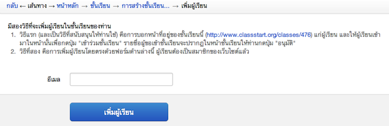
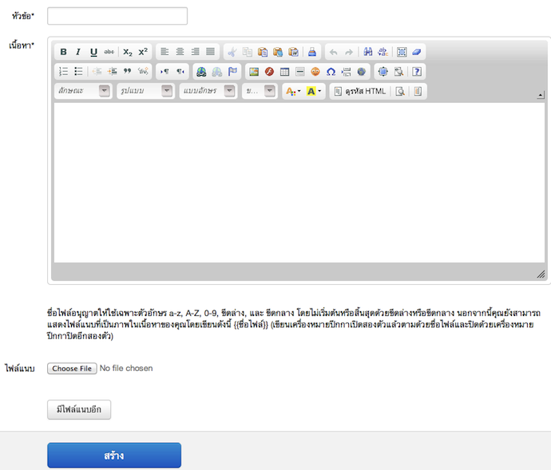
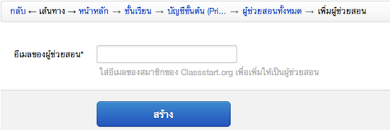

=============
สำหรับผู้สอน
=============

กำลังจัดทำ

จัดการชั้นเรียน*
==============

ผู้สอนเป็นผู้ดำเนินการหลักในส่วนนี้ โดยเริ่มตั้งแต่การสร้างชั้นเรียน เพื่อให้ผู้เรียนไม่ว่าจะเป็นนักเรียน นักศึกษา หรือผู้ที่สนใจ ทำการขออนุมัติเข้าเรียนในชั้นเรียนที่ต้องการ โดยผู้สอนจะต้องทำการอนุมัติผู้เข้าเรียนในชั้นเรียนก่อน จึงจะสามารถจัดการผู้เรียน ไม่ว่าจะเป็นการแบ่งกลุ่ม ประกาศข่าว พูดคุย ปรึกษาผ่านหัวข้อสนทนา ให้คะแนนพร้อมทั้งอธิบายและแจกแจงเอกสารการสอนและแบบฝึกหัดต่างๆ เพื่อให้ผู้เรียนได้ศึกษาผ่านทางชั้นเรียนออนไลน์

สร้างชั้นเรียน*
------------

#. คลิกเลือกที่เมนูผู้สอนเลือก "สร้างชั้นเรียนใหม่" จะได้แบบฟอร์มการสร้างชั้นเรียนใหม่ :ref:`create-class-form` ซึ่งผู้สอนระบุรายละเอียดต่างๆ ตามหัวข้อที่ีมีเครื่องหมายดอกจัน (*) อยู่หลังหัวข้อเป็นหัวข้อที่ต้องกรอก ส่วนหัวข้อที่ไม่มีเครื่องหมายดอกจันไม่จำเป็นต้องกรอก แต่สมาชิกควรกรอกข้อมูลให้ครบทุกหัวข้อเพื่อความสมบูรณ์ของข้อมูลชั้นเรียนที่สร้างขึ้น

	ชื่อชั้นเรียน
		ใส่ชื่อชั้นเรียนที่ต้องการสร้าง
	คำอธิบายชั้นเรียน 
		ใส่รายละเอียดต่างๆ ที่อธิบายถึงชั้นเรียนที่สร้างขึ้น โดยสามารถใช้เครื่องมือจัดการข้อความที่มีอยู่ได้เช่นเดียวกับการทำงานของโปรแกรมพิมพ์งานทั่วไป เช่น Microsoft Word หรือหากไม่ต้องการใช้เครื่องมือช่วยจัดการ สามารถกดปุ่ม ปิดเครื่องมือจัดการข้อความเพื่อปิดเครื่องมือจัดการข้อความ :ref:`word-tools-section` ต่างๆ ได้ 

#. เมื่อระบุรายละเอียดต่างๆ เสร็จสิ้นแล้วให้กดปุ่ม สร้าง 

#. หากดำเนินการสำเร็จ จะมีข้อความ "ชั้นเรียนถูกสร้างแล้ว" แสดงขึ้นมาและสามารถตรวจสอบชั้นเรียนที่สร้างแล้วได้จากขั้นตอนการดูชั้นเรียนที่สอน :ref:`view-class-detail-section`  

.. _create-class-form:

.. figure:: _static/teachers/create_class_form.png
  :align: center
  :scale: 60
  
  แบบฟอร์มการสร้างชั้นเรียน

แก้ไขชั้นเรียน*
-------------
เมื่อผู้สอนต้องการเพิ่มเติมหรือแก้ไขรายละเอียดชั้นเรียนที่สร้างไว้ สามารถทำได้ ตามขั้นตอนต่อไปนี้

  #. คลิกที่เมนูผู้สอน เลือกชั้นเรียนที่ชั้นสอน
  #. ระบบจะแสดงชั้นเรียนที่ผู้สอนได้สร้างไว้แล้วขึ้นมาตามลำดับของวันที่สร้าง
  #. คลิกเลือกชั้นเรียนที่ต้องการแก้ไข โดยการกดปุ่ม "แก้ไข" ทางด้านขวามือของชื่อชั้นเรียนนั้นๆ หรือสามารถคลิกไปที่ชื่อชั้นเรียนนั้น แล้วกดปุ่ม "แก้ไข" ในส่วนของตัวเลือกสำหรับผู้สอน
  #. เมื่อระบบแสดงหน้าแก้ไขชั้นเรียนขึ้นมาแล้ว ผู้สอนสามารถแก้ไขรายละเอียดของชั้นเรียนต่างๆ ได้ตามต้องการ (โดยหัวข้อที่ีมีเครื่องหมายดอกจัน (*) อยู่หลังหัวข้อเป็นหัวข้อที่ต้องกรอก) 
  #. เมื่อแก้ไขรายละเอียดชั้นเรียนเสร็จแล้ว ให้กดปุ่ม "จัดเก็บ" เพื่อบันทึกข้อมูลชั้นเรียนที่แก้ไขในระบบ
  #. หากดำเนินการสำเร็จ จะมีข้อความแสดงขึ้นมาว่า "ชั้นเรียนได้ถูกแก้ไขแล้ว" 

.. _view-class-detail-section:

ดูชั้นเรียนที่สอน*
---------------
เมื่อผู้สอนสร้างชั้นเรียนต่างๆ แล้ว หากต้องการตรวจสอบรายละเอียดชั้นเรียนที่สร้างไว้ สามารถทำได้ 2 วิธี ดังนี้ 

วิธีที่ 1
	คลิกเลือกจากเมนูผู้สอน จากนั้นเลือกชั้นเรียนที่ชั้นสอน
วิธีที่ 2
	คลิกเลือกจากเมนูสมาชิก จากนั้นเลือกหน้าหลัก และกดปุ่ม "ชั้นเรียนที่ฉันสอน"
	
ระบบจะแสดงชั้นเรียนที่ผู้สอนได้สร้างไว้แล้วขึ้นมาตามลำดับของวันที่สร้าง

รายละเอียดต่างๆ ในหน้าชั้นเรียน*
--------------------------------
:ref:`view-class-detail` ประกอบไปด้วยส่วนต่างๆ ดังนี้ 

  - รายละเอียดชั้นเรียน : ชื่อชั้นเรียน
  
    - ที่อยู่เว็บ : แสดงที่อยู่ของเว็บไซต์ของชั้นเรียน
    
    - ผู้สอน : รายชื่อผู้สอน และสามารถลิงค์เข้าไปในประวัติของผู้สอนได้
    
    - สถานศึกษา รายชื่อสถานศึกษาของชั้นเรียน
    
.. _view-assistant-section:
    
    - ผู้ช่วยสอน : รายชื่อผู้ช่วยสอน    
      คลิกที่รายชื่อผู้ช่วยสอน จะปรากฏรายชื่อของผู้ช่วยสอนทั้งหมดของชั้นเรียนนั้น
      
.. _view-class-member-section:

    - จำนวนผู้เรียน : รายชื่อผู้เรียน
      คลิกที่รายชื่อผู้เรียน จะปรากฏรายชื่อของผู้เรียนทั้งหมดของชั้นเรียนนั้น

.. _view-group-class-section:

    - กลุ่มผู้เรียน : รายการกลุ่มผู้เรียน
      คลิกที่รายการกลุ่มผู้เรียน จะปรากฏรายการของกลุ่มผู้เรียนทั้งหมดของชั้นเรียนนั้น
    
    - คำอธิบายชั้นเรียน
  
  - ตัวเลือกสำหรับผู้สอน : แก้ไขรายละเอียดของชั้นเรียน
  
  - ผู้ขอเข้าร่วมชั้นเรียน  แสดงรายชื่อผู้ขอเข้าร่วมชั้นเรียนขณะรอการอนุมัติจากผู้สอน

.. _view_class_announcement_section:
  
  - ข่าวประกาศ 
  
  - เอกสารการสอน
  
  - แบบฝึกหัด
  
  - หัวข้อสนทนา
  
  - บันทึกการเรียนรู้

.. _view-class-detail:

.. figure:: _static/teachers/view_class_detail.png
  :align: center
  :scale: 60
  
  แบบฟอร์มแสดงรายละเอียดต่างๆ ของชั้นเรียนของฉัน

การเพิ่มผู้เรียน*
--------------
เมื่อผู้สอนสร้างชั้นเรียนแล้ว สามารถแจ้งให้ผู้ขอเข้าร่วมชั้นเรียน นักเรียน นักศึกษา ทำได้ 2 วิธี ดังนี้

วิธีที่ 1 
    บอกหน้าที่อยู่ของชั้นเรียนให้ผู้ขอเข้าเรียนทราบ 
วิธีที่ 2 
    เพิ่มผู้เรียนโดยตรง ซึ่งผู้สอนจะต้องทราบอีเมลของผู้ขอเข้าเรียน และผู้ขอเข้าเรียนจะต้องเป็นสมาชิกของเว็บไซต์ (http://www.class.in.th) แล้ว 

**วิธีที่ 1 บอกหน้าที่อยู่ของชั้นเรียนให้ผู้ขอเข้าเรียนทราบ**  
ตามขั้นตอนดังต่อไปนี้

  #. เข้าไปที่ชั้นเรียนที่ฉันสอน จากนั้นให้กดเลือกที่ชื่อของชั้นเรียนสร้างแล้ว
  #. นำที่อยู่เว็บในช่องสี่เหลี่ยมที่แสดงในชั้นเรียนนั้นๆ แจ้งให้ผู้ขอเข้าร่วมชั้นเรียนทราบ เช่น 

  ::
  
      ตัวอย่างที่อยู่เว็บ
      ที่อยู่เว็บ:  http://www.class.in.th/classes/9999
        
  #. เมื่อผู้ขอเข้าร่วมชั้นเรียนได้ดำเนินการขออนุมัติเข้าชั้นเรียนสำเร็จแล้ว จะมีสถานะเป็น "รอการอนุมัติ" ซึ่งผู้สอนสามารถตรวจสอบรายชื่อได้ที่รายละเอียดของชั้นเรียนนั้น ในส่วนของ "ผู้ขอเข้าร่วมชั้นเรียน" ดังรูป :ref:`approve-class-form` 
  #. ผู้สอนสามารถอนุมัติการขอเข้าร่วมชั้นเรียนของนักเรียน นักศึกษาแต่ละท่าน ด้วยการกดปุ่ม "อนุญาต"  และกรณีไม่สามารถอนุมัติการขอเข้าชั้นเรียนด้วยการกดปุ่ม "ปฏิเสธ" 
  #. ผู้สอนจะสามารถดำเนินการขั้นตอนนี้ได้จนกว่ารายชื่อผู้ขอเข้าร่วมชั้นเรียนเปลี่ยนสถานะจาก "รอการอนุมัติ" หมดแล้ว
  #. สามารถตรวจสอบจำนวนผู้เรียนได้จาก หัวข้อรายชื่อผู้เรียน

**วิธีที่ 2 เพิ่มผู้เรียนโดยตรง** 
ตามขั้นตอนดังต่อไปนี้

  #. เข้าไปที่ชั้นเรียนที่ฉันสอน จากนั้นให้กดเลือกที่ชื่อของชั้นเรียนสร้างแล้ว
  #. กดปุ่ม "เพิ่มผู้เรียน" 
  #. ระบบจะแสดงหน้าเพิ่มผู้เรียน ให้ดังรูป :ref:`create-class-member`  
  #. จากนั้นให้ผู้สอนกรอกอีเมลของผู้เรียนในช่องอีเมล
  #. เมื่อกรอกรายละเอียดแล้วกดปุ่ม "เพิ่มผู้เรียน" เพื่อบันทึกผู้เรียน ในชั้นเรียนนั้นๆ 

  *กรณีที่ผู้ขอเข้าร่วมชั้นเรียนถูกปฏิเสธจากผู้สอน สามารถทำการขออนุมัติใหม่ได้ ตามขั้นตอนข้างต้น*

.. _create-class-member:

  
  ภาพประกอบการเพิ่มผู้เรียนโดยตรง
 
การอนุมัตินักเรียนเข้าสู่ชั้นเรียน*
-----------------------------
เมื่อผู้เรียนขออนุมัติเข้าร่วมชั้นเรียนแล้ว ผู้สอนจะปรากฏข้อมูลของผู้ขอเข้าร่วมชั้นเรียนในหน้าชั้นเรียนของฉัน "ส่วนของผู้ขอเข้าร่วมชั้นเรียน" โดยในขั้นตอนนี้ผู้สอนสามารถ "อนุมัติ" หรือ "ปฏิเสธ" การขอเข้าร่วมชั้นเรียนของผู้เรียนได้ ตามขั้นตอนดังต่อไปนี้

  #. เมื่อผู้ขอเข้าร่วมชั้นเรียนได้ดำเนินการขออนุมัติเข้าชั้นเรียน :ref:`join-class-section` สำเร็จแล้ว จะมีสถานะเป็น "รอการอนุมัติ" ซึ่งผู้สอนสามารถตรวจสอบรายชื่อได้ที่รายละเอียดของชั้นเรียนนั้น ในส่วนของ "ผู้ขอเข้าร่วมชั้นเรียน" ดังรูป :ref:`approve-class-form` 
  #. ผู้สอนสามารถอนุมัติการขอเข้าร่วมชั้นเรียนของนักเรียน นักศึกษาแต่ละท่าน ด้วยการกดปุ่ม "อนุญาต"  และกรณีไม่สามารถอนุมัติการขอเข้าชั้นเรียนด้วยการกดปุ่ม "ปฏิเสธ" 
  #. ผู้สอนจะสามารถดำเนินการขั้นตอนนี้ได้จนกว่ารายชื่อผู้ขอเข้าร่วมชั้นเรียนเปลี่ยนสถานะจาก "รอการอนุมัติ" หมดแล้ว
  #. สามารถตรวจสอบจำนวนผู้เรียนได้จาก หัวข้อรายชื่อผู้เรียน

.. _approve-class-form:

.. figure:: _static/teachers/approve_class_form.png
  :align: center
  :scale: 60
  
  ภาพประกอบการอนุมัตินักเรียนเข้าสู่ชั้นเรียน

จัดการข่าวประกาศ*
=================

กำลังจัดทำ

เพิ่มข่าวประกาศ
---------------

ผู้สอนเป็นผู้เพิ่มข่าวประกาศ ตามขั้นตอนดังต่อไปนี้

  #. เข้าไปที่ชั้นเรียนของฉัน เลือกชั้นเรียนที่ต้องการประกาศข่าวให้ผู้เรียนทราบ
  #. ในส่วนของข่าวประกาศ กดปุ่ม "เพิ่มข่าวประกาศใหม่" จะปรากฏแบบฟอร์มข่าวประกาศแสดงขึ้นมา ดังรูป :ref:`create-annoucement-form` 
  #. กรอกหัวข้อข่าวประกาศ ในช่องหัวข้อ*
  #. กรอกรายละเอียดต่างๆ ที่ต้องการแจ้งให้ผู้เรียนทราบในช่องเนื้อหา* ซึ่งสามารถใช้เครื่องมือจัดการข้อความช่วยในการจัดรูปแบบข่าวประกาศ
  #. เลือกการแสดงผลข่าวประกาศ 
  
      - ใช่ กรณีที่ต้องการแสดงข่าวประกาศทันที หลังจากบันทึกข่าวประกาศ
      - ไม่ใช่ กรณีที่ต้องการซ่อนข่าวประกาศไว้ก่อน และหากต้องการแสดงในครั้งหน้าสามารถเลือกการแสดงผลเป็น "ใช่"
       
  #. ระบุวันที่และเวลาเร่ิมต้นของการแสดงผลข่าวประกาศ
  #. ระบุวันที่และเวลาสิ้นสุดของการแสดงผลข่าวประกาศ
  #. คลิกเครื่องหมายหน้าช่องสี่เหลี่ยม เพื่อส่งอีเมลแจ้งข่าวประกาศที่สร้างนี้ให้กับผู้เรียนในชั้นเรียนนั้นทั้งหมด
  #. กดปุ่ม "สร้าง" เพื่อบันทึกข่าวประกาศ และเมื่อสร้างสำเร็จแล้วจะปรากฏข้อความ "ข่าวประกาศได้ถูกทำการสร้างแล้วสำเร็จแล้ว" แสดงขึ้นมา
  
*ตรวจสอบการแสดงผลได้จากส่วนข่าวประกาศของชั้นเรียนของฉัน* :ref:`view-class-detail-section` 

.. _create-annoucement-form:

.. figure:: _static/teachers/create_announcement_form.png
  :align: center
  :scale: 60
  
  แบบฟอร์มการเพิ่มข่าวประกาศ

แก้ไขข่าวประกาศ*
----------------
ผู้สอนสามารถปรับเปลี่ยนรายละเอียดของข่าวประกาศ ตามขั้นตอนดังต่อไปนี้

  #. เข้าไปที่ชั้นเรียนของฉัน เลือกชั้นเรียนที่ประกาศข่าวไว้
  #. ในส่วนของข่าวประกาศเลือกคลิกข่าวประกาศที่ต้องการแก้ไขหรือเพิ่มเติม หากในหน้าที่แสดงผลปัจจุบันไม่มีข่าวประกาศดังกล่าว สามารถกดปุ่ม "ข่าวประกาศทั้งหมด" จะปรากฏหน้าข่าวประกาศทั้งหมดของชั้นเรียนนั้นแสดงขึ้นมา จากนั้นให้คลิกเลือกข่าวประกาศที่ต้องการ
  #. กดปุ่ม "แก้ไขข่าวประกาศ" เพื่อแก้ไขรายละเอียดของข่าวประกาศ
  #. กรอกรายละเอียดที่ต้องการแก้ไขหรือเพิ่มเติมของข่าวประกาศ
  #. เลือกการแสดงผลของข่าวประกาศ 
      
      - ใช่ กรณีที่ต้องการแสดงข่าวประกาศทันที หลังจากบันทึกข่าวประกาศ
      - ไม่ใช่ กรณีที่ต้องการซ่อนข่าวประกาศไว้ก่อน และหากต้องการแสดงในครั้งหน้าสามารถเลือกการแสดงผลเป็น "ใช่" 
      
  #. ระบุวันที่และเวลาเร่ิมต้นของการแสดงผลข่าวประกาศ
  #. ระบุวันที่และเวลาสิ้นสุดของการแสดงผลข่าวประกาศ
  #. คลิกเครื่องหมายหน้าช่องสี่เหลี่ยม เพื่อส่งอีเมลแจ้งข่าวประกาศที่สร้างนี้ให้กับผู้เรียนในชั้นเรียนนั้นทั้งหมด
  #. กดปุ่ม "จัดเก็บ" เพื่อบันทึกข่าวประกาศที่แก้ไข เมื่อบันทีึกแล้วจะปรากฏข้อความ "ข่าวประกาศได้ถูกทำการแก้ไขสำเร็จแล้ว" แสดงขึ้นมา
  
*ตรวจสอบการแสดงผลได้จากส่วนข่าวประกาศของชั้นเรียนของฉัน* :ref:`view-class-detail-section` 

ลบข่าวประกาศ*
--------------
ผู้สอนสามารถลบข่าวประกาศที่ประกาศไว้ ตามขั้นตอนดังต่อไปนี้

  #. เข้าไปที่ชั้นเรียนของฉัน เลือกชั้นเรียนที่ประกาศข่าวไว้
  #. ในส่วนของข่าวประกาศเลือกคลิกข่าวประกาศที่ต้องการลบ หากในหน้าที่แสดงผลปัจจุบันไม่มีข่าวประกาศดังกล่าว สามารถกดปุ่ม "ข่าวประกาศทั้งหมด" จะปรากฏหน้าข่าวประกาศทั้งหมดของชั้นเรียนนั้นแสดงขึ้นมา จากนั้นให้คลิกเลือกข่าวประกาศที่ต้องการ
  #. กดปุ่ม "ลบ" เพื่อลบข่าวประกาศ
  #. จะปรากฏข้อความ "คุณแน่ใจหรือไม่ ?" เพื่อยืนยันการลบข่าวประกาศ
  
      - หากต้องการลบ กดปุ่ม "OK"
      - หากต้องการยกเลิกการลบ กดปุ่ม "Cancel" 
  
  #. เมื่อกดปุ่มยืนยันความต้องการแล้ว ระบบจะดำเนินการตามที่ยืนยัน
  
      - หากกดปุ่ม "OK"  จะปรากฏข้อความ "ข่าวประกาศได้ถูกทำการลบแล้วสำเร็จแล้ว"
      - หากกดปุ่ม "Cancel" จะกลับสู่หน้าข่าวประกาศนั้น 
  
*ตรวจสอบการแสดงผลได้จากส่วนข่าวประกาศของชั้นเรียนของฉัน* :ref:`view-class-detail-section` 

จัดการเอกสารการสอน*
=====================

.. _create-class-material-section :

เพิ่มเอกสารการสอน*
-------------------

ผู้สอนเป็นผู้เพิ่มเอกสารการสอนเพื่อใช้ในชั้นเรียนตามขั้นตอนดังต่อไปนี้

  #. เข้าไปที่ชั้นเรียนของฉัน เลือกชั้นเรียนที่ต้องการเพิ่มเอกสารการสอน
  #. ในส่วนของเอกสารการสอน กดปุ่ม "เพิ่มเอกสารการสอนใหม่" จะปรากฏแบบฟอร์มเพิ่มเอกสารการสอนแสดงขึ้นมา ดังรูป :ref:`create-class-material-form` 
  #. กรอกหัวข้อเอกสารการสอนที่ใช้ในชั้นเรียน ในช่องหัวข้อ*
  #. กรอกรายละเอียดในช่องเนื้อหา* เพื่ออธิบายเอกสารการสอนที่เพิ่มใหม่ ซึ่งสามารถใช้เครื่องมือจัดการข้อความ :ref:`word-tools-section` ช่วยในการจัดรูปแบบ
  #. หากต้องการแนบไฟล์ที่มีแล้ว ขึ้นเป็นไฟล์แนบ สามารถทำตามขั้นตอน :ref:`add-material-files-attach-section`
  #. เมื่อกรอกรายละเอียดและแนบไฟล์แล้ว กดปุ่ม "สร้าง" เพื่อบันทึกเอกสารการสอนสำหรับชั้นเรียน และเมื่อสร้างสำเร็จแล้วจะปรากฏข้อความ "เอกสารการสอนได้ถูกทำการสร้างสำเร็จแล้ว" แสดงขึ้นมา

:: โดยไฟล์ที่แนบมีข้อจำกัดดังนี้
  
        ชื่อไฟล์อนุญาตให้ใช้เฉพาะตัวอักษร a-z, A-Z, 0-9, ขีดล่าง, และ ขีดกลาง โดยไม่เริ่มต้นหรือสิ้นสุดด้วยขีดล่างหรือขีดกลาง นอกจากนี้คุณยังสามารถแสดงไฟล์แนบที่เป็นภาพในเนื้อหาของคุณโดยเขียนดังนี้ {{ชื่อไฟล์}} (เขียนเครื่องหมายปีกกาเปิดสองตัวแล้วตามด้วยชื่อไฟล์และปิดด้วยเครื่องหมายปีกกาปิดอีกสองตัว)

*ตรวจสอบการแสดงผลได้จากส่วนเอกสารการสอนของชั้นเรียนของฉัน* :ref:`view-class-detail-section` 

.. _create-class-material-form:

  
  แบบฟอร์มการเพิ่มเอกสารการสอน

.. _edit-class-material-section:

แก้ไขเอกสารการสอน***
--------------------
ผู้สอนสามารถปรับเปลี่ยนรายละเอียดของเอกสารการสอน ตามขั้นตอนดังต่อไปนี้

  #. เข้าไปที่ชั้นเรียนของฉัน เลือกชั้นเรียนที่มีรายการของเอกสารการสอนนั้นไว้
  #. ในส่วนของเอกสารการสอนเลือกคลิกรายการที่ต้องการแก้ไขหรือเพิ่มเติม หากในหน้าที่แสดงผลปัจจุบันไม่มีเอกสารการสอนดังกล่าว สามารถกดปุ่ม "เอกสารการสอนทั้งหมด" จะปรากฏหน้าเอกสารการสอนทั้งหมดของชั้นเรียนนั้นแสดงขึ้นมา จากนั้นให้คลิกเลือกเอกสารการสอนที่ต้องการ
  #. กดปุ่ม "แก้ไขเอกสารการสอน" เพื่อแก้ไขรายละเอียดของเอกสารการสอน
  #. กรอกรายละเอียดที่ต้องการแก้ไขหรือเพิ่มเติมของเอกสารการสอน
  #. เลือกการแสดงผลของเอกสารการสอน 
      
      - ใช่ กรณีที่ต้องการแสดงเอกสารการสอนทันที หลังจากบันทึกเอกสารการสอน
      - ไม่ใช่ กรณีที่ต้องการซ่อนเอกสารไว้ก่อน และหากต้องการแสดงในครั้งหน้าสามารถเลือกการแสดงผลเป็น "ใช่" 
      
  #. ระบุวันที่และเวลาเร่ิมต้นของการแสดงผลเอกสารการสอน
  #. ระบุวันที่และเวลาสิ้นสุดของการแสดงผลเอกสารการสอน
  #. คลิกเครื่องหมายหน้าช่องสี่เหลี่ยม เพื่อส่งอีเมลแจ้งเอกสารการสอนที่สร้างนี้ให้กับผู้เรียนในชั้นเรียนนั้นทั้งหมด
  #. กดปุ่ม "จัดเก็บ" เพื่อบันทึกเอกสารการสอนที่แก้ไข เมื่อบันทีึกแล้วจะปรากฏข้อความ "เอกสารการสอนได้ถูกทำการแก้ไขสำเร็จแล้ว" แสดงขึ้นมา
  
*ตรวจสอบการแสดงผลได้จากส่วนเอกสารการสอนของชั้นเรียนของฉัน* :ref:`view-class-detail-section` 

.. _edit-class-material-form:

.. figure:: _static/teachers/edit_class_material_form.png
  :align: center
  :scale: 60
  
  แบบฟอร์มการแก้ไขเอกสารการสอน

.. _add-material-files-attach-section:

เพิ่มไฟล์แนบในเอกสารการสอน*
-----------------------------

กรณีที่ผู้สอนมีไฟล์เอกสารอยู่แล้ว สามารถแนบไฟล์เพื่อใช้เป็นเอกสารการสอน  ตามขั้นตอนดังต่อไปนี้ 

  #. เปิดหน้าหลักของชั้นเรียน แล้วเข้าสู่รายการเอกสารการสอนที่ต้องการ โดยหากต้องการสร้างเอกสารการใหม่ สามารถทำตามขั้นตอน :ref:`create-class-material-section` ได้ตามลำดับ ส่วนกรณีที่มีเอกสารการสอนแล้ว สามารถทำตามขั้นตอนการแก้ไขเอกสารการสอน :ref:`edit-class-material-section` เพื่อเพิ่มไฟล์แนบ
  #. การแนบไฟล์นั้นให้กดปุ่ม "Choose File" เพื่อเลือกไฟล์จากทึ่เก็บไฟล์นั้น โดยไม่จำกัดประเภทไฟล์ที่แนบและการแนบไฟล์แต่ละครั้ง สามารถแนบไฟล์ได้ครั้งละ 1 ไฟล์ 
  #. หากต้องการแนบไฟล์เพิ่มเติม ให้กดปุ่ม "มีไฟล์แนบอีก" จะปรากฏบรรทัดเพิ่มเติมขึ้นมา 
  #. ทำตามข้อ 2. เพื่อเลือกไฟล์อื่นเพิ่มเติม
  #. เมื่อแนบไฟล์ได้ตามจำนวนที่ต้องการแล้ว กดปุ่ม "สร้าง" หรือ "แก้ไข" เพื่อบันทึกเอกสารการสอนสำหรับชั้นเรียน และเมื่อสำเร็จแล้วจะปรากฏข้อความ "เอกสารการสอนได้ถูกทำการสร้างสำเร็จแล้ว" หรือ "เอกสารการสอนได้ถูกทำการแก้ไขเสร็จแล้ว" แสดงขึ้นมา

:: ข้อจำกัดของไฟล์แนบใน Class.in.th มีดังนี้
  
        ชื่อไฟล์อนุญาตให้ใช้เฉพาะตัวอักษร a-z, A-Z, 0-9, ขีดล่าง, และ ขีดกลาง โดยไม่เริ่มต้นหรือสิ้นสุดด้วยขีดล่างหรือขีดกลาง นอกจากนี้คุณยังสามารถแสดงไฟล์แนบที่เป็นภาพในเนื้อหาของคุณโดยเขียนดังนี้ {{ชื่อไฟล์}} (เขียนเครื่องหมายปีกกาเปิดสองตัวแล้วตามด้วยชื่อไฟล์และปิดด้วยเครื่องหมายปีกกาปิดอีกสองตัว)

.. _attached-file-form:

.. figure:: _static/teachers/AttachedFile.png
  :align: center
  :scale: 60
  
  ส่วนการแสดงผลเกี่ยวกับไฟล์แนบ

แก้ไขไฟล์แนบในเอกสารการสอน*
------------------------------

กรณีที่ผู้สอนมีไฟล์เอกสารอยู่แล้ว สามารถแนบไฟล์เพื่อใช้เป็นเอกสารการสอน  ตามขั้นตอนดังต่อไปนี้ 

  #. เปิดหน้าหลักของชั้นเรียน แล้วเข้าสู่รายการเอกสารการสอนที่ต้องการ สามารถทำตามขั้นตอนการแก้ไขเอกสารการสอน :ref:`edit-class-material-section` เพื่อแก้ไขไฟล์แนบ
  #. การแนบไฟล์นั้นให้กดปุ่ม "Choose File" เพื่อเลือกไฟล์จากทึ่เก็บไฟล์นั้น โดยไม่จำกัดประเภทไฟล์ที่แนบและการเลือกไฟล์แต่ละครั้ง สามารถเลือกไฟล์ได้ครั้งละ 1 ไฟล์ ดังรูป :ref:`attached-file-form`
  #. หากต้องการแนบไฟล์เพิ่มเติม ให้กดปุ่ม "มีไฟล์แนบอีก" จะปรากฏบรรทัดเพิ่มเติมขึ้นมา 
  #. ทำตามข้อ 2. เพื่อเลือกไฟล์อื่นเพิ่มเติม
  #. เมื่อแนบไฟล์ได้ตามจำนวนที่ต้องการแล้ว กดปุ่ม "สร้าง" หรือ "แก้ไข" เพื่อบันทึกเอกสารการสอนสำหรับชั้นเรียน และเมื่อสำเร็จแล้วจะปรากฏข้อความ "เอกสารการสอนได้ถูกทำการสร้างสำเร็จแล้ว" หรือ "เอกสารการสอนได้ถูกทำการแก้ไขเสร็จแล้ว" แสดงขึ้นมา

:: ข้อจำกัดของไฟล์แนบใน Class.in.th มีดังนี้
  
        ชื่อไฟล์อนุญาตให้ใช้เฉพาะตัวอักษร a-z, A-Z, 0-9, ขีดล่าง, และ ขีดกลาง โดยไม่เริ่มต้นหรือสิ้นสุดด้วยขีดล่างหรือขีดกลาง นอกจากนี้คุณยังสามารถแสดงไฟล์แนบที่เป็นภาพในเนื้อหาของคุณโดยเขียนดังนี้ {{ชื่อไฟล์}} (เขียนเครื่องหมายปีกกาเปิดสองตัวแล้วตามด้วยชื่อไฟล์และปิดด้วยเครื่องหมายปีกกาปิดอีกสองตัว)

ลบไฟล์แนบในเอกสารการสอน*
----------------------------

กรณีที่ผู้สอนต้องการลบไฟล์ที่แนบแล้วในเอกสารการสอน สามารถตามขั้นตอนดังต่อไปนี้ 

  #. เปิดหน้าหลักของชั้นเรียน แล้วคลิกเข้าสู่รายการเอกสารการสอนที่ต้องการ
  #. สามารถกดปุ่ม "ลบ" ทางด้านข้างของแต่ละไฟล์ 
  #. จะปรากฏข้อความ "การกระทำนี้จะแก้ไขไม่ได้ คุณแน่ใจหรือไม่ว่าต้องการลบไฟล์แนบนี้?" เพื่อยืนยันการลบไฟล์ 
  
      - หากต้องการลบ กดปุ่ม "OK"
      - หากต้องการยกเลิกการลบ กดปุ่ม "Cancel" 
  
  #. เมื่อกดปุ่มยืนยันความต้องการแล้ว ระบบจะดำเนินการตามที่ยืนยัน
  
      - หากกดปุ่ม "OK"  จะปรากฏข้อความ "Uploaded File ได้ถูกทำการลบแล้วสำเร็จแล้ว"
      - หากกดปุ่ม "Cancel" จะกลับสู่หน้ารายละเอียดเอกสารการสอนนั้น 
  
*ตรวจสอบการแสดงผลได้จากส่วนเอกสารการสอนของชั้นเรียนของฉัน* :ref:`view-class-detail-section` 

จัดการกระดานข้อความ*
======================

กำลังจัดทำ

.. _discussion-section:

สร้างหัวข้อสนทนาใหม่*
---------------------

สมาชิกที่อยู่ในชั้นเรียนสามารถเพิ่มหัวข้อสนทนาใหม่ได้ เพื่อใช้ในชั้นเรียนตามขั้นตอนดังต่อไปนี้

  #. เข้าไปที่ชั้นเรียนของฉัน เลือกชั้นเรียนที่ต้องการเพิ่มหัวข้อสนทนา
  #. ในส่วนของเอกสารการสอน กดปุ่ม "เพิ่มหัวข้อใหม่" จะปรากฏแบบฟอร์มเพิ่มหัวข้อสนทนาใหม่แสดงขึ้นมา ดังรูป :ref:`create-class-discussion-form` หรือ กดปุ่ม "หัวข้อสนทนาทั้งหมด" แล้วจึงกดปุ่ม "เพิ่มหัวข้อใหม่" ตามลำดับ
  #. กรอกหัวข้อที่ต้องการสนทนาที่ใช้ในชั้นเรียน ในช่องหัวข้อ*
  #. กรอกรายละเอียดในช่องเนื้อหา* เพื่ออธิบายรายละเอียดการสนทนาที่เพิ่มใหม่ ซึ่งสามารถใช้เครื่องมือจัดการข้อความ :ref:`word-tools-section` ช่วยในการจัดรูปแบบ
  #. คลิกเครื่องหมายหน้าหัวข้อ ส่งอีเมล์เพื่อแจ้งผู้เรียนทั้งหมด เพื่อส่งอีเมล์แจ้งรายละเอียดเกี่ยวกับการสนทนาในครั้งนี้ให้กับผู้เรียนทั้งหมดทราบ
  #. เมื่อกรอกรายละเอียดต่างๆ แล้ว กดปุ่ม "สร้าง" เพื่อบันทึกหัวข้อสนทนาสำหรับชั้นเรียน และเมื่อสร้างสำเร็จแล้วจะปรากฏข้อความ "หัวข้อสนทนาสร้างแล้ว" แสดงขึ้นมา
  #. จากนั้นสามารถเพิ่มไฟล์แนบ ได้ตามขั้นตอน :ref:`create-attached-file-discussion-section` 
  #. และเพิ่มความเห็นใหม่ ได้ตามขั้นตอน :ref:`opinion-section`

*ตรวจสอบการแสดงผลได้จากส่วนเอกสารการสอนของชั้นเรียนของฉัน* :ref:`view-class-detail-section` 

.. _create-class-discussion-form:

.. figure:: _static/teachers/create_class_discussion_form.png
  :align: center
  :scale: 60
  
  แบบฟอร์มการสร้างหัวข้อสนทนาในกระดานข้อความ

.. _create-attached-file-discussion-section:

เพิ่มไฟล์แนบในหัวข้อสนทนา*
--------------------------

กรณีต้องการแนบไฟล์เพื่อใช้ในหัวข้อสนทนา สามารถทำตามขั้นตอนดังต่อไปนี้ 

  #. เปิดหน้าหลักของชั้นเรียน แล้วเข้าสู่รายการหัวข้อสนทนาที่ต้องการ
  #. กดปุ่ม "เพิ่มไฟล์แนบ" จากนั้นกดปุ่ม "Choose File" เพื่อเลือกไฟล์จากทึ่เก็บไฟล์นั้น โดยไม่จำกัดประเภทไฟล์ที่แนบและการแนบไฟล์แต่ละครั้ง สามารถแนบไฟล์ได้ครั้งละ 1 ไฟล์
  #. เมื่อแนบไฟล์ต้องการแล้ว กดปุ่ม "เพิ่มไฟล์แนบ" เพื่อบันทึกไฟล์ที่แนบในหัวข้อสนทนานั้น และเมื่อสำเร็จแล้วจะปรากฏข้อความ "ไฟล์ถูกเพิ่มแล้ว" แสดงขึ้นมา
  #. และสามารถเพิ่มไฟล์แนบได้อีก โดยทำตามขั้นตอนข้อที่ 2 ตามลำดับ
  
:: ข้อจำกัดของไฟล์แนบใน Class.in.th มีดังนี้
  
        ชื่อไฟล์อนุญาตให้ใช้เฉพาะตัวอักษร a-z, A-Z, 0-9, ขีดล่าง, และ ขีดกลาง โดยไม่เริ่มต้นหรือสิ้นสุดด้วยขีดล่างหรือขีดกลาง นอกจากนี้คุณยังสามารถแสดงไฟล์แนบที่เป็นภาพในเนื้อหาของคุณโดยเขียนดังนี้ {{ชื่อไฟล์}} (เขียนเครื่องหมายปีกกาเปิดสองตัวแล้วตามด้วยชื่อไฟล์และปิดด้วยเครื่องหมายปีกกาปิดอีกสองตัว)

แก้ไขไฟล์แนบในหัวข้อสนทนา*
---------------------------
  #. เปิดหน้าหลักของชั้นเรียน แล้วเข้าสู่รายการหัวข้อสนทนาที่ต้องการ
  #. ทำตามขั้นตอนการลบไฟล์แนบในหัวข้อสนทนา :ref:`delete-attached-file-discussion-section` เพื่อลบไฟล์ที่แนบแล้วออก
  #. แล้วทำตามขั้นตอนเพิ่มไฟล์แนบในหัวข้อสนทนา :ref:`create-attached-file-discussion-section` เพื่อแนบไฟล์ใหม่แทนไฟล์เดิม

.. _delete-attached-file-discussion-section:

ลบไฟล์แนบในหัวข้อสนทนา*
--------------------------
  #. เปิดหน้าหลักของชั้นเรียน แล้วเข้าสู่รายการหัวข้อสนทนาที่ต้องการ
  #. กดปุ่ม "ลบ" ด้านข้างของไฟล์ที่แนบแต่ละไฟล์
  #. จะปรากฏข้อความ "การกระทำนี้จะแก้ไขไม่ได้ คุณแน่ใจหรือไม่ว่าต้องการลบไฟล์แนบนี้?" เพื่อยืนยันการลบไฟล์ 
  
      - หากต้องการลบ กดปุ่ม "OK"
      - หากต้องการยกเลิกการลบ กดปุ่ม "Cancel" 
  
  #. เมื่อกดปุ่มยืนยันความต้องการแล้ว ระบบจะดำเนินการตามที่ยืนยัน
  
      - หากกดปุ่ม "OK"  จะปรากฏข้อความ "Uploaded File ได้ถูกทำการลบแล้วสำเร็จแล้ว"
      - หากกดปุ่ม "Cancel" จะกลับสู่หน้ารายละเอียดหัวข้อสนทนานั้น 
  
.. _opinion-section:

เพิ่มความเห็น*
-------------

 #. เปิดหน้าหลักของชั้นเรียน แล้วเข้าสู่รายการหัวข้อสนทนาที่ต้องการ
 #. กรอกความคิดเห็นในช่องว่าง เพื่อแสดงความคิดเห็นต่างๆ เกี่ยวกับการสนทนาที่เลือก โดยสามารถใช้เครื่องมือจัดการข้อความช่วยจัดรูปแบบได้ :ref:`word-tools-section`
 #. หากต้องการแนบไฟล์ สามารถแนบไฟล์ได้ตามขั้นตอน :ref:`create-attached-file-opinion`
 #. กดปุ่ม "สร้าง" เพื่อบันทึกความคิดเห็น เมื่อสำเร็จจะปรากฏข้อความ "ความเห็นถูกเพิ่มแล้ว"

.. _create-class-opinion-form:

.. figure:: _static/teachers/create_class_opinion_form.png
  :align: center
  :scale: 60
  
  แบบฟอร์มการเพิ่มความคิดเห็น

.. _create-attached-file-opinion:

เพิ่มไฟล์แนบในความเห็น*
-----------------------

กำลังจัดทำ

ปิดหัวข้อสนทนา*
---------------

กำลังจัดทำ

อ่านบันทึกการเรียนรู้ของชั้นเรียน*
==============================

กำลังจัดทำ

จัดการกลุ่มผู้เรียน*
=================

กำลังจัดทำ

เพิ่มกลุ่มผู้เรียน*
--------------

กำลังจัดทำ

.. _create-group-class-form:

.. figure:: _static/teachers/create_group_class_form.png
  :align: center
  :scale: 60
  
  แบบฟอร์มการสร้างกลุ่มผู้เรียน

แก้ไขกลุ่มผู้เรียน*
---------------

กำลังจัดทำ

ลบกลุ่มผู้เรียน*
-------------

กำลังจัดทำ

เพิ่มสมาชิกในกลุ่มผู้เรียน*
-----------------------

กำลังจัดทำ

.. _create-group-class-member-form:

.. figure:: _static/teachers/create_group_class_member_form.png
  :align: center
  :scale: 60
  
  แบบฟอร์มการเพิ่มสมาชิกในกลุ่มผู้เรียน

ลบสมาชิกจากกลุ่มผู้เรียน*
-----------------------

กำลังจัดทำ

แก้ไขตัวแทนกลุ่ม*
----------------

กำลังจัดทำ

เพิ่มผู้ช่วยสอน*
^^^^^^^^^^

**เพิ่มผู้ช่วยสอนโดยตรง** ตามขั้นตอนดังต่อไปนี้

  #. เข้าไปที่ชั้นเรียนที่ฉันสอน จากนั้นให้กดเลือกที่ชื่อของชั้นเรียนสร้างแล้ว
  #. กดปุ่ม "เพิ่มผู้ช่วยสอน" 
  #. ระบบจะแสดงหน้าเพิ่มผู้ช่วยสอน ดังรูป :ref:`create-class-assistant` 
  #. จากนั้นให้ผู้สอนกรอกอีเมลของผู้ช่วยสอนในช่องอีเมล ซึ่งผู้ช่วยสอนท่านนั้นจะต้องเป็นสมาชิกของเว็บไซต์ (http://www.class.in.th) แล้ว 
  #. เมื่อกรอกรายละเอียดแล้วกดปุ่ม "สร้าง" เพื่อบันทึกผู้ช่วยสอน ในชั้นเรียนนั้นๆ 
  #. หากสร้างสำเร็จแล้ว จะปรากฏข้อความ "ผู้ช่วยสอนได้ถูกทำการสร้างสำเร็จแล้ว"

.. _create-class-assistant:

  
  ภาพประกอบการเพิ่มผู้ช่วยสอนโดยตรง

*สามารถดูรายชื่อผู้ช่วยสอนได้ในขั้นตอนดูรายชื่อผู้ช่วยสอน* :ref:`view-assistant-section`

จัดการแบบฝึกหัด (การบ้าน)*
==========================

กำลังจัดทำ

สร้างแบบฝึกหัดใหม่*
------------------

ผู้สอนเป็นผู้เพิ่มแบบฝึกหัด เพื่อใช้ในชั้นเรียนตามขั้นตอนดังต่อไปนี้

  #. เข้าไปที่ชั้นเรียนของฉัน เลือกชั้นเรียนที่ต้องการเพิ่มแบบฝึกหัดใหม่
  #. ในส่วนของแบบฝึกหัด กดปุ่ม "เพิ่มแบบฝึกหัดใหม่" จะปรากฏแบบฟอร์มเพิ่มแบบฝึกหัดแสดงขึ้นมา ดังรูป :ref:`create-class-assignment-form` 
  #. กรอกชื่อแบบฝึกหัดที่สร้างใหม่ ในช่องหัวข้อ*
  #. กรอกรายละเอียดในช่องเนื้อหา* เพื่ออธิบายแบบฝึกหัดที่เพิ่มใหม่เพื่อความชัดเจนสำหรับผู้เรียนนำไปศึกษาต่อ ซึ่งสามารถใช้เครื่องมือจัดการข้อความ :ref:`word-tools-section` ช่วยในการจัดรูปแบบ
  #. หากมีไฟล์เอกสารอยู่แล้ว สามารถแนบไฟล์เพื่อใช้เป็นแบบฝึกหัดซึ่งการแนบไฟล์นั้นให้กดปุ่ม "Browse…"  เพื่อเลือกไฟล์จากทึ่เก็บไฟล์นั้น โดยไม่จำกัดประเภทไฟล์ที่แนบและการแนบไฟล์แต่ละครั้ง สามารถแนบไฟล์ได้ครั้งละ 1 ไฟล์ หากต้องการแนบไฟล์เพิ่มเติม ให้กดปุ่ม "มีไฟล์แนบอีก" เพื่อเลือกไฟล์เพิ่มเติม
  #. เมื่อกรอกรายละเอียดและแนบไฟล์แล้ว กดปุ่ม "สร้าง" เพื่อบันทึกแบบฝึกหัดสำหรับชั้นเรียน และเมื่อสร้างสำเร็จแล้วจะปรากฏข้อความ "แบบฝึกหัดได้ถูกทำการสร้างสำเร็จแล้ว" แสดงขึ้นมา

:: โดยไฟล์ที่แนบมีข้อจำกัดดังนี้
  
        ชื่อไฟล์อนุญาตให้ใช้เฉพาะตัวอักษร a-z, A-Z, 0-9, ขีดล่าง, และ ขีดกลาง โดยไม่เริ่มต้นหรือสิ้นสุดด้วยขีดล่างหรือขีดกลาง นอกจากนี้คุณยังสามารถแสดงไฟล์แนบที่เป็นภาพในเนื้อหาของคุณโดยเขียนดังนี้ {{ชื่อไฟล์}} (เขียนเครื่องหมายปีกกาเปิดสองตัวแล้วตามด้วยชื่อไฟล์และปิดด้วยเครื่องหมายปีกกาปิดอีกสองตัว)

*ตรวจสอบการแสดงผลได้จากส่วนแบบฝึกหัดของชั้นเรียนของฉัน* :ref:`view-class-detail-section`

.. _create-class-assignment-form:

.. figure:: _static/teachers/create_class_assignment.png
  :align: center
  :scale: 60
  
  แบบฟอร์มการสร้างแบบฝึกหัด

แก้ไขแบบฝึกหัด*
---------------

กำลังจัดทำ

เพิ่มไฟล์แนบในแบบฝึกหัด*
------------------------

กำลังจัดทำ

แก้ไขไฟล์แนบในแบบฝึกหัด*
------------------------

กำลังจัดทำ

ลบไฟล์แนบในแบบฝึกหัด*
-----------------------

กำลังจัดทำ

ปิดแบบฝึกหัด*
-------------

กำลังจัดทำ

ตรวจให้คะแนนแบบฝึกหัด*
------------------------

กำลังจัดทำ

.. _post-score-class-assignment-form:

.. figure:: _static/teachers/post_score_class_assignment.png
  :align: center
  :scale: 60
  
  แบบฟอร์มการให้คะแนนแบบฝึกหัด
