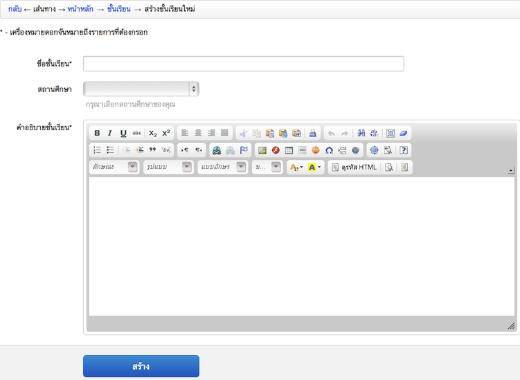
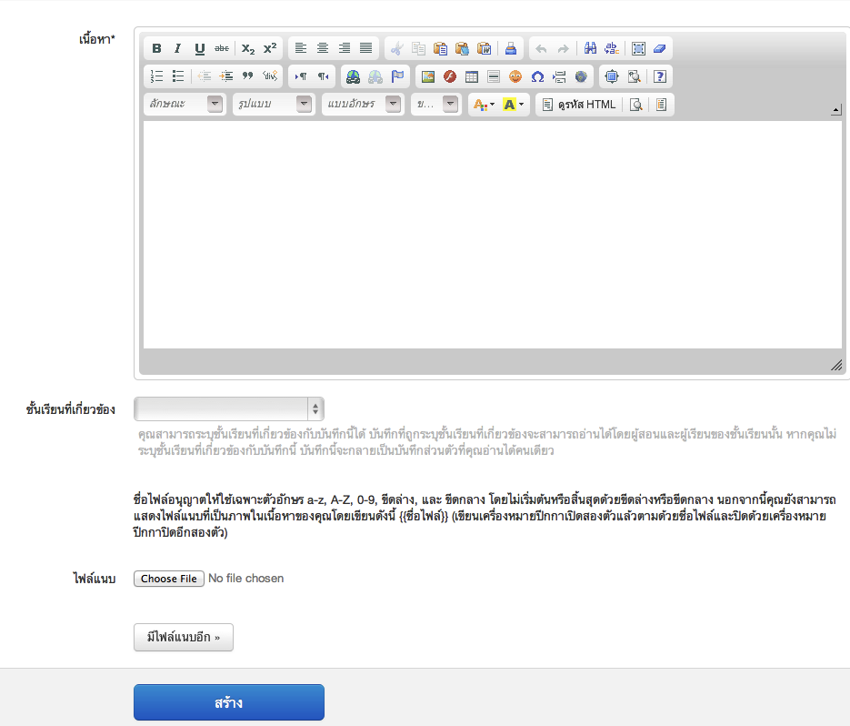
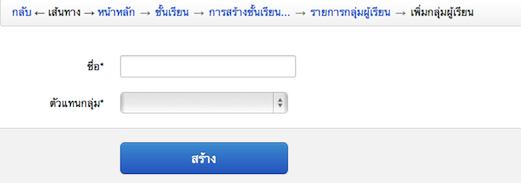
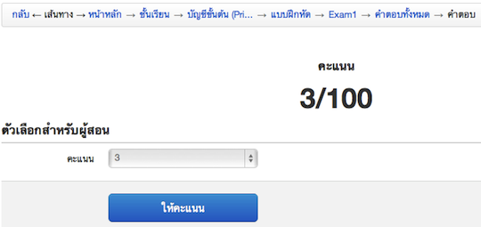

=============
สำหรับผู้สอน
=============

กำลังจัดทำ

จัดการชั้นเรียน*
==============

ผู้สอนเป็นผู้ดำเนินการหลักในส่วนนี้ โดยเริ่มตั้งแต่การสร้างชั้นเรียน เพื่อให้ผู้เรียนไม่ว่าจะเป็นนักเรียน นักศึกษา หรือผู้ที่สนใจ ทำการขออนุมัติเข้าเรียนในชั้นเรียนที่ต้องการ โดยผู้สอนจะต้องทำการอนุมัติผู้เข้าเรียนในชั้นเรียนก่อน จึงจะสามารถจัดการผู้เรียน ไม่ว่าจะเป็นการแบ่งกลุ่ม ประกาศข่าว พูดคุย ปรึกษาผ่านหัวข้อสนทนา ให้คะแนนพร้อมทั้งอธิบายและแจกแจงเอกสารการสอนและแบบฝึกหัดต่างๆ เพื่อให้ผู้เรียนได้ศึกษาผ่านทางชั้นเรียนออนไลน์

สร้างชั้นเรียน*
------------

  #. คลิ๊กเลือกที่เมนูผู้สอนเลือก "สร้างชั้นเรียนใหม่" จะได้แบบฟอร์มการสร้างชั้นเรียนใหม่ :ref:`create-class-form` ซึ่งผู้สอนระบุรายละเอียดต่างๆ ตามหัวข้อที่ีมีเครื่องหมายดอกจัน (*) อยู่หลังหัวข้อเป็นหัวข้อที่ต้องกรอก ส่วนหัวข้อที่ไม่มีเครื่องหมายดอกจันไม่จำเป็นต้องกรอก แต่สมาชิกควรกรอกข้อมูลให้ครบทุกหัวข้อเพื่อความสมบูรณ์ของข้อมูลชั้นเรียนที่สร้างขึ้น

    - ชื่อชั้นเรียน
      ใส่ชื่อชั้นเรียนที่ต้องการสร้าง
    - คำอธิบายชั้นเรียน 
      ใส่รายละเอียดต่างๆ ที่อธิบายถึงชั้นเรียนที่สร้างขึ้น โดยสามารถใช้เครื่องมือจัดการข้อความที่มีอยู่ได้เช่นเดียวกับการทำงานของโปรแกรมพิมพ์งานทั่วไป เช่น Microsoft Word หรือหากไม่ต้องการใช้เครื่องมือช่วยจัดการ สามารถกดปุ่ม ปิดเครื่องมือจัดการข้อความเพื่อปิดเครื่องมือจัดการข้อความ :ref:`word_tools_section`_ ต่างๆ ได้ 

  #. เมื่อระบุรายละเอียดต่างๆ เสร็จสิ้นแล้วให้กดปุ่ม สร้าง 
  #. หากดำเนินการสำเร็จ จะมีข้อความ "ชั้นเรียนถูกสร้างแล้ว" แสดงขึ้นมาและสามารถตรวจสอบชั้นเรียนที่สร้างแล้วได้จากขั้นตอนดูชั้นเรียนที่สอน :ref:`view-class-description`  

.. _create-class-form:

  
  แบบฟอร์มการสร้างชั้นเรียน

แก้ไขชั้นเรียน*
------------
เมื่อผู้สอนต้องการเพิ่มเติมหรือแก้ไขรายละเอียดชั้นเรียนที่สร้างไว้ สามารถทำได้ ตามขั้นตอนต่อไปนี้

  #. คลิกที่เมนูผู้สอน เลือกชั้นเรียนที่ชั้นสอน
  #. ระบบจะแสดงชั้นเรียนที่ผู้สอนได้สร้างไว้แล้วขึ้นมาตามลำดับของวันที่สร้าง
  #. คลิกเลือกชั้นเรียนที่ต้องการแก้ไข โดยการกดปุ่ม "แก้ไข" ทางด้านขวามือของชื่อชั้นเรียนนั้นๆ หรือสามารถคลิกไปที่ชื่อชั้นเรียนนั้น แล้วกดปุ่ม "แก้ไข" ในส่วนของตัวเลือกสำหรับผู้สอน
  #. เมื่อระบบแสดงหน้าแก้ไขชั้นเรียนขึ้นมาแล้ว ผู้สอนสามารถแก้ไขรายละเอียดของชั้นเรียนต่างๆ ได้ตามต้องการ (โดยหัวข้อที่ีมีเครื่องหมายดอกจัน (*) อยู่หลังหัวข้อเป็นหัวข้อที่ต้องกรอก) 
  #. เมื่อแก้ไขรายละเอียดชั้นเรียนเสร็จแล้ว ให้กดปุ่ม "จัดเก็บ" เพื่อบันทึกข้อมูลชั้นเรียนที่แก้ไขในระบบ
  #. หากดำเนินการสำเร็จ จะมีข้อความแสดงขึ้นมาว่า "ชั้นเรียนได้ถูกแก้ไขแล้ว" 

.. _view-class-detail-section:

ดูชั้นเรียนที่สอน*
---------------
เมื่อผู้สอนสร้างชั้นเรียนต่างๆ แล้ว หากต้องการตรวจสอบรายละเอียดชั้นเรียนที่สร้างไว้ สามารถทำได้ 2 วิธี ดังนี้ 

  - วิธีที่ 1 คลิกเลือกจากเมนู
  - วิธีที่ 2 คลิกเลือกจากหน้าหลัก

ซึ่งมีขั้นตอนต่อไปนี้
  #. กรณีเลือกวิธีที่ 1 ให้คลิกที่เมนูผู้สอน เลือกชั้นเรียนที่ชั้นสอน
  #. กรณีเลือกวิธีที่ 2 ให้คลิกที่เมนูสมาชิก เลือกหน้าหลัก และกดปุ่ม "ชั้นเรียนที่ฉันสอน"
  #. ระบบจะแสดงชั้นเรียนที่ผู้สอนได้สร้างไว้แล้วขึ้นมาตามลำดับของวันที่สร้าง

**รายละเอียดต่างๆ ในหน้าชั้นเรียน**
:ref:`view-class-detail` ประกอบไปด้วยส่วนต่างๆ ดังนี้ 

  - รายละเอียดชั้นเรียน : ชื่อชั้นเรียน
  
    - ที่อยู่เว็บ : แสดงที่อยู่ของเว็บไซต์ของชั้นเรียน
    
    - ผู้สอน : รายชื่อผู้สอน และสามารถลิงค์เข้าไปในประวัติของผู้สอนได้
    
    - สถานศึกษา รายชื่อสถานศึกษาของชั้นเรียน
    
.. _view-assistant-section:
    
    - ผู้ช่วยสอน : รายชื่อผู้ช่วยสอน    
      คลิกที่รายชื่อผู้ช่วยสอน จะปรากฏรายชื่อของผู้ช่วยสอนทั้งหมดของชั้นเรียนนั้น
      
.. _view-class-member-section:

    - จำนวนผู้เรียน : รายชื่อผู้เรียน
      คลิกที่รายชื่อผู้เรียน จะปรากฏรายชื่อของผู้เรียนทั้งหมดของชั้นเรียนนั้น

.. _view-group-class-section:

    - กลุ่มผู้เรียน : รายการกลุ่มผู้เรียน
      คลิกที่รายการกลุ่มผู้เรียน จะปรากฏรายการของกลุ่มผู้เรียนทั้งหมดของชั้นเรียนนั้น
    
    - คำอธิบายชั้นเรียน
  
  - ตัวเลือกสำหรับผู้สอน : แก้ไขรายละเอียดของชั้นเรียน
  
  - ผู้ขอเข้าร่วมชั้นเรียน  แสดงรายชื่อผู้ขอเข้าร่วมชั้นเรียนขณะรอการอนุมัติจากผู้สอน

.. _view_class_announcement_section:
  
  - ข่าวประกาศ 
  
  - เอกสารการสอน
  
  - แบบฝึกหัด
  
  - หัวข้อสนทนา
  
  - บันทึกการเรียนรู้

.. _view-class-detail:

.. figure:: _static/teachers/view_class_detail.png
  :align: center
  :scale: 60
  
  แบบฟอร์มแสดงรายละเอียดต่างๆ ของชั้นเรียนของฉัน

การเพิ่มผู้เรียน*
--------------
เมื่อผู้สอนสร้างชั้นเรียนแล้ว สามารถแจ้งให้ผู้ขอเข้าร่วมชั้นเรียน นักเรียน นักศึกษา ทำได้ 2 วิธี ดังนี้

 - วิธีที่ 1 บอกหน้าที่อยู่ของชั้นเรียนให้ผู้ขอเข้าเรียนทราบ 
 - วิธีที่ 2 เพิ่มผู้เรียนโดยตรง ซึ่งผู้สอนจะต้องทราบอีเมลของผู้ขอเข้าเรียน และผู้ขอเข้าเรียนจะต้องเป็นสมาชิกของเว็บไซต์ (http://www.class.in.th) แล้ว 

**วิธีที่ 1 บอกหน้าที่อยู่ของชั้นเรียนให้ผู้ขอเข้าเรียนทราบ**  
ตามขั้นตอนดังต่อไปนี้

  #. เข้าไปที่ชั้นเรียนที่ฉันสอน จากนั้นให้กดเลือกที่ชื่อของชั้นเรียนสร้างแล้ว
  #. นำที่อยู่เว็บในช่องสี่เหลี่ยมที่แสดงในชั้นเรียนนั้นๆ แจ้งให้ผู้ขอเข้าร่วมชั้นเรียนทราบ เช่น 

  ::
        ชั้นเรียนที่ 1
        ที่อยู่เว็บ:  http://www.class.in.th/classes/9999

  #. เมื่อผู้ขอเข้าร่วมชั้นเรียนได้ดำเนินการขออนุมัติเข้าชั้นเรียนสำเร็จแล้ว จะมีสถานะเป็น "รอการอนุมัติ" ซึ่งผู้สอนสามารถตรวจสอบรายชื่อได้ที่รายละเอียดของชั้นเรียนนั้น ในส่วนของ "ผู้ขอเข้าร่วมชั้นเรียน" ดังรูป :ref:`approve-class-form` 
  #. ผู้สอนสามารถอนุมัติการขอเข้าร่วมชั้นเรียนของนักเรียน นักศึกษาแต่ละท่าน ด้วยการกดปุ่ม "อนุญาต"  และกรณีไม่สามารถอนุมัติการขอเข้าชั้นเรียนด้วยการกดปุ่ม "ปฏิเสธ" 
  #. ผู้สอนจะสามารถดำเนินการขั้นตอนนี้ได้จนกว่ารายชื่อผู้ขอเข้าร่วมชั้นเรียนเปลี่ยนสถานะจาก "รอการอนุมัติ" หมดแล้ว
  #. สามารถตรวจสอบจำนวนผู้เรียนได้จาก หัวข้อรายชื่อผู้เรียน

**วิธีที่ 2 เพิ่มผู้เรียนโดยตรง** 
ตามขั้นตอนดังต่อไปนี้

  #. เข้าไปที่ชั้นเรียนที่ฉันสอน จากนั้นให้กดเลือกที่ชื่อของชั้นเรียนสร้างแล้ว
  #. กดปุ่ม "เพิ่มผู้เรียน" 
  #. ระบบจะแสดงหน้าเพิ่มผู้เรียน :ref:`create-class-member` ให้ดังรูป 
  #. จากนั้นให้ผู้สอนกรอกอีเมลของผู้เรียนในช่องอีเมล
  #. เมื่อกรอกรายละเอียดแล้วกดปุ่ม "เพิ่มผู้เรียน" เพื่อบันทึกผู้เรียน ในชั้นเรียนนั้นๆ 

  *กรณีที่ผู้ขอเข้าร่วมชั้นเรียนถูกปฏิเสธจากผู้สอน สามารถทำการขออนุมัติใหม่ได้ ตามขั้นตอนข้างต้น*

.. _create-class-member:

.. figure:: _static/teachers/create_class_member.png
  :align: center
  :scale: 60
  
  ภาพประกอบการเพิ่มผู้เรียนโดยตรง
 
การอนุมัตินักเรียนเข้าสู่ชั้นเรียน*
-----------------------------
เมื่อผู้เรียนขออนุมัติเข้าร่วมชั้นเรียนแล้ว ผู้สอนจะปรากฏข้อมูลของผู้ขอเข้าร่วมชั้นเรียนในหน้าชั้นเรียนของฉัน "ส่วนของผู้ขอเข้าร่วมชั้นเรียน" โดยในขั้นตอนนี้ผู้สอนสามารถ "อนุมัติ" หรือ "ปฏิเสธ" การขอเข้าร่วมชั้นเรียนของผู้เรียนได้ ตามขั้นตอนดังต่อไปนี้

  #. เมื่อผู้ขอเข้าร่วมชั้นเรียนได้ดำเนินการขออนุมัติเข้าชั้นเรียน :ref:`join-class-section`_ สำเร็จแล้ว จะมีสถานะเป็น "รอการอนุมัติ" ซึ่งผู้สอนสามารถตรวจสอบรายชื่อได้ที่รายละเอียดของชั้นเรียนนั้น ในส่วนของ "ผู้ขอเข้าร่วมชั้นเรียน" ดังรูป :ref:`approve-class-form` 
  #. ผู้สอนสามารถอนุมัติการขอเข้าร่วมชั้นเรียนของนักเรียน นักศึกษาแต่ละท่าน ด้วยการกดปุ่ม "อนุญาต"  และกรณีไม่สามารถอนุมัติการขอเข้าชั้นเรียนด้วยการกดปุ่ม "ปฏิเสธ" 
  #. ผู้สอนจะสามารถดำเนินการขั้นตอนนี้ได้จนกว่ารายชื่อผู้ขอเข้าร่วมชั้นเรียนเปลี่ยนสถานะจาก "รอการอนุมัติ" หมดแล้ว
  #. สามารถตรวจสอบจำนวนผู้เรียนได้จาก หัวข้อรายชื่อผู้เรียน

.. _approve-class-form:

  
  ภาพประกอบการอนุมัตินักเรียนเข้าสู่ชั้นเรียน

จัดการข่าวประกาศ*
=================

กำลังจัดทำ

เพิ่มข่าวประกาศ
---------------

ผู้สอนเป็นผู้เพิ่มข่าวประกาศ ตามขั้นตอนดังต่อไปนี้

  #. เข้าไปที่ชั้นเรียนของฉัน เลือกชั้นเรียนที่ต้องการประกาศข่าวให้ผู้เรียนทราบ
  #. ในส่วนของข่าวประกาศ กดปุ่ม "เพิ่มข่าวประกาศใหม่" จะปรากฏแบบฟอร์มข่าวประกาศแสดงขึ้นมา :ref:`create-announcement-form` ดังรูป
  #. กรอกหัวข้อข่าวประกาศ ในช่องหัวข้อ*
  #. กรอกรายละเอียดต่างๆ ที่ต้องการแจ้งให้ผู้เรียนทราบในช่องเนื้อหา* ซึ่งสามารถใช้เครื่องมือจัดการข้อความช่วยในการจัดรูปแบบข่าวประกาศ
  #. เลือกการแสดงผลข่าวประกาศ 
  
      - ใช่ กรณีที่ต้องการแสดงข่าวประกาศทันที หลังจากบันทึกข่าวประกาศ
      - ไม่ใช่ กรณีที่ต้องการซ่อนข่าวประกาศไว้ก่อน และหากต้องการแสดงในครั้งหน้าสามารถเลือกการแสดงผลเป็น "ใช่"
       
  #. ระบุวันที่และเวลาเร่ิมต้นของการแสดงผลข่าวประกาศ
  #. ระบุวันที่และเวลาสิ้นสุดของการแสดงผลข่าวประกาศ
  #. คลิกเครื่องหมายหน้าช่องสี่เหลี่ยม เพื่อส่งอีเมลแจ้งข่าวประกาศที่สร้างนี้ให้กับผู้เรียนในชั้นเรียนนั้นทั้งหมด
  #. กดปุ่ม "สร้าง" เพื่อบันทึกข่าวประกาศ และเมื่อสร้างสำเร็จแล้วจะปรากฏข้อความ "ข่าวประกาศได้ถูกทำการสร้างแล้วสำเร็จแล้ว" แสดงขึ้นมา
  
*ตรวจสอบการแสดงผลได้จากส่วนข่าวประกาศของชั้นเรียนของฉัน* :ref:`view_class_detail` 

.. _create-annoucement-form:

.. figure:: _static/teachers/create_announcement_form.png
  :align: center
  :scale: 60
  
  แบบฟอร์มการเพิ่มข่าวประกาศ

แก้ไขข่าวประกาศ*
----------------
ผู้สอนสามารถปรับเปลี่ยนรายละเอียดของข่าวประกาศ ตามขั้นตอนดังต่อไปนี้

  #. เข้าไปที่ชั้นเรียนของฉัน เลือกชั้นเรียนที่ประกาศข่าวไว้
  #. ในส่วนของข่าวประกาศเลือกคลิกข่าวประกาศที่ต้องการแก้ไขหรือเพิ่มเติม หากในหน้าที่แสดงผลปัจจุบันไม่มีข่าวประกาศดังกล่าว สามารถกดปุ่ม "ข่าวประกาศทั้งหมด" จะปรากฏหน้าข่าวประกาศทั้งหมดของชั้นเรียนนั้นแสดงขึ้นมา จากนั้นให้คลิกเลือกข่าวประกาศที่ต้องการ
  #. กดปุ่ม "แก้ไขข่าวประกาศ" เพื่อแก้ไขรายละเอียดของข่าวประกาศ
  #. กรอกรายละเอียดที่ต้องการแก้ไขหรือเพิ่มเติมของข่าวประกาศ
  #. เลือกการแสดงผลของข่าวประกาศ 
      
      - ใช่ กรณีที่ต้องการแสดงข่าวประกาศทันที หลังจากบันทึกข่าวประกาศ
      - ไม่ใช่ กรณีที่ต้องการซ่อนข่าวประกาศไว้ก่อน และหากต้องการแสดงในครั้งหน้าสามารถเลือกการแสดงผลเป็น "ใช่" 
      
  #. ระบุวันที่และเวลาเร่ิมต้นของการแสดงผลข่าวประกาศ
  #. ระบุวันที่และเวลาสิ้นสุดของการแสดงผลข่าวประกาศ
  #. คลิกเครื่องหมายหน้าช่องสี่เหลี่ยม เพื่อส่งอีเมลแจ้งข่าวประกาศที่สร้างนี้ให้กับผู้เรียนในชั้นเรียนนั้นทั้งหมด
  #. กดปุ่ม "จัดเก็บ" เพื่อบันทึกข่าวประกาศที่แก้ไข เมื่อบันทีึกแล้วจะปรากฏข้อความ "ข่าวประกาศได้ถูกทำการแก้ไขสำเร็จแล้ว" แสดงขึ้นมา
  
*ตรวจสอบการแสดงผลได้จากส่วนข่าวประกาศของชั้นเรียนของฉัน* :ref:`view_class_detail` 

ลบข่าวประกาศ*
--------------
ผู้สอนสามารถลบข่าวประกาศที่ประกาศไว้ ตามขั้นตอนดังต่อไปนี้

  #. เข้าไปที่ชั้นเรียนของฉัน เลือกชั้นเรียนที่ประกาศข่าวไว้
  #. ในส่วนของข่าวประกาศเลือกคลิกข่าวประกาศที่ต้องการลบ หากในหน้าที่แสดงผลปัจจุบันไม่มีข่าวประกาศดังกล่าว สามารถกดปุ่ม "ข่าวประกาศทั้งหมด" จะปรากฏหน้าข่าวประกาศทั้งหมดของชั้นเรียนนั้นแสดงขึ้นมา จากนั้นให้คลิกเลือกข่าวประกาศที่ต้องการ
  #. กดปุ่ม "ลบ" เพื่อลบข่าวประกาศ
  #. จะปรากฏข้อความ "คุณแน่ใจหรือไม่ ?" เพื่อยืนยันการลบข่าวประกาศ
  
      - หากต้องการลบ กดปุ่ม "OK"
      - หากต้องการยกเลิกการลบ กดปุ่ม "Cancel" 
  
  #. เมื่อกดปุ่มยืนยันความต้องการแล้ว ระบบจะดำเนินการตามที่ยืนยัน
  
      - หากกดปุ่ม "OK"  จะปรากฏข้อความ "ข่าวประกาศได้ถูกทำการลบแล้วสำเร็จแล้ว"
      - หากกดปุ่ม "Cancel" จะกลับสู่หน้าข่าวประกาศนั้น 
  
*ตรวจสอบการแสดงผลได้จากส่วนข่าวประกาศของชั้นเรียนของฉัน* :ref:`view_class_detail` 

จัดการเอกสารการสอน*
=====================

กำลังจัดทำ

เพิ่มเอกสารการสอน*
-------------------

กำลังจัดทำ

.. _create-class-material-form:

.. figure:: _static/teachers/create_class_material.png
  :align: center
  :scale: 60
  
  แบบฟอร์มการเพิ่มเอกสารการสอน

แก้ไขเอกสารการสอน*
--------------------

กำลังจัดทำ

.. _edit-class-material-form:

  
  แบบฟอร์มการแก้ไขเอกสารการสอน

เพิ่มไฟล์แนบในเอกสารการสอน*
-----------------------------

กำลังจัดทำ

แก้ไขไฟล์แนบในเอกสารการสอน*
-----------------------------

กำลังจัดทำ

ลบไฟล์แนบในเอกสารการสอน*
----------------------------

กำลังจัดทำ

จัดการกระดานข้อความ*
=====================

กำลังจัดทำ

.. _discussion-section:

สร้างหัวข้อสนทนาใหม่*
---------------------

กำลังจัดทำ

.. _create-class-discussion-form:

  
  แบบฟอร์มการสร้างหัวข้อสนทนาในกระดานข้อความ

เพิ่มไฟล์แนบในหัวข้อสนทนา*
--------------------------

กำลังจัดทำ

แก้ไขไฟล์แนบในหัวข้อสนทนา*
---------------------------

กำลังจัดทำ

ลบไฟล์แนบในหัวข้อสนทนา*
-------------------------

กำลังจัดทำ

.. _opinion-section:

เพิ่มความเห็น*
-------------

กำลังจัดทำ

.. _create-class-opinion-form:

  
  แบบฟอร์มการเพิ่มความคิดเห็น

เพิ่มไฟล์แนบในความเห็น*
-----------------------

กำลังจัดทำ

ปิดหัวข้อสนทนา*
---------------

กำลังจัดทำ

อ่านบันทึกการเรียนรู้ของชั้นเรียน*
==============================

กำลังจัดทำ

จัดการกลุ่มผู้เรียน*
================

กำลังจัดทำ

เพิ่มกลุ่มผู้เรียน*
--------------

กำลังจัดทำ

.. _create-group-class-form:

  
  แบบฟอร์มการสร้างกลุ่มผู้เรียน

แก้ไขกลุ่มผู้เรียน*
---------------

กำลังจัดทำ

ลบกลุ่มผู้เรียน*
-------------

กำลังจัดทำ

เพิ่มสมาชิกในกลุ่มผู้เรียน*
-----------------------

กำลังจัดทำ

.. _create-group-class-member-form:

.. figure:: _static/teachers/create_group_class_member_form.png
  :align: center
  :scale: 60
  
  แบบฟอร์มการเพิ่มสมาชิกในกลุ่มผู้เรียน

ลบสมาชิกจากกลุ่มผู้เรียน*
-----------------------

กำลังจัดทำ

แก้ไขตัวแทนกลุ่ม*
----------------

กำลังจัดทำ

เพิ่มผู้ช่วยสอน*
-------------

**เพิ่มผู้ช่วยสอนโดยตรง** ตามขั้นตอนดังต่อไปนี้

  #. เข้าไปที่ชั้นเรียนที่ฉันสอน จากนั้นให้กดเลือกที่ชื่อของชั้นเรียนสร้างแล้ว
  #. กดปุ่ม "เพิ่มผู้ช่วยสอน" 
  #. ระบบจะแสดงหน้าเพิ่มผู้ช่วยสอน :ref:`create-class-assistant` ให้ดังรูป 

.. _create-class-assistant:

.. figure:: _static/teachers/create_class_assistant.png
  :align: center
  :scale: 60
  
  ภาพประกอบการเพิ่มผู้ช่วยสอนโดยตรง
 
  #. จากนั้นให้ผู้สอนกรอกอีเมลของผู้ช่วยสอนในช่องอีเมล ซึ่งผู้ช่วยสอนท่านนั้นจะต้องเป็นสมาชิกของเว็บไซต์ (http://www.class.in.th) แล้ว 
  #. เมื่อกรอกรายละเอียดแล้วกดปุ่ม "สร้าง" เพื่อบันทึกผู้ช่วยสอน ในชั้นเรียนนั้นๆ 
  #. หากสร้างสำเร็จแล้ว จะปรากฏข้อความ "ผู้ช่วยสอนได้ถูกทำการสร้างสำเร็จแล้ว"

*สามารถดูรายชื่อผู้ช่วยสอนได้ในขั้นตอนดูรายชื่อผู้ช่วยสอน :ref:`view-assistant-section` *

จัดการแบบฝึกหัด (การบ้าน)*
==========================

กำลังจัดทำ

สร้างแบบฝึกหัดใหม่*
------------------

กำลังจัดทำ

.. _create-class-assignment-form:

  
  แบบฟอร์มการสร้างแบบฝึกหัด

แก้ไขแบบฝึกหัด*
---------------

กำลังจัดทำ

เพิ่มไฟล์แนบในแบบฝึกหัด*
------------------------

กำลังจัดทำ

แก้ไขไฟล์แนบในแบบฝึกหัด*
------------------------

กำลังจัดทำ

ลบไฟล์แนบในแบบฝึกหัด*
-----------------------

กำลังจัดทำ

ปิดแบบฝึกหัด*
-------------

กำลังจัดทำ

ตรวจให้คะแนนแบบฝึกหัด*
------------------------

กำลังจัดทำ

.. _post-score-class-assignment-form:

  
  แบบฟอร์มการให้คะแนนแบบฝึกหัด
