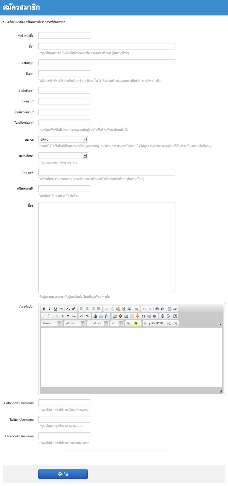
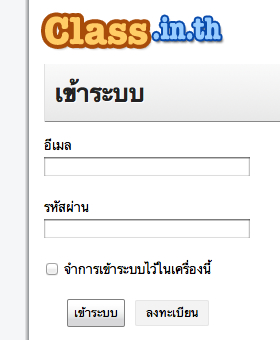
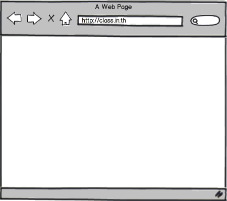

=============
สำหรับสมาชิก
=============

คนไทยทุกคนสามารถเป็นสมาชิกและใช้บริการของ Class.in.th ได้ไม่จำกัด โดยสามารถใช้ได้ทั้งในฐานะผู้สอนและผู้เรียนพร้อมกัน บทนี้อธิบายวิธีการใช้งานระบบสมาชิกของ Class.in.th

ลงทะเบียน
==========

การลงทะเบียนเป็นสมาชิกของเว็บไซต์ Class.in.th สามารถทำได้โดยเข้าไปที่หน้าแรกของเว็บไซต์ แล้วคลิกที่ปุ่ม "ลงทะเบียน" ที่มุมบนขวาของหน้านั้นเพื่อเข้าสู่หน้าแบบฟอร์มการลงทะเบียน

เมื่อเข้าสู่แบบฟอร์มดังในภาพ :ref:`sign-up-form` แล้ว ให้สมาชิกกรอกข้อมูลในหัวข้อต่างๆ ในแบบฟอร์ม หัวข้อที่ีมีเครื่องหมายดอกจัน (*) อยู่หลังหัวข้อเป็นหัวข้อที่ต้องกรอก ส่วนหัวข้อที่ไม่มีเครื่องหมายดอกจันไม่จำเป็นต้องกรอก แต่สมาชิกควรกรอกข้อมูลให้ครบทุกหัวข้อเพื่อความสมบูรณ์ของข้อมูลการเป็นสมาชิกในระบบ

.. _sign-up-form:

  
  แบบฟอร์มการลงทะเบียน

คำนำหน้าชื่อ ตำแหน่ง หรือยศ
  ให้สมาชิกกรอกคำนำหน้าชื่อ เช่น นาย นางสาว หากสมาชิกมีตำแหน่งหรือยศสามารถกรอกได้ในช่องนี้
  
ชื่อ
  ให้สมาชิกใส่เฉพาะชื่อจริงเป็นภาษาไทยในช่องนี้
  
นามสกุล
  ให้สมาชิกใส่นามสกุลเป็นภาษาไทยในช่องนี้
  
อีเมล
  ให้สมาชิกใส่อีเมลที่สมาชิกใช้งานอยู่เป็นประจำในช่องนี้ สมาชิกต้องกรอกอีเมลที่ใช้งานจริงเพราะสมาชิกต้องยืนยันการลงทะเบียนผ่านอีเมลถึงจะเริ่มใช้งานระบบได้ นอกจากนี้ระบบจะติดต่อสมาชิกผ่านอีเมลเพื่อแจ้งข้อมูลสำคัญต่างๆ ในชั้นเรียนที่สมาชิกเป็นผู้สอนหรือผู้เรียน ดังนั้นสมาชิกกรุณาตรวจสอบข้อมูลที่กรอกให้ชัดเจนว่าได้พิมพ์อีเมลของตนถูกต้องในช่องนี้
  
รหัสผ่าน
  ให้สมาชิกพิมพ์รหัสผ่านที่สมาชิกจะใช้ในการเข้าระบบในช่องนี้
  
ยืนยันรหัสผ่าน
  ให้สมาชิกพิมพ์รหัสผ่านซ้ำอีกครั้งในช่องนี้เพื่อยืนยันความถูกต้อง
  
โทรศัพท์มือถือ
  ให้สมาชิกพิมพ์หมายเลขโทรศัพท์มือถือของสมาชิกในช่องนี้ เบอร์โทรศัพท์ของสมาชิกจะไม่แสดงแก่สมาชิกอื่นๆ แต่จะแสดงกับผู้สอนในชั้นเรียนที่สมาชิกเป็นผู้เรียนเท่านั้น
  
สถานศึกษา
  ให้สมาชิกพิมพ์ชื่อเต็มของสถานศึกษาของท่านเป็นภาษาไทยในช่องนี้ กรุณาอย่าใช้ตัวย่อไม่ว่าในส่วนใดๆ ของชื่อ อาทิเช่น มหาวิทยาลัยสงขลานครินทร์ โรงเรียนศรียาภัย เป็นต้น
  
วิทยาเขต
  ให้สมาชิกพิมพ์ชื่อเต็มของวิทยาเขตของสถานศึกษาของท่าน (หากมี) เป็นภาษาไทยในช่องนี้

สถานะ
  ให้สมาชิกเลือกสถานะของการใช้งานของท่านในระบบว่าท่านใช้งาน Class.in.th ด้วยวัตถุประสงค์เพื่อเป็น "ผู้สอน" หรือ "ผู้เรียน" อย่างไรก็ตาม ไม่ว่าท่านจะเลือกสถานะใด สมาชิกทุกคนสามารถเป็นทั้งผู้สอน (เพื่อเปิดชั้นเรียนในการสอนผู้เรียน) หรือเป็นผู้เรียน (ของชั้นเรียนที่มีผู้อื่นเป็นผู้สอน) ได้พร้อมๆ กันโดยไม่ต้องลงทะเบียนใหม่
  
รหัสประจำตัว
  ให้สมาชิกใส่รหัสประจำตัวที่ใช้ในสถานศึกษาของท่าน อาจจะเป็นรหัสประจำตัวนักศึกษา หรือรหัสประจำตัวนักเรียน ซึ่งเป็นรหัสที่ช่วยทำให้ผู้สอนทราบว่าสมาชิกเป็นผู้เรียนในสถานศึกษานั้นและเป็นผู้เรียนในชั้นเรียนของผู้สอน
  
ที่อยู่
  ให้สมาชิกใส่ที่อยู่ที่ติดต่อได้ในช่องนี้ ที่อยู่ของสมาชิกจะไม่แสดงต่อสมาชิกคนอื่น แต่จะแสดงต่อผู้สอนในชั้นเรียนที่สมาชิกเป็นผู้เรียนเท่านั้น
  
เกี่ยวกับฉัน
  ให้สมาชิกใส่ข้อมูลเกี่ยวกับตัวสมาชิกเอง ซึ่งเป็นข้อมูลที่จะทำให้สมาชิกอื่นๆ และผู้สอนที่สมาชิกสมัครเข้าชั้นเรียนสามารถทราบได้ว่าสมาชิกเป็นใคร
  
GotoKnow Username
  หากสมาชิกเป็นสมาชิกของเว็บไซต์ GotoKnow.org ให้ใส่ชื่อผู้ใช้ (username) ในช่องนี้ด้วย

Twitter Username
  หากสมาชิกเป็นสมาชิกของเว็บไซต์ Twitter.com ให้ใส่ชื่อผู้ใช้ (username) ในช่องนี้ด้วย
Facebook Username
  หากสมาชิกเป็นสมาชิกของเว็บไซต์ Facebook.com ให้ใส่ชื่อผู้ใช้ (username) ในช่องนี้ด้วย

หลังจากสมาชิกกรอกข้อมูลในตัวข้อต่างๆ ครบแล้ว ให้กดปุ่ม "ลงทะเบียน" เพื่อส่งข้อมูลนั้นไปยังระบบ เมื่อระบบบันทึกข้อมูลแล้ว ระบบจะแจ้งให้สมาชิกตรวจสอบอีเมลของท่านเพื่อยืนยันการลงทะเบียนดังอธิบายในรายละเอียดในหัวข้อต่อไปนี้

ยืนยันการลงทะเบียน
===================

เมื่อสมาชิกกรอกแบบฟอร์มลงทะเบียนเรียบร้อยแล้วดังคำอธิบายในหัวข้อก่อนหน้านี้ สมาชิกจะได้อีเมลที่มีหัวข้อ **"[Class.in.th] วิธีการยืนยันบัญชีผู้ใช้"** จาก support@class.in.th ซึ่งมีเนื้อความดังนี้

::

  ยินดีต้อนรับ ปิยะวิชญ์ ปิยะวัฒน์

  คุณสามารถยืนยันการลงทะเบียนใช้งานระบบโดยคลิกลิงก์ต่อไปนี้: 
  ยืนยันการลงทะเบียนใช้งานระบบ 

  ถ้าลิงก์ด้านบนไม่สามารถคลิกได้ โปรดสำเนาลิงก์ด้านล่างนี้ไปเปิดกับเว็บบราวเซอร์: 
  http://class.in.th/users/confirmation?confirmation_token=ZMbtt4JNtOTohNu0Td4J 

  ขอบคุณ
  support@class.in.th
  
ให้สมาชิกกดที่ลิงก์ **"ยืนยันการลงทะเบียนใช้งานระบบ"** หากข้อความดังกล่าวไม่ได้เป็นลิงก์และไม่สามารถคลิกได้ ให้สมาชิกสำเนาลิงก์ไปเปิดกับเว็บบราวเซอร์ดังข้อความที่อธิบายในอีเมล

เมื่อสมาชิกเปิดหน้าเว็บตามลิงก์นั้น สมาชิกจะเข้าสู่หน้าแรกสำหรับสมาชิกของ Class.in.th พร้อมมีข้อความแสดงว่า **"คุณได้ยืนยันการลงทะเบียนเข้าใช้ระบบเรียบร้อยแล้ว และคุณได้เข้าระบบเรียบร้อยแล้ว"** แสดงว่าการยืนยันการลงทะเบียนได้ดำเนินการเรียบร้อยแล้ว และสมาชิกสามารถเริ่มใช้งานระบบได้ทันที

เข้าระบบ
========

สำหรับสมาชิกที่ลงทะเบียนและยืนยันการลงทะเบียนผ่านอีเมลเรียบร้อยแล้ว สามารถเข้าระบบเพื่อใช้บริการ Class.in.th ได้โดยไปที่หน้าแรกของ Class.in.th แล้วคลิกที่ปุ่ม "เข้าระบบ" ที่มุมบนขวาของเว็บไซต์เพื่อเข้าสู่หน้าแบบฟอร์มการเข้าระบบ

.. _sign-in-form:

  
  แบบฟอร์มการเข้าระบบ

เมื่อเข้าสู่หน้าแบบฟอร์มดังในภาพ :ref:`sign-in-form` แล้ว ให้สมาชิกพิมพ์อีเมลและรหัสผ่านตามที่ลงทะเบียนไว้กับเว็บไซต์ หลังจากนั้นให้กดปุ่ม "เข้าระบบ" เพื่อเข้าสู่ระบบของ Class.in.th

หากสมาชิกใช้เครื่องคอมพิวเตอร์ส่วนตัว และต้องการให้เครื่องคอมพิวเตอร์เข้าระบบโดยอัตโนมัติทุกครั้งที่เข้าเว็บไซต์ Class.in.th สมาชิกสามารถคลิกเลือกตัวเลือก "จำการเข้าระบบไว้ในเครื่องนี้" ได้ด้วย

ลืมรหัสผ่าน*
===========

หากสมาชิกลืมรหัสผ่าน สมาชิกสามารถขออีเมลจากระบบเพื่อให้ได้ลิงก์ในการเข้าระบบไปแก้ไขรหัสผ่านได้

แก้ไขข้อมูลสมาชิก*
================

กำลังจัดทำ

ใส่รูปประจำตัว*
==============

กำลังจัดทำ

ใช้งานบันทึกการเรียนรู้*
====================

กำลังจัดทำ

เพิ่มบันทึกการเรียนรู้*
-------------------

กำลังจัดทำ

.. _learning-journal-form:

  
  แบบฟอร์มบันทึกการเรียนรู้

แก้ไขบันทึกการเรียนรู้*
--------------------

กำลังจัดทำ

อ่านบันทึกการเรียนรู้*
-------------------

กำลังจัดทำ

ลบบันทึกการเรียนรู้*
------------------

กำลังจัดทำ

ใช้งานเครื่องมือจัดการข้อความ*
=============================

กำลังจัดทำ
