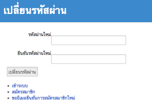
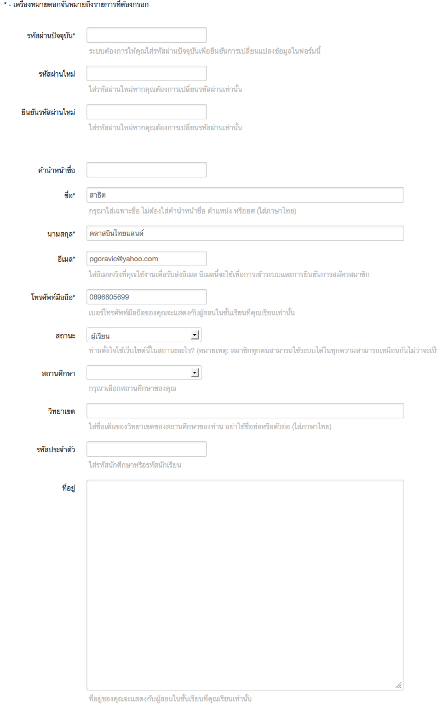

=============
สำหรับสมาชิก
=============

คนไทยทุกคนสามารถเป็นสมาชิกและใช้บริการของ ClassStart.org ได้ไม่จำกัด โดยสามารถใช้ได้ทั้งในฐานะผู้สอนและผู้เรียนพร้อมกัน บทนี้อธิบายวิธีการใช้งานระบบสมาชิกของ ClassStart.org

ลงทะเบียน
==========

การลงทะเบียนเป็นสมาชิกของเว็บไซต์ ClassStart.org สามารถทำได้โดยเข้าไปที่หน้าแรกของเว็บไซต์ แล้วคลิกที่ปุ่ม "ลงทะเบียน" ที่มุมบนขวาของหน้านั้นเพื่อเข้าสู่หน้าแบบฟอร์มการลงทะเบียน

เมื่อเข้าสู่แบบฟอร์มดังในภาพ :ref:`sign-up-form` แล้ว ให้สมาชิกกรอกข้อมูลในหัวข้อต่างๆ ในแบบฟอร์ม หัวข้อที่ีมีเครื่องหมายดอกจัน (*) อยู่หลังหัวข้อเป็นหัวข้อที่ต้องกรอก ส่วนหัวข้อที่ไม่มีเครื่องหมายดอกจันไม่จำเป็นต้องกรอก แต่สมาชิกควรกรอกข้อมูลให้ครบทุกหัวข้อเพื่อความสมบูรณ์ของข้อมูลการเป็นสมาชิกในระบบ

.. _sign-up-form:

  
  แบบฟอร์มการลงทะเบียน

คำนำหน้าชื่อ ตำแหน่ง หรือยศ
  ให้สมาชิกกรอกคำนำหน้าชื่อ เช่น นาย นางสาว หากสมาชิกมีตำแหน่งหรือยศสามารถกรอกได้ในช่องนี้
  
ชื่อ
  ให้สมาชิกใส่เฉพาะชื่อจริงเป็นภาษาไทยในช่องนี้
  
นามสกุล
  ให้สมาชิกใส่นามสกุลเป็นภาษาไทยในช่องนี้
  
อีเมล
  ให้สมาชิกใส่อีเมลที่สมาชิกใช้งานอยู่เป็นประจำในช่องนี้ สมาชิกต้องกรอกอีเมลที่ใช้งานจริงเพราะสมาชิกต้องยืนยันการลงทะเบียนผ่านอีเมลถึงจะเริ่มใช้งานระบบได้ นอกจากนี้ระบบจะติดต่อสมาชิกผ่านอีเมลเพื่อแจ้งข้อมูลสำคัญต่างๆ ในชั้นเรียนที่สมาชิกเป็นผู้สอนหรือผู้เรียน ดังนั้นสมาชิกกรุณาตรวจสอบข้อมูลที่กรอกให้ชัดเจนว่าได้พิมพ์อีเมลของตนถูกต้องในช่องนี้
  
รหัสผ่าน
  ให้สมาชิกพิมพ์รหัสผ่านที่สมาชิกจะใช้ในการเข้าระบบในช่องนี้
  
ยืนยันรหัสผ่าน
  ให้สมาชิกพิมพ์รหัสผ่านซ้ำอีกครั้งในช่องนี้เพื่อยืนยันความถูกต้อง
  
โทรศัพท์มือถือ
  ให้สมาชิกพิมพ์หมายเลขโทรศัพท์มือถือของสมาชิกในช่องนี้ เบอร์โทรศัพท์ของสมาชิกจะไม่แสดงแก่สมาชิกอื่นๆ แต่จะแสดงกับผู้สอนในชั้นเรียนที่สมาชิกเป็นผู้เรียนเท่านั้น
  
สถานศึกษา
  ให้สมาชิกพิมพ์ชื่อเต็มของสถานศึกษาของท่านเป็นภาษาไทยในช่องนี้ กรุณาอย่าใช้ตัวย่อไม่ว่าในส่วนใดๆ ของชื่อ อาทิเช่น มหาวิทยาลัยสงขลานครินทร์ โรงเรียนศรียาภัย เป็นต้น
  
วิทยาเขต
  ให้สมาชิกพิมพ์ชื่อเต็มของวิทยาเขตของสถานศึกษาของท่าน (หากมี) เป็นภาษาไทยในช่องนี้

สถานะ
  ให้สมาชิกเลือกสถานะของการใช้งานของท่านในระบบว่าท่านใช้งาน ClassStart.org ด้วยวัตถุประสงค์เพื่อเป็น "ผู้สอน" หรือ "ผู้เรียน" อย่างไรก็ตาม ไม่ว่าท่านจะเลือกสถานะใด สมาชิกทุกคนสามารถเป็นทั้งผู้สอน (เพื่อเปิดชั้นเรียนในการสอนผู้เรียน) หรือเป็นผู้เรียน (ของชั้นเรียนที่มีผู้อื่นเป็นผู้สอน) ได้พร้อมๆ กันโดยไม่ต้องลงทะเบียนใหม่
  
รหัสประจำตัว
  ให้สมาชิกใส่รหัสประจำตัวที่ใช้ในสถานศึกษาของท่าน อาจจะเป็นรหัสประจำตัวนักศึกษา หรือรหัสประจำตัวนักเรียน ซึ่งเป็นรหัสที่ช่วยทำให้ผู้สอนทราบว่าสมาชิกเป็นผู้เรียนในสถานศึกษานั้นและเป็นผู้เรียนในชั้นเรียนของผู้สอน
  
ที่อยู่
  ให้สมาชิกใส่ที่อยู่ที่ติดต่อได้ในช่องนี้ ที่อยู่ของสมาชิกจะไม่แสดงต่อสมาชิกคนอื่น แต่จะแสดงต่อผู้สอนในชั้นเรียนที่สมาชิกเป็นผู้เรียนเท่านั้น
  
เกี่ยวกับฉัน
  ให้สมาชิกใส่ข้อมูลเกี่ยวกับตัวสมาชิกเอง ซึ่งเป็นข้อมูลที่จะทำให้สมาชิกอื่นๆ และผู้สอนที่สมาชิกสมัครเข้าชั้นเรียนสามารถทราบได้ว่าสมาชิกเป็นใคร
  
GotoKnow Username
  หากสมาชิกเป็นสมาชิกของเว็บไซต์ GotoKnow.org ให้ใส่ชื่อผู้ใช้ (username) ในช่องนี้ด้วย

Twitter Username
  หากสมาชิกเป็นสมาชิกของเว็บไซต์ Twitter.com ให้ใส่ชื่อผู้ใช้ (username) ในช่องนี้ด้วย
Facebook Username
  หากสมาชิกเป็นสมาชิกของเว็บไซต์ Facebook.com ให้ใส่ชื่อผู้ใช้ (username) ในช่องนี้ด้วย

หลังจากสมาชิกกรอกข้อมูลในตัวข้อต่างๆ ครบแล้ว ให้กดปุ่ม "ลงทะเบียน" เพื่อส่งข้อมูลนั้นไปยังระบบ เมื่อระบบบันทึกข้อมูลแล้ว ระบบจะแจ้งให้สมาชิกตรวจสอบอีเมลของท่านเพื่อยืนยันการลงทะเบียนดังอธิบายในรายละเอียดในหัวข้อต่อไปนี้

ยืนยันการลงทะเบียน
===================

เมื่อสมาชิกกรอกแบบฟอร์มลงทะเบียนเรียบร้อยแล้วดังคำอธิบายในหัวข้อก่อนหน้านี้ สมาชิกจะได้อีเมลที่มีหัวข้อ **"[ClassStart.org] วิธีการยืนยันบัญชีผู้ใช้"** จาก support@class.in.th ซึ่งมีเนื้อความดังนี้

::

  ยินดีต้อนรับ ปิยะวิชญ์ ปิยะวัฒน์

  คุณสามารถยืนยันการลงทะเบียนใช้งานระบบโดยคลิกลิงก์ต่อไปนี้: 
  ยืนยันการลงทะเบียนใช้งานระบบ 

  ถ้าลิงก์ด้านบนไม่สามารถคลิกได้ โปรดสำเนาลิงก์ด้านล่างนี้ไปเปิดกับเว็บบราวเซอร์: 
  http://class.in.th/users/confirmation?confirmation_token=ZMbtt4JNtOTohNu0Td4J 

  ขอบคุณ
  support@class.in.th
  
ให้สมาชิกกดที่ลิงก์ **"ยืนยันการลงทะเบียนใช้งานระบบ"** หากข้อความดังกล่าวไม่ได้เป็นลิงก์และไม่สามารถคลิกได้ ให้สมาชิกสำเนาลิงก์ไปเปิดกับเว็บบราวเซอร์ดังข้อความที่อธิบายในอีเมล

เมื่อสมาชิกเปิดหน้าเว็บตามลิงก์นั้น สมาชิกจะเข้าสู่หน้าแรกสำหรับสมาชิกของ ClassStart.org พร้อมมีข้อความแสดงว่า **"คุณได้ยืนยันการลงทะเบียนเข้าใช้ระบบเรียบร้อยแล้ว และคุณได้เข้าระบบเรียบร้อยแล้ว"** แสดงว่าการยืนยันการลงทะเบียนได้ดำเนินการเรียบร้อยแล้ว และสมาชิกสามารถเริ่มใช้งานระบบได้ทันที

เข้าระบบ
========

สำหรับสมาชิกที่ลงทะเบียนและยืนยันการลงทะเบียนผ่านอีเมลเรียบร้อยแล้ว สามารถเข้าระบบเพื่อใช้บริการ ClassStart.org ได้โดยไปที่หน้าแรกของ ClassStart.org แล้วคลิกที่ปุ่ม "เข้าระบบ" ที่มุมบนขวาของเว็บไซต์เพื่อเข้าสู่หน้าแบบฟอร์มการเข้าระบบ

.. _sign-in-form:

.. figure:: _static/users/sign_in_form.jpg
  :align: center
  :scale: 60
  
  แบบฟอร์มการเข้าระบบ

เมื่อเข้าสู่หน้าแบบฟอร์มดังในภาพ :ref:`sign-in-form` แล้ว ให้สมาชิกพิมพ์อีเมลและรหัสผ่านตามที่ลงทะเบียนไว้กับเว็บไซต์ หลังจากนั้นให้กดปุ่ม "เข้าระบบ" เพื่อเข้าสู่ระบบของ ClassStart.org

หากสมาชิกใช้เครื่องคอมพิวเตอร์ส่วนตัว และต้องการให้เครื่องคอมพิวเตอร์เข้าระบบโดยอัตโนมัติทุกครั้งที่เข้าเว็บไซต์ ClassStart.org สมาชิกสามารถคลิกเลือกตัวเลือก "จำการเข้าระบบไว้ในเครื่องนี้" ได้ด้วย

ลืมรหัสผ่าน
===========

หากสมาชิกลืมรหัสผ่าน สามารถขอเปลี่ยนรหัสผ่านใหม่ได้จากหน้าแรกของเว็บไซต์ ClassStart.org จากนั้นสมาชิกจะได้รับอีเมลจากระบบเพื่อให้ได้ลิงก์ในการเข้าระบบไปแก้ไขรหัสผ่านได้ ตามขั้นตอนดังต่อไปนี้

  #. เข้าสู่เว็บไซต์ ClassStart.org
  #. คลิกเลือกที่ "ลืมรหัสผ่าน?'' จะปรากฏแบบฟอร์มการแจ้งขอเปลี่ยนรหัสผ่าน
  #. ใส่อีเมลที่สมาชิกใช้ในการลงทะเบียนสมาชิกของเว็บไซต์ ClassStart.org
  #. กดปุ่ม "ส่งอีเมลขั้นตอนในเปลี่ยนรหัสผ่าน'' เพื่อส่งคำขอ
  #. เมื่อเสร็จแล้ว จะปรากฏข้อความ "กรุณาตรวจสอบอีเมล คุณจะได้รับอีเมลบอกขั้นตอนในการเปลี่ยนรหัสผ่านในอีกไม่กี่วินาทีนี้'' แสดงขึ้นมา
  #. ให้สมาชิกตรวจสอบอีเมลที่มีหัวข้อ ***[ClassStart.org] ขั้นตอนการเปลี่ยนรหัสผ่าน*** จาก support@class.in.th ซึ่งมีเนื้อความดังนี้

    ::
    
      สวัสดี member@domain.org
      
      มีคนขอลิงก์เพื่อเปลี่ยนรหัสผ่านของคุณ คุณสามารถเปลี่ยนรหัสผ่านของคุณได้โดยคลิกที่ลิงก์ต่อไปนี้
      
      เปลี่ยนรหัสผ่าน
      
      ถ้าคุณไม่ได้ขอข้อมูลต่อไปนี้ คุณสามารถลบเมลนี้ได้
      
      รหัสผ่านของคุณยังไม่เปลี่ยนแปลงจนกว่าคุณคลิกลิงก์ด้านบนนี้หรือสร้างใหม่
  
  7. ให้สมาชิกกดที่ลิงก์ "เปลี่ยนรหัสผ่าน" หากข้อความดังกล่าวไม่ได้เป็นลิงก์และไม่สามารถคลิกได้ ให้สมาชิกสำเนาลิงก์ไปเปิดกับเว็บบราวเซอร์ดังข้อความที่อธิบายในอีเมล
  #. เมื่อสมาชิกเปิดหน้าเว็บตามลิงก์นั้น สมาชิกจะเข้าสู่เปลี่ยนรหัสผ่าน :ref:`change-password-form` ดังรูป
  #. สมาชิกพิมพ์รหัสผ่านใหม่ที่ช่องรหัสผ่านใหม่
  #. สมาชิกพิมพ์รหัสผ่านใหม่อีกครั้งเพื่อยืนยันรหัสใหม่ดังกล่าว ที่ช่องยืนยันรหัสผ่านใหม่
  #. เมื่อสำเร็จ สมาชิกจะเข้าสู่หน้าหลักของระบบ ClassStart.org โดยอัตโนมัติ และสมาชิกสามารถเริ่มใช้งานระบบได้ทันที

.. _change-password-form:

  
  แบบฟอร์มการเปลี่ยนรหัสผ่านใหม่

แก้ไขข้อมูลสมาชิก
================

สมาชิกสามารถแก้ไขรายละเอียดประวัติส่วนตัวต่างๆ รวมทั้งรหัสผ่านใหม่ได้ที่หน้าแก้ไขข้อมูลสมาชิกนี้ โดยสามารถแบ่งออกได้ 2 ส่วน ดังนี้

ส่วนที่ 1 การแก้ไขรหัสผ่านปัจจุบัน

ส่วนที่ 2 การแก้ไขข้อมูลส่วนตัวของสมาชิก

ซึ่งขั้นตอนการแก้ไขแต่ละส่วนนั้น มีขั้นตอนดังต่อไปนี้

**ส่วนที่ 1 การแก้ไขรหัสผ่านปัจจุบัน** (สามารถใช้ได้ในกรณีที่ทราบรหัสผ่านปััจจุบันและต้องการเปลี่ยนแปลงเพื่อความปลอดภัยของข้อมูลสมาชิก) มีขั้นตอนการแก้ไขดังต่อไปนี้

  #. หลังจากเข้าระบบได้แล้ว คลิกเลือกที่เมนูสมาชิกเลือก "แก้ไขข้อมูลสมาชิก"
  #. จะปรากฏแบบฟอร์มการแก้ไขข้อมูลสมาชิกแสดงขึ้นมา ซึ่งจะแสดงข้อมูลต่างๆ ที่สมาชิกได้ลงทะเบียนไว้แล้วแสดงขึ้นมา เพื่อรอการแก้ไข :ref:`edit-password-form` ดังรูป

.. _edit-password-form:

  
  แบบฟอร์มการแก้ไขรหัสผ่านใหม่
  
  3. กรอกรหัสผ่านปัจจุบัน (หมายถึง รหัสผ่านที่ท่านสมาชิกใช้ในการเข้าระบบในครั้งนี้) ที่หัวข้อ "รหัสผ่านใหม่" เพื่อยืนยันการเปลี่ยนแปลงรหัสผ่านใหม่
  #. กรอกรหัสผ่านใหม่ ที่หัวข้อ "รหัสผ่านใหม่*'' โดยรหัสผ่านใหม่นี้จะต้องไม่ซ้ำกับรหัสเดิม(รหัสผ่านปัจจุบัน)
  #. กรอกรหัสผ่านใหม่เพื่อยืนยันรหัสอีกครั้ง ที่หัวข้อ "ยืนยันรหัสผ่านใหม่*''
  #. จากนั้นกดปุ่ม "จัดเก็บ'' ด้านท้ายแบบฟอร์ม เพื่อบันทึกรหัสผ่านใหม่
  #. เมื่อเสร็จแล้ว จะปรากฏข้อความ "ท่านได้เปลี่ยนแปลงข้อมูลสำเร็จแล้ว'' แสดงขึ้นมา แสดงว่าท่านสมาชิกสามารถใช้รหัสผ่านใหม่นี้ในการเข้าระบบครั้งต่อไป
  #. กรอกรายละเอียดแก้ไขข้อมูลส่วนตัวของสมาชิกในข้อต่างๆ ตามคำแนะนำด้านล่างของข้อนั้นบนแบบฟอร์ม :ref:`edit-member-detail-form-01`
  #. จากนั้นกดปุ่ม "จัดเก็บ'' ด้านท้ายแบบฟอร์ม เพื่อบันทึกรหัสผ่านใหม่
  #. เมื่อเสร็จแล้ว จะปรากฏข้อความ "ท่านได้เปลี่ยนแปลงข้อมูลสำเร็จแล้ว'' แสดงขึ้นมา แสดงว่าท่านสมาชิกสามารถใช้รหัสผ่านใหม่นี้ในการเข้าระบบครั้งต่อไป

.. _edit-member-detail-form-01:

  
  แบบฟอร์มแก้ไขข้อมูลสมาชิก (ส่วนที่2 : การแก้ไขรายละเอียดข้อมูลส่วนตัวของสมาชิก)

ใส่รูปประจำตัว
==============

หลังจากเข้าระบบได้แล้ว คลิกเลือกที่เมนูสมาชิกเลือก "แก้ไขรูปประจำตัว''

  #. จะปรากฏแบบฟอร์มการแก้ไขรูปประจำตัวแสดงขึ้นมา :ref:`edit-picture-profile-form` เพื่อรอการแก้ไข ดังรูป
  #. กดปุ่ม "Browse…'' เพื่อเลือกไฟล์รูปภาพที่ต้องการ โดยเลือกจากที่เก็บไฟล์รูปดังกล่าวจากการแสดงผลบนหน้าจอ File upload
  #. คลิกเลือกไฟล์ที่ต้องการ แล้วกดปุ่ม "Open'' เพื่ออัพโหลดขึ้นระบบ ClassStart.org
  #. ในช่องรูปประจำตัวจะแสดงที่มาของไฟล์ จากนั้นกดปุ่ม "จัดเก็บ'' ด้านท้ายแบบฟอร์ม เพื่อบันทึกและอัพโหลดไฟล์รูปแทนที่รูปประจำตัวเดิมที่ใส่ไว้
  #. เมื่อเสร็จแล้ว จะปรากฏข้อความ "รูปประจำตัวได้ถูกทำการแก้ไขสำเร็จแล้ว'' แสดงขึ้นมา แสดงว่าท่านสมาชิกได้แก้ไขรูปประจำตัว พร้อมแสดงผลรูปดังกล่าวขึ้นมาในระบบ ClassStart.org

.. _edit-picture-profile-form:

  
  แบบฟอร์มการแก้ไขรูปประจำตัว

ใช้งานบันทึกการเรียนรู้
=====================

รายการการเรียนรู้ต่างๆ ที่เกิดขึ้นในชั้นเรียนแต่ละครั้ง โดยสมาชิกสามารถบันทึกการเรียนรู้ที่ได้รับในแต่ละครั้งให้ท่านสมาชิกและสมาชิกท่านอื่นได้ศึกษา เพื่อเพิ่มพูนองค์ความรู้ต่อไป

เพิ่มบันทึกการเรียนรู้
-------------------

สมาชิกสามารถเพ่ิมบันทึกการเรียนรู้ ตามขั้นตอนดังต่อไปนี้

  โดยการผ่านเมนูของระบบ
      
      (เมนูสมาชิก - หน้าหลัก - กดปุ่ม "เพิ่มบันทึกการเรียนรู้'')
      (เมนูสมาชิก - บันทึกการเรียนรู้ - กดปุ่ม "เพิ่มบันทึกการเรียนรู้'')

**วิธีใช้ ผ่านเมนูของระบบ**

  (เมนูสมาชิก - หน้าหลัก - กดปุ่ม "เพิ่มบันทึกการเรียนรู้'')
  
  (เมนูสมาชิก - บันทึกการเรียนรู้ - กดปุ่ม "เพิ่มบันทึกการเรียนรู้'')

  #. เมื่อสมาชิกเข้าสู่ระบบ ClassStart.org คลิกเมนูสมาชิกเลือกบันทึกการเรียนรู้
  #. กดปุ่ม "เพิ่มบันทึกการเรียนรู้'' จะปรากฏแบบฟอร์มการเพิ่มบันทึกการเรียนรู้ ดังรูป
  #. กรอกรายละเอียดการเรียนรู้ในช่องเนื้อหา* โดยสามารถใช้เครื่องมือจัดการข้อความ :ref:`word-tools-section` ช่วยในการจัดรูปแบบการแสดงผลของบันทึกได้
  #. เลือกชั้นเรียนที่ต้องการบันทึกการเรียนรู้ในครั้งนี้ โดยเลือกจากช่องชั้นเรียนที่เกี่ยวข้อง (รายการชั้นเรียนจะมีข้อมูลปรากฏตามชั้นเรียนที่ท่านเป็นสมาชิกภายในเว็บไซต์)

*หากท่านไม่ระบุชั้นเรียนที่เกี่ยวข้องกับบันทึกนี้ บันทึกนี้จะกลายเป็นบันทึกส่วนตัวท่านสมาชิกสามารถอ่านได้คนเดียว*

  #. กรณีมีไฟล์แนบสามารถแนบไฟล์ที่มีอยู่ ใส่ในบันทึกนี้ได้ตามขั้นตอนการแนบไฟล์ :ref:`add-attach-file-section`
  #. สมาชิกสามารถบันทึกการเรียนรู้ที่เกิดขึ้นและได้รับ เพื่อเพิ่มบันทึกการเรียนรู้ของท่านได้ตลอดเวลาในขณะที่ท่านอยู่ในระบบ ClassStart.org
  #. กดปุ่ม "จัดเก็บ'' เพื่อบันทึกการเรียนรู้ในบันทึกนี้ และเมื่อสร้างสำเร็จแล้วจะปรากฏข้อความ "บันทึกการเรียนรู้ได้ถูกบันทึกสำเร็จแล้ว'' แสดงขึ้นมา

.. _learning-journal-form:

  
  แบบฟอร์มบันทึกการเรียนรู้

.. _add-attach-file-section:

เพิ่มไฟล์แนบในบันทึกการเรียนรู้
-----------------------------
  
  #. เปิดหน้าหลักของชั้นเรียน แล้วเข้าสู่รายการบันทึกการเรียนรู้ที่ต้องการ
  #. กดปุ่ม "Browse…'' เพื่อเลือกไฟล์จากทึ่เก็บไฟล์นั้น โดยไม่จำกัดประเภทไฟล์ที่แนบและการแนบไฟล์แต่ละครั้ง สามารถแนบไฟล์ได้ครั้งละ 1 ไฟล์ แนบใส่ในบันทึกการเรียนรู้
  #. เมื่อได้ไฟล์ตามที่เก็บไว้ ให้กดปุ่ม "Open'' เพื่ออัพโหลดไฟล์ขึ้นไปใส่บันทึกการเรียนรู้
  #. หากมีไฟล์มากกว่า 1 ไฟล์ สามารถเพิ่มไฟล์แนบได้อีกโดยกดปุ่ม ``มีไฟล์แนบอีก'' เพื่อเพิ่มบรรทัดในช่องไฟล์แนบบแล้วทำตามขั้นตอนข้อที่ 2 ตามลำดับ
  #. จากนั้นกดปุ่ม "จัดเก็บ'' เพื่อบันทึกข้อมูล
  #. เมื่อเสร็จแล้วจะปรากฏข้อความ ``บันทึกการเรียนรู้ได้ถูกทำการสร้างแล้วสำเร็จแล้ว'' แสดงขึ้นมา
  

***ข้อจำกัดของไฟล์แนบใน ClassStart.org*** มีดังนี้
  
  *ชื่อไฟล์อนุญาตให้ใช้เฉพาะตัวอักษร a-z, A-Z, 0-9, ขีดล่าง, และ ขีดกลาง โดยไม่เริ่มต้นหรือสิ้นสุดด้วยขีดล่างหรือขีดกลาง นอกจากนี้คุณยังสามารถแสดงไฟล์แนบที่เป็นภาพในเนื้อหาของคุณโดยเขียนดังนี้ {{ชื่อไฟล์}}  (เขียนเครื่องหมายปีกกาเปิดสองตัวแล้วตามด้วยชื่อไฟล์และปิดด้วยเครื่องหมายปีกกาปิดอีกสองตัว)*

.. _add-attach-file-form:

  
  แบบฟอร์มการเพิ่มไฟล์แนบ

แก้ไขบันทึกการเรียนรู้
--------------------

  #. เข้าไปที่หน้าหลักของสมาชิก เลือกบันทึกการเรียนรู้
  #. ในส่วนของบันทึกการเรียนรู้ เลือกคลิกบันทึกที่ต้องการแก้ไขหรือเพิ่มเติม หากในหน้าที่แสดงผลปัจจุบันไม่มีบันทึกดังกล่าว สามารถกดปุ่ม ``บันทึกการเรียนรู้ทั้งหมด'' จะปรากฏหน้าบันทึกการเรียนรู้ทั้งหมดแสดงขึ้นมา ตามวันที่บันทึกข้อมูลนั้น
  #. จากนั้นให้คลิกเลือกบันทึกที่ต้องการ
  #. กดปุ่ม "แก้ไข'' เพื่อแก้ไขรายละเอียดของบันทึกการเรียนรู้
  #. กรอกรายละเอียดที่ต้องการแก้ไขหรือเพิ่มเติมของบันทึกการเรียนรู้ หากต้องการแนบไฟล์เพิ่มเติมสามารถศึกษาการใช้งานได้จากขั้นตอน :ref:`add-attach-file-form`
  #. กดปุ่ม "จัดเก็บ'' เพื่อบันทึกการเรียนรู้ที่แก้ไข เมื่อบันทีึกแล้วจะปรากฏข้อความ "บันทึกการเรียนรู้ได้ถูกทำการแก้ไขสำเร็จแล้ว'' แสดงขึ้นมา

.. _view-learning-section:

อ่านบันทึกการเรียนรู้
-------------------

สมาชิกสามารถอ่านบันทึกการเรียนรู้ ได้ตามขั้นตอนดังต่อไปนี้

  #. เข้าไปที่หน้าหลักของสมาชิก เลือกบันทึกการเรียนรู้
  #. ในส่วนของบันทึกการเรียนรู้ เลือกคลิกบันทึกที่ต้องการ หากในหน้าที่แสดงผลปัจจุบันไม่มีบันทึกดังกล่าว สามารถกดปุ่ม "บันทึกการเรียนรู้ทั้งหมด'' จะปรากฏหน้าบันทึกการเรียนรู้ทั้งหมดแสดงขึ้นมา ตามวันที่บันทึกข้อมูลนั้น
  #. จากนั้นให้คลิกเลือกบันทึกที่ต้องการ
  #. สังเกตส่วนของบันทึกการเรียนรู้ที่เกิดขึ้นตลอดการสอนที่ถูกสร้างขึ้นทั้งที่เป็นข้อมูลส่วนตัวและสมาชิกในชั้นเรียน ซึ่งหากต้องการให้แสดงบันทึกการเรียนรู้ทั้งหมด สามารถกดปุ่ม "บันทึกการเรียนรู้ทั้งหมด'' เพื่อเปิดหน้าแสดงรายการบันทึกการเรียนรู้ทั้งหมด
  
ในส่วนนี้สมาชิกสามารถกดปุ่ม "ถูกใจ" กรณีที่ท่านต้องการให้กำลังใจผู้เขียนบันทึกการเรียนรู้นั้นๆ หรือหากต้องการยกเลิกสามารถกดปุ่ม "ไม่ถูกใจ" เพื่อยกเลิกได้ 

ลบบันทึกการเรียนรู้
------------------

สมาชิกสามารถลบบันทึกการเรียนรู้ที่บันทึกไว้ ตามขั้นตอนดังต่อไปนี้

  #. เข้าไปที่หน้าหลักของสมาชิก เลือกบันทึกการเรียนรู้
  #. ในส่วนของบันทึกการเรียนรู้ เลือกคลิกบันทึกที่ต้องการลบ หากในหน้าที่แสดงผลปัจจุบันไม่มีบันทึกดังกล่าว สามารถกดปุ่ม "บันทึกการเรียนรู้ทั้งหมด'' จะปรากฏหน้าบันทึกการเรียนรู้ทั้งหมดแสดงขึ้นมา ตามวันที่บันทึกข้อมูลนั้น
  #. จากนั้นให้คลิกเลือกบันทึกที่ต้องการ
  #. กดปุ่ม "ลบ'' เพื่อลบบันทึกการเรียนรู้
  #. จะปรากฏข้อความ "คุณแน่ใจหรือไม่ ?'' เพื่อยืนยันการลบบันทึกการเรียนรู้
  
      - หากต้องการลบ กดปุ่ม "OK''
      - หากต้องการยกเลิกการลบ กดปุ่ม "Cancel''
  
  #. เมื่อกดปุ่มยืนยันความต้องการแล้ว ระบบจะดำเนินการตามที่ยืนยัน
 
      - หากกดปุ่ม "OK''  จะปรากฏข้อความ "บันทึกการเรียนรู้ได้ถูกทำการลบแล้วสำเร็จแล้ว''
      - หากกดปุ่ม "Cancel'' จะกลับสู่หน้าบันทึกการเรียนรู้นั้น

.. _word-tools-section:

ใช้งานเครื่องมือจัดการข้อความ
=============================

เมื่อสมาชิกกรอกเนื้อหาในแบบฟอร์มต่างๆ จะมีเครื่องมือที่สามารถช่วยเกี่ยวกับการจัดการรูปแบบของเนื้อหาที่กรอกลงไปโดยใช้เทคนิคแบบ WYSIWYG(What You See Is What You Get) เพื่อความเหมาะสมในการแสดงผล ซึ่งเครื่องมือแบบนี้เรียกว่า "เครื่องมือจัดการข้อความ" :ref:`word-tools-form` และหากสมาชิกไม่ต้องการใช้เครื่องมือดังกล่าว สามารถทำการ "เปิด" หรือ "ปิด" ได้ตามต้องการ ดังรูป

.. _word-tools-form:

  
  แบบฟอร์มเครื่องมือจัดการข้อความ
  
  
.. _word-tools-form-open:

.. figure:: _static/users/word_tools_form_open.png
  :align: center
  :scale: 80
  
  รูปแบบการเปิดแบบฟอร์มเครื่องมือจัดการข้อความ

.. _word-tools-form-close:

.. figure:: _static/users/word_tools_form_close.png
  :align: center
  :scale: 80
  
  รูปแบบการปิดแบบฟอร์มเครื่องมือจัดการข้อความ

ความสามารถของปุ่มต่างๆ ในแถบเครื่องมือ ดังต่อไปนี้

.. _word-tools-form-01:

  
  รูปแบบเครื่องมือจัดการข้อความชุดที่ 1

:ref:`word-tools-form-01`

  #. Bold : ทำข้อความที่เลือกเป็น **ตัวหนา**
  #. Italic : ทำข้อความที่เลือกเป็น *ตัวเอียง*
  #. Underline : ขีดเส้นใต้ข้อความที่เลือก
  #. Strikethrough : ลากเส้นผ่านตรงกลางของข้อความที่เลือก 
  #. Subscript : สร้างตัวอักษรขนาดเล็กใต้แนวหลักของข้อความ 
  #. Superscript : สร้างตัวอักษรขนาดเล็กเหนือบรรทัดข้อความ

  
.. _word-tools-form-02:

  
  รูปแบบเครื่องมือจัดการข้อความชุดที่ 2

  
:ref:`word-tools-form-02`
  
  #. Align Left : จัดข้อความชิดซ้าย 
  #. Center : จัดข้อความไว้กึ่งกลาง
  #. Align Right : จัดข้อความชิดขวา
  #. Justify : จัดข้อความชิดระยะขอบทั้งซ้ายขวา โดยจะเพิ่มช่องว่างพิเศษระหว่างคำตามความจำเป็น

  
.. _word-tools-form-03:

  
  รูปแบบเครื่องมือจัดการข้อความชุดที่ 3

  
:ref:`word-tools-form-03`

  #. Cut : ตัดส่วนที่เลือก
  #. Copy : คัดลอกส่วนที่เลือก
  #. Paste : วางส่วนที่ตัดหรือคัดลอกไว้
  #. Paste as plain text : วางส่วนที่ตัดหรือคัดลอกไว้เป็นข้อความธรรมดา
  #. Paste from Word : วางส่วนที่ตัดหรือคัดลอกมาจากเอกสาร Word 
  #. Print : พิมพ์เนื้อหาออกเครื่องพิมพ์
  

.. _word-tools-form-04:

  
  รูปแบบเครื่องมือจัดการข้อความชุดที่ 4

  
:ref:`word-tools-form-04`
  
  #. Undo : เลิกทำ
  #. Redo : ทำซ้ำ
  #. Find : ค้นหาคำหรือวลี
  #. Replace : ค้นหาและแทนที่คำหรือวลี
  #. Select all : เลือกข้อความทั้งหมด
  #. Remove format : ลบการจัดรูปแบบข้อความ
  

.. _word-tools-form-05:

  
  รูปแบบเครื่องมือจัดการข้อความชุดที่ 5
  

:ref:`word-tools-form-05`
  
  #. Insert/Remove Numericed List : ใส่ลำดับตัวเลข  
  #. Insert/Remove Bulleted List : ใส่สัญลักษณ์แสดงหัวข้อย่อย
  #. Decrease Indent : ลดระดับการเยื้องของเยื้องข้อความ
  #. Increase Indent : เพิ่มระดับการเยื้องของเยื้องข้อความ
  #. Block Quote : รูปแบบบล็อกของข้อความเป็นคำพูดเยื้อง
  #. Create Div Container : สร้างการแบ่งพื้นที่ในการเก็บข้อความ

  
.. _word-tools-form-06:

  
  รูปแบบเครื่องมือจัดการข้อความชุดที่ 6

  
:ref:`word-tools-form-06`
  
  #. Text direction from left to right : กำหนดทิศทางข้อความที่เลือกจากซ้ายไปขวา
  #. Text direction from right to left : กำหนดทิศทางข้อความที่เลือกจากขวาไปซ้าย

    
.. _word-tools-form-07:

  
  รูปแบบเครื่องมือจัดการข้อความชุดที่ 7

  
:ref:`word-tools-form-07`

  #. Link : แทรกหรือแก้ไขลิงค์
  #. Unlink : ยกเลิกการทำลิงค์
  #. Anchor : ใส่สมอเชื่อมโยงไปยังข้อความที่ต้องการ
  

.. _word-tools-form-08:

  
  รูปแบบเครื่องมือจัดการข้อความชุดที่ 8

:ref:`word-tools-form-08`
  
  #. Image : แทรกรูปภาพ
  #. Flash : แทรกวัตถุที่ใช้ Adobe Flash ในเนื้อหา
  #. Table : สร้างตารางที่มีจำนวนที่กำหนดของแถวและคอลัมน์
  #. Insert Horisontal Line : แทรกเส้นแบ่งตามแนวนอน
  #. Smiley : แทรกรูปภาพไอคอนต่างๆ 
  #. Insert special character : แทรกสัญลักษณ์ท่ีไม่มีอยู่บนแป้นพิมพ์ของสมาชิกเช่น สัญลักษณ์ลิขสิทธ์ิ สัญลักษณ์เครื่องหมายการค้า เคร่ืองหมายย่อหน้า และอักขระ Unicode เป็นต้น
  #. Insert Page Break for Printing : แทรกหน้าสำหรับพิมพ์
  #. IFrame : การแทรกเฟรมแบบอินไลน์ 

.. _word-tools-form-09:

  
  รูปแบบเครื่องมือจัดการข้อความชุดที่ 9

:ref:`word-tools-form-09`
  
  #. Maximize : ขยายส่วนที่เลือก   
  #. Show Block : แสดงตัวอย่างเนื้อหาส่วนที่ block ไว้
  #. Help : แสดงข้อมูลเกี่ยวกับ editor

  
.. _word-tools-form-10:

  
  รูปแบบเครื่องมือจัดการข้อความชุดที่ 10

  
:ref:`word-tools-form-10` 

  #. Formatting Styles : ลักษณะการจัดรูปแบบ
  #. Paragraph Format : ลักษณะการจัดย่อหน้า
  #. Font name : รูปแบบตัวอักษร
  #. Font Size : ขนาดตัวอักษร

 
.. _word-tools-form-11:

.. figure:: _static/users/word_tools_form_11.png
  :align: center
  :scale: 80
  
  รูปแบบเครื่องมือจัดการข้อความชุดที่ 11

  
:ref:`word-tools-form-11`
  
  #. Text color : เปลี่ยนสีข้อความ 
  #. Background color : ทำให้ข้อความดูเหมือนถูกทำเครื่องหมายด้วยปากกาเน้นข้อความ
  

.. _word-tools-form-12:

  
  รูปแบบเครื่องมือจัดการข้อความชุดที่ 12

  
:ref:`word-tools-form-12`
  
  #. Source : ดูหรือแก้ไขโค้ดสำหรับเพ่ิมเติมการแสดงผลแบบ Multimedia โดยการใส่ script เพื่ออ้างอิงข้อมูลที่ต้องการแสดงผล เช่น SlideShare, Youtube แทรกในเนื้อหา   
  #. Preview : แสดงตัวอย่างการแสดงผล
  #. Template : เลือกเค้าโครงการแสดงผลที่ระบบกำหนดไว้ให้
