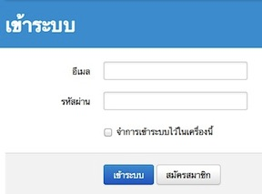

=============
สำหรับสมาชิก
=============

กำลังจัดทำ

ลงทะเบียน
==========

กำลังจัดทำ

ยืนยันการลงทะเบียน
===================

กำลังจัดทำ

เข้าระบบ
========

สำหรับสมาชิกที่ลงทะเบียนและยืนยันการลงทะเบียนผ่านอีเมลเรียบร้อยแล้ว สามารถเข้าระบบเพื่อใช้บริการ Class.in.th ได้โดยไปที่หน้าแรกของ Class.in.th แล้วคลิกที่ปุ่ม "เข้าระบบ" ที่มุมบนขวาของเว็บไซต์เพื่อเข้าสู่หน้าแบบฟอร์มการเข้าระบบ

เมื่อเข้าสู่หน้าแบบฟอร์มดังในภาพ :ref:`sign-in-form` แล้ว ให้สมาชิกพิมพ์อีเมลและรหัสผ่านตามที่ลงทะเบียนไว้กับเว็บไซต์ หลังจากนั้นให้กดปุ่ม "เข้าระบบ" เพื่อเข้าสู่ระบบของ Class.in.th

หากสมาชิกใช้เครื่องคอมพิวเตอร์ส่วนตัว และต้องการให้เครื่องคอมพิวเตอร์เข้าระบบโดยอัตโนมัติทุกครั้งที่เข้าเว็บไซต์ Class.in.th สมาชิกสามารถคลิกเลือกตัวเลือก "จำการเข้าระบบไว้ในเครื่องนี้" ได้ด้วย

.. _sign-in-form:

  
  แบบฟอร์มการเข้าระบบ

ลืมรหัสผ่าน
===========

หากสมาชิกลืมรหัสผ่าน สมาชิกสามารถขออีเมลจากระบบเพื่อให้ได้ลิงก์ในการเข้าระบบไปแก้ไขรหัสผ่านได้

แก้ไขข้อมูลสมาชิก
================

กำลังจัดทำ

ใส่รูปประจำตัว
==============

กำลังจัดทำ

ใช้งานบันทึกการเรียนรู้
====================

กำลังจัดทำ

เพิ่มบันทึกการเรียนรู้
-------------------

กำลังจัดทำ

แก้ไขบันทึกการเรียนรู้
--------------------

กำลังจัดทำ

อ่านบันทึกการเรียนรู้
-------------------

กำลังจัดทำ

ลบบันทึกการเรียนรู้
------------------

กำลังจัดทำ
